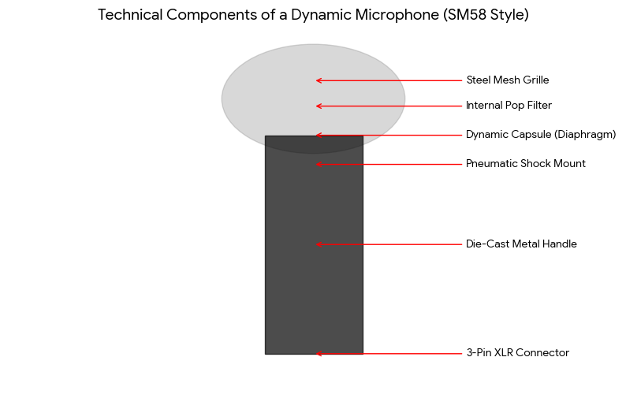

https://share.google/aimode/S33lSAXookzOvoMcC

The general name for this style of microphone is a Handheld Dynamic Microphone. Because of its distinctive profile—a spherical mesh top and a tapered cylindrical handle—it is also colloquially referred to as an "ice cream cone" style microphone. [1, 2, 3] 
## Key Characteristics of this Category

* Handheld Form Factor: Designed specifically to be held comfortably in the hand or secured in a standard microphone clip on a stand.
* Dynamic Element: Most microphones in this shape use a moving-coil dynamic capsule, which is rugged and does not require external power.
* Ball Grille (Windscreen): The mesh head acts as a built-in pop filter to protect the internal diaphragm from breath blasts and physical damage.
* XLR Output: Almost all professional versions of this style feature a 3-pin XLR male connector at the base for a balanced, low-noise connection to mixers and interfaces. [1, 2, 4, 5, 6] 

## Common Industry Terms

* Stage Mic / Vocal Mic: Because they are built to "take a beating" on tour, they are the industry standard for live stage performances.
* Cardioid Microphone: This refers to the heart-shaped pickup pattern common in this style, which captures sound from the front (the user's mouth) while rejecting noise from the back (the audience).
* "The Workhorse": Audio engineers often use this nickname for handheld dynamic mics like the Shure SM58 because of their extreme reliability in varied environments. [7, 8, 9] 

Would you like to see a list of other popular models that use this same handheld design for comparison?

[1] [https://www.dpamicrophones.com](https://www.dpamicrophones.com/microphones/handheld/#:~:text=A%20handheld%20microphone%20is%20generally%20held%20in,common%2C%20but%20not%20the%20only%20shape%20used.)
[2] [https://www.avixa.org](https://www.avixa.org/pro-av-trends/articles/types-of-microphones)
[3] [https://ecmicrophones.com](https://ecmicrophones.com/where-dynamic-microphone-elements-are-commonly-used/)
[4] [https://carvinaudio.com](https://carvinaudio.com/blogs/audio-education/microphone-anatomy-basic-introductory)
[5] [https://englishan.com](https://englishan.com/parts-of-a-microphone/)
[6] [https://www.youtube.com](https://www.youtube.com/watch?v=OxzTj1IXvVQ)
[7] [https://www.vocalpractices.com](https://www.vocalpractices.com/microphones)
[8] [https://soundref.com](https://soundref.com/different-types-of-microphones/)
[9] [https://engadinemusic.com.au](https://engadinemusic.com.au/blogs/news/microphone-types)

At the Utah Valley University (UVU) event on 10 September 2025, the two wired microphones used were Shure SM58 dynamic microphones.
While Charlie Kirk typically utilized wireless systems for mobility, for the "Prove Me Wrong" table setup at UVU, the production switched to a wired XLR configuration to ensure maximum reliability in the outdoor courtyard environment. [1] 
## Microphone Specifications

* Charlie's Microphone: A handheld [Shure SM58](https://www.digidirect.com.au/shure-sm58-dynamic-vocal-microphone) connected via a standard XLR cable. This model is favoured for its "legendary" ruggedness and ability to isolate his voice while rejecting the ambient noise of the crowd.
* Guest Microphone: A second Shure SM58 mounted on a heavy-duty tripod mic stand. It was positioned directly across the table from Charlie to allow students to debate him hands-free. [2, 3] 

## Why these models were used

* Durability: The [Shure SM58](https://derringers.com.au/products/shure-sm58-dynamic-vocal-cardioid-microphone) is designed to handle being dropped or exposed to outdoor elements, which is common during campus tours.
* Feedback Rejection: Its cardioid pickup pattern is specifically tuned to prevent the high-pitched squealing (feedback) that often occurs when microphones are used near portable PA speakers in open spaces.
* Consistency: Using identical wired models for both the host and the guest ensures a balanced audio levels for the high-quality video recordings and livestreams produced by the Turning Point USA team. [2] 

## Where to Buy

* digiDirect: Offers the standard Shure SM58 for ~~~$279~~~ $217.01.
* Sieffs Music: Stocks the SM58 for ~~~$269~~~ $199.
* [DJ City](https://djcity.com.au/product/shure-sm58s-vocal-microphone-switch): Carries the Shure SM58S (the version with an on/off switch) for $265.

Would you like to know about the audio interface or mixer they used to connect these wired microphones to their recording setup?

[1] [https://www.istore.nc](https://www.istore.nc/products/new-shure-sm7b-cardioid-vocal-broadcast-microphone-shipped-f/26581769/)
[2] [https://bestmicrophones.net](https://bestmicrophones.net/index.php/shure-sm58-microphone-review/#:~:text=As%20a%20cardioid%20dynamic%20microphone%2C%20the%20Shure,on%20stage%20sound%20sources%20and%20limits%20feedback.)
[3] [https://www.facebook.com](https://www.facebook.com/christinedarg/posts/charlie-kirk-the-founder-of-turning-point-usa-was-known-for-his-prove-me-wrong-c/10162282714414102/#:~:text=Charlie%20Kirk%2C%20the%20founder%20of%20Turning%20Point,viral%20through%20clips%20shared%20on%20social%20media.)

The Shure SM58 is a dynamic microphone, meaning it uses a physical coil and magnet system rather than electronics requiring external power. This makes it incredibly durable for high-intensity environments like the "Prove Me Wrong" debates.
## Technical Components Breakdown

* Heavy-Duty Steel Mesh Grille: This is the first line of defence. It is designed to dent upon impact to absorb energy, protecting the sensitive internal components.
* Integrated Pop Filter: A layer of acoustic foam sits inside the grille to reduce "plosives" (harsh 'P' and 'B' sounds) and wind noise.
* Dynamic Capsule (Diaphragm): The heart of the mic. It contains a very thin, lightweight diaphragm attached to a copper voice coil that moves within a magnetic field to create an electrical signal.
* Pneumatic Shock Mount: A sophisticated internal suspension system that isolates the capsule from the handle. This is why you don't hear a loud "thump" when Charlie Kirk or a guest moves the microphone or taps the stand.
* Cardioid Polar Pattern: The capsule is physically engineered to be most sensitive to sound coming from the front and least sensitive to the back, which prevents the speakers (PA system) from feeding back into the mic.
* 3-Pin XLR Connector: The professional industry standard for balanced audio, ensuring the signal remains clear and interference-free even over long cable runs to the mixing board.

You can find official technical drawings and replacement parts in the Shure SM58 User Guide or view purchasing options for the full unit at Store DJ.
Do you need the technical specifications (like frequency response or impedance) for these components to compare them with another model?

