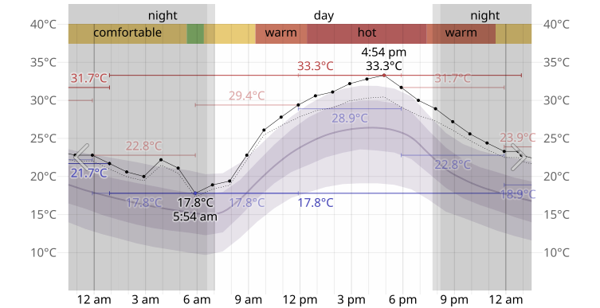

# Environment Conditions

## Temperature

Figure Temperature-on-Wednesday-10-September-2025-in-Orem.svg

[Temperature link](https://weatherspark.com/h/d/2700/2025/9/10/Historical-Weather-on-Wednesday-September-10-2025-in-Orem-Utah-United-States#Figures-Temperature)

## Wind Speed

Figure Wind-Speed-on-Wednesday-10-September-2025-in-Orem.svg

[Wind speed link](https://weatherspark.com/h/d/2700/2025/9/10/Historical-Weather-on-Wednesday-September-10-2025-in-Orem-Utah-United-States#Figures-WindSpeed)

## Wind Direction

Figure Wind-Direction-on-Wednesday-10-September-2025-in-Orem.svg

[Wind direction link](https://weatherspark.com/h/d/2700/2025/9/10/Historical-Weather-on-Wednesday-September-10-2025-in-Orem-Utah-United-States#Figures-WindDirection)

---

## Hourly Data [weather-spark]

11:54 am	29.4°C	1,013 mb	35.2 km/h, S	≥ 16.1 km	Mostly Cloudy (5,791 m)
Local:	11:54, Wed., 10 Sep. 2025
UTC:	17:54, Wed., 10 Sep. 2025
Source:	Cycle Files
Automatic Type:	ASOS automated observation with precipitation discriminator (rain/snow)
6-Hour Low:	17.8°C
6-Hour High:	29.4°C
Dew Pt.:	3.9°C
Gust Speed:	53.7 km/h
Other Cloud Layers:	Mostly Clear (3,353 m), Partly Cloudy (4,572 m)
Raw:	KSLC 101754Z 16019G29KT 10SM FEW110 SCT150 BKN190 29/04 A2990 RMK AO2 PK WND 17029/1743 SLP067 ACSL DSNT SW-W T02940039 10294 20178 58000

12:54 pm	30.6°C	1,012 mb	20.4 km/h, S	≥ 16.1 km	Mostly Cloudy (5,791 m)

Local:	12:54, Wed., 10 Sep. 2025
UTC:	18:54, Wed., 10 Sep. 2025
Source:	Cycle Files
Automatic Type:	ASOS automated observation with precipitation discriminator (rain/snow)
Dew Pt.:	2.2°C
Gust Speed:	46.3 km/h
Other Cloud Layers:	Mostly Clear (3,353 m), Partly Cloudy (4,572 m)
Raw:	KSLC 101854Z 17011G25KT 10SM FEW110 SCT150 BKN190 31/02 A2989 RMK AO2 PK WND 15032/1835 SLP061 ACSL DSNT S AND SW T03060022

## Midpoint Temperature b/n 11:54 am - 12:54 pm

* Temperature: 30.0°C

## References

[weather-spark]: https://weatherspark.com/h/d/2700/2025/9/10/Historical-Weather-on-Wednesday-September-10-2025-in-Orem-Utah-United-States#metar-11-54