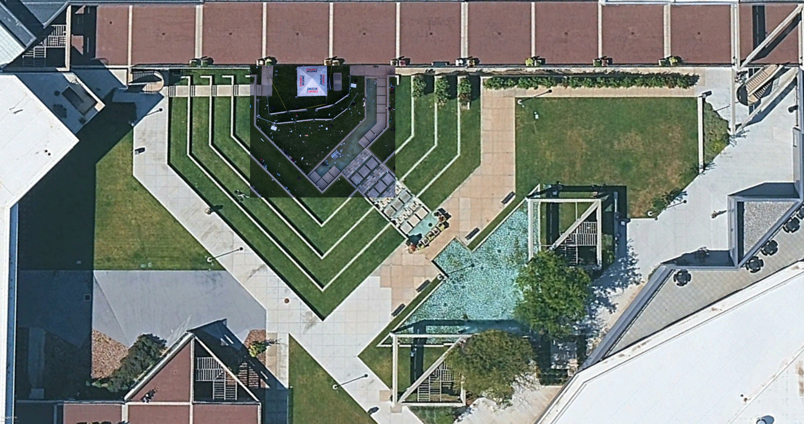
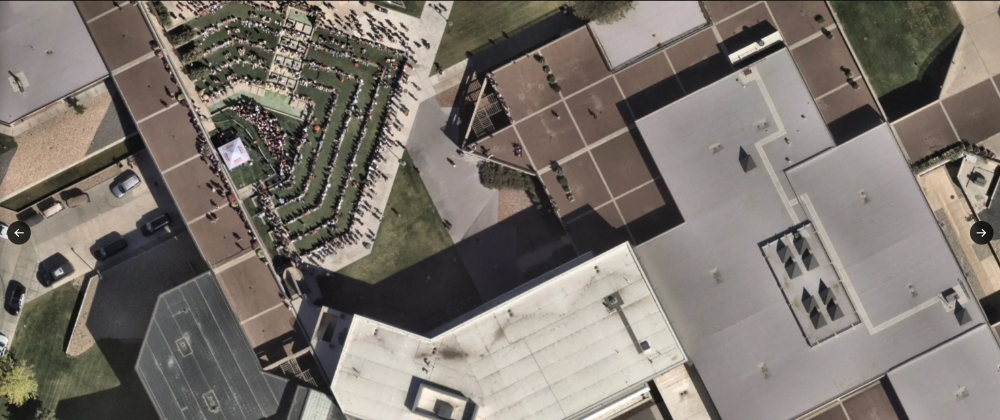
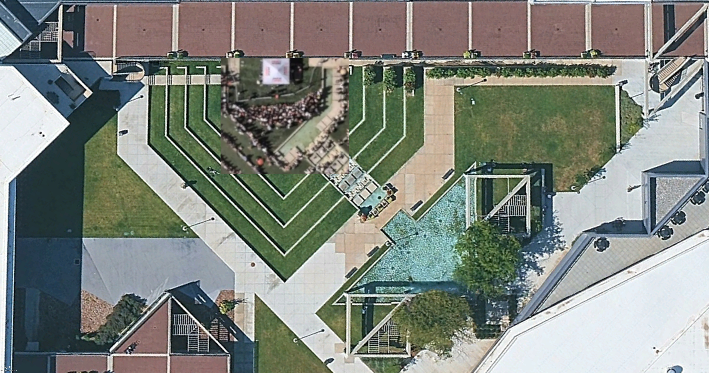
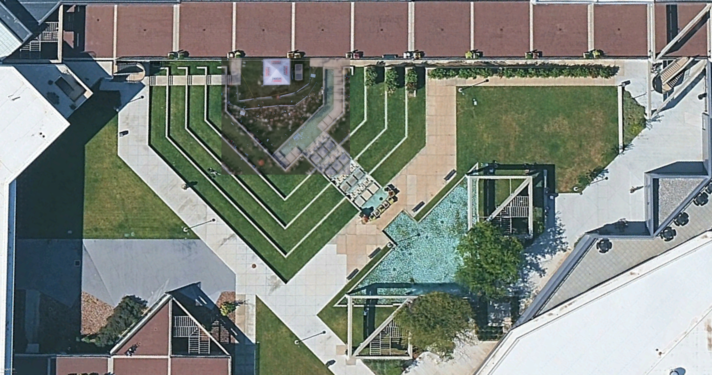
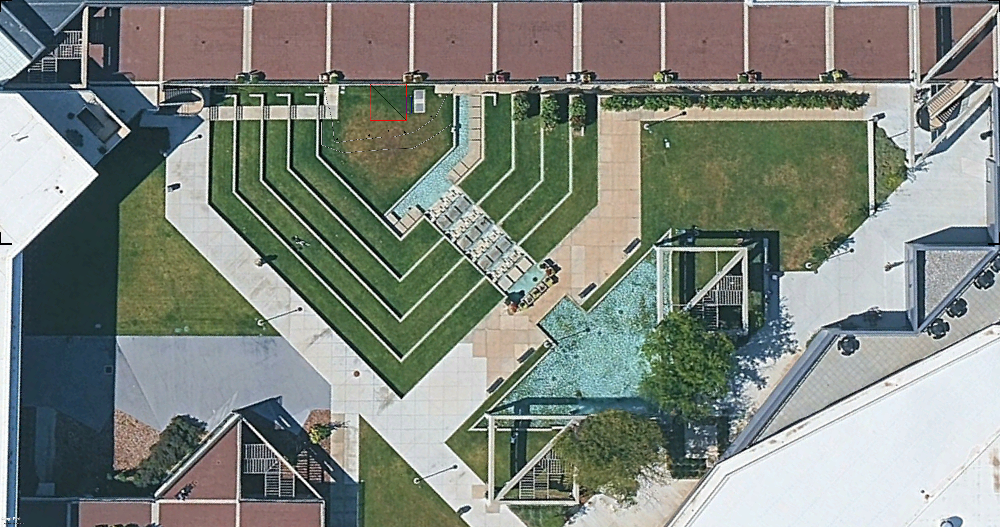

# Measurements for the Amphitheatre

## Summary

| #  | Feature                            | Editor Size (Pt) | Millimeters |  Ratio      | Notes                                                              |
|----|------------------------------------|------------------|-------------|-------------|--------------------------------------------------------------------|
| 1  | Google Earth yardstick             | 1102.00          | 14700.00    | 13.34       | Horiz & diag measurements                                          |
| 2  | Tent width & depth (east side)     | 297.00           | 3961.80     |             | Adjusted to be 13ft                                                |
| 3  | Barricade width                    | 182.77           | 2438.00     |             | Standard Size (8-foot): Approximately 2,438 mm (L) x 1,118 mm (H). |
| 4  | Barricade height                   |                  | 1118.00     |             |                                                                    |
| 5  | AV table width                     | 135.00           | 1800.82     |             |                                                                    |
| 6  | AV table front setback             | 60.00            | 800.36      |             |                                                                    |
| 7  | AV table rear setback              | 103.00           | 1373.96     |             |                                                                    |
| 8  | AV table overhang depth            | 42.50            | 566.92      |             | Full visible AV table depth is hidden                              |
| 9  |                                    |                  |             |             |                                                                    |
| 10 | Stage-area                         |                  |             |             |                                                                    |
| 11 | Center South speaker front setback | 121.92           | 1626.35     |             |                                                                    |
| 12 | Center North speaker front setback | 106.04           | 1414.46     |             |                                                                    |
| 13 | Audience microphone setfront       | 85.73            | 1143.61     |             |                                                                    |

Table estimated measurements

## Process

1. Acquire a 2D model of the Amphitheatre from Google Earth
2. Position stage using aftermath drone photo
3. Adjust stage using event setup drone photo
4. Take measurements
5. Create a low-fidelity model for use in other areas of analysis

### 1. Google Earth 2D base map

Figure google-earth-uvu-2d.jpg

The Google Earth map will form the base from which all other overlayed layers must their resolve their respective positioning with. 

This base layer map crucially acts as the basis of the local co-ordinate system for the forensic work. Note, two yardstick (both 14.7m) were modeled in the central lower-level Hall of Flags courtyard (beside the underpass). 

This layer's features and landmarks provide a direct mapping to latitude, longitude and altitude from Google Earth. Hence, the yardstick measurements provide the mapping between metres and pixels and from a local co-ordinate system to a GPS system.

### 2. Drone aftermath photo layer

Figure aftermath-drone-photo.png

The aftermath photo provides a high resolution photo of the stage and captures all the key features. Some of these features were moved in the panic and chaos that ensued. Further, the drone camera was slightly offset from center which thus required image transformations to resolve with the base Google Earth layer.

Note, the foot stools were used for the tent boundaries and the bottom of the barricades where used to remove the offset issue.

Figure aftermath-drone-photo-transformed-overlay.jpg

Using the overlayed aftermath photo we can now model the stage (ie. tent, barricaded & PA system speaker locations)

### 3. Drone setup photo layer

Figure setup-drone-photo.png

The setup drone photo was taken from a very high elevation. At the time the photo was taken, only the tent was erected and the barricades positioned. Note, The PA system speakers had still not been positioned. This photo will provide the basis for the adjusting of the "Prove Me Wrong" stage modeled previously.

Figure setup-drone-photo-transformed-overlay.jpg

The setup drone photo also need image transformations in order for it to be overlayed.

Using this layer we can now fine-tune the barricade positions as they were at the time of the "bang". 

### 4. Drone combined layer

Figure google-earth-uvu-2d-combined-overlay.jpg

### 5. Measurements

With the core stage features modeled, we can use both the horizontal and diagonal yardsticks measurements to measure the tent and barricade lengths.

Figure stage-model.svg

### 6. Model

Using the Google Earth 2D layer and the stage we can now create an amphitheatre model as an SVG image which can be incorporated into other areas for analysis.

Figure amphitheatre-model.jpg
