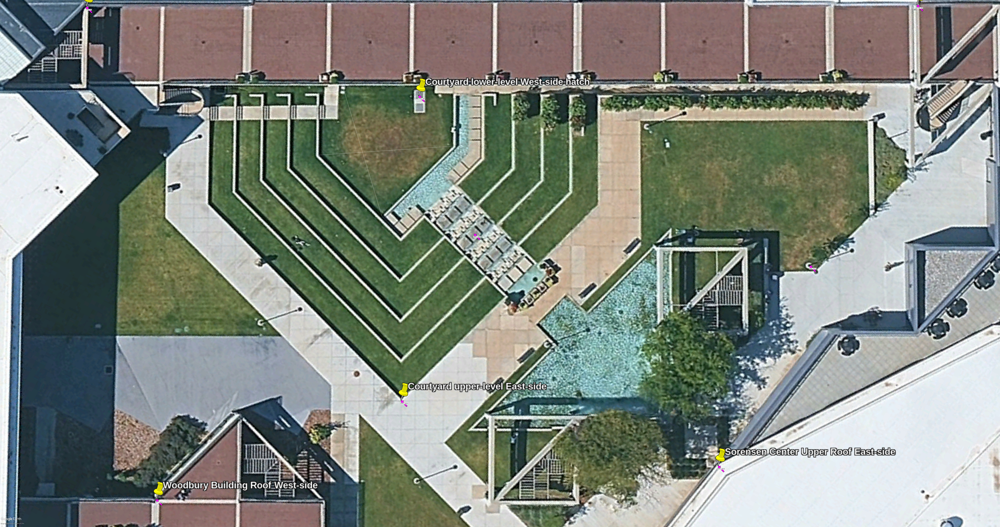

# Measurements for Perspective-n-Point (PnP) pose computation


## Summary

 
Table measurements


## Process

1. Establish a 2D GPS map for the scope of the world with placemarks from Google Earth
2. Export 2D map view and map to local World Co-ordinate System
3. Cross reference placemarks to local coordinate system
4. Test mapping resolution

1. Set the z-axis origin (ie. 0 value) to the elevation of the lower-level courtyard (1401m)
2. Scale all heights for the z-axis of the local model coordinate system


## 1. World Co-ordinate System Map


Figure google-earth-uvu-2d-mapping.jpg with cross referenced placemarks


## 2. Cross-Referenced Map


Figure Cross-referenced map with local coordinates


## 3. JSON configuration

```json world-coordinate-system_to_gps_base-placemarks.json
[
  {
    "Feature": "Hall of Flags Roof South-side",
    "x": "704",
    "y": "55",
    "lat": "40.277209",
    "lon": "-111.713974"
  },
  {
    "Feature": "Hall of Flags Roof North-side",
    "x": "7510",
    "y": "40",
    "lat": "40.277943",
    "lon": "-111.714458"
  },
  {
    "Feature": "Courtyard lower-level West-side hatch",
    "x": "3428",
    "y": "784",
    "lat": "40.277544",
    "lon": "-111.714064"
  },
  {
    "Feature": "Courtyard upper-level East-side",
    "x": "3297",
    "y": "3266",
    "lat": "40.277664",
    "lon": "-111.713705"
  },
  {
    "Feature": "Woodbury Building Roof West-side",
    "x": "1277",
    "y": "4092",
    "lat": "40.277494",
    "lon": "-111.713453"
  }
]
```

```json world-coordinate-system_to_gps_lamp-posts.json
[
  {
    "Feature": "HoF North lamp post",
    "x": "5287",
    "y": "1051",
    "lat": "40.277759",
    "lon": "-111.714159"
  },
  {
    "Feature": "HoF South lamp post",
    "x": "1348",
    "y": "1255",
    "lat": "40.277342",
    "lon": "-111.71385"
  },
  {
    "Feature": "Woodbury North lamp post",
    "x": "3421",
    "y": "3928",
    "lat": "40.277713",
    "lon": "-111.713622"
  },
  {
    "Feature": "Woodbury South lamp post",
    "x": "2164",
    "y": "2637",
    "lat": "40.277508",
    "lon": "-111.713713"
  },
  {
    "Feature": "Sorrensen North lamp post",
    "x": "6605",
    "y": "2175",
    "lat": "40.277961",
    "lon": "-111.714092"
  }
]
```

## 4. Test resolution of mapper

```json test-case-input.json
[
    {
        "Feature": "Water feature center square",
        "x": 3882, 
        "y": 1916
    },
    {
        "Feature": "Water feature lamp post",
        "x": 4476, 
        "y": 2823
    },
    {
        "Feature": "Subject Facing Point",
        "x": 3180, 
        "y": 4319
    }
]
```

```bash
$ python ../tools/2.world-coordinate-system.py -v -m world-coordinate-system_to_gps_lamp-posts.json -i test-case-input.json -o output.json 
--- Mapping Model Status ---
RMSE: 0.00000129 Degrees
Approximate ground error: 0.143 meters
----------------------------
Successfully processed 3 entries to output.json
```

```json output.json
[
    {
        "lat": 40.27765324578341,
        "lon": -111.71393670919618
    },
    {
        "lat": 40.27776700183629,
        "lon": -111.7138512434923
    },
    {
        "lat": 40.27770851931429,
        "lon": -111.7135491343376
    }
]
```


## 5. Height measurements


| #  | Feature                                 | P-n-P height | Millimeters | Elevation Offset | POI-Elevation |  Ratio | Base elevation (m) | Notes |
|----|-----------------------------------------|--------------|-------------|------------------|---------------|--------|--------------------|-------|
| 1  | Amphitheatre                            |              |             |                  |               |        |                    |       |
| 2  | Google Earth yardstick                  | 1102.00      | 14700.00    |                  |               | 13.34  | 1401               |       |
| 3  |                                         |              |             |                  |               |        |                    |       |
| 4  |                                         | Z-value      |             |                  |               |        |                    |       |
| 5  | Tent                                    |              |             |                  |               |        |                    |       |
| 6  | Tent height                             | 198.00       | 2641.20     | 0                | 1401.00       |        |                    |       |
| 7  | Tent roof height (wrt center)           | 315.10       | 4203.20     | 0                | 1401.00       |        |                    |       |
| 8  | Tent banner lightning rod center height | 187.27       | 2498.04     | 0                | 1401.00       |        |                    |       |
| 9  | Tent banner bottom height               | 171.17       | 2283.31     | 0                | 1401.00       |        |                    |       |
| 10 |                                         |              |             |                  |               |        |                    |       |
| 11 | Tables                                  |              |             |                  |               |        |                    |       |
| 12 | Charlie’s Table height                  | 71.60        | 955.13      | 0                | 1401.00       |        |                    |       |
| 13 | AV Table height                         | 54.73        | 730.00      | 0                | 1401.00       |        |                    |       |
| 14 |                                         |              |             |                  |               |        |                    |       |
| 15 | Stage-area                              |              |             |                  |               |        |                    |       |
| 16 | Barricade height                        | 83.81        | 1118.00     | 0                | 1401.00       |        |                    |       |
| 17 | Speaker tripod base height              | 67.26        | 897.19      | 0                | 1401.00       |        |                    |       |
| 18 | Center north speaker height             | 188.45       | 2513.78     | 0                | 1401.00       |        |                    |       |
| 19 | Center south speaker height             | 177.40       | 2366.41     | 0                | 1401.00       |        |                    |       |
| 20 | North speaker height                    | 204.81       | 2732.08     | 0                | 1401.00       |        |                    |       |
| 21 | South speaker height                    | 221.68       | 2957.02     | 0                | 1401.00       |        |                    |       |
| 22 | Audience microphone stand               | 102.69       | 1369.80     | 0                | 1401.00       |        |                    |       |
| 23 |                                         |              |             |                  |               |        |                    |       |
| 24 | People                                  |              |             |                  |               |        |                    |       |
| 25 | Charlie’s head height (center)          | 139.85       | 1865.45     | 0                | 1401.00       |        |                    |       |
| 26 | Hunter’s head height (center)           | 139.69       | 1863.33     | 0                | 1401.00       |        |                    |       |


# References

1. https://docs.opencv.org/4.x/d5/d1f/calib3d_solvePnP.html