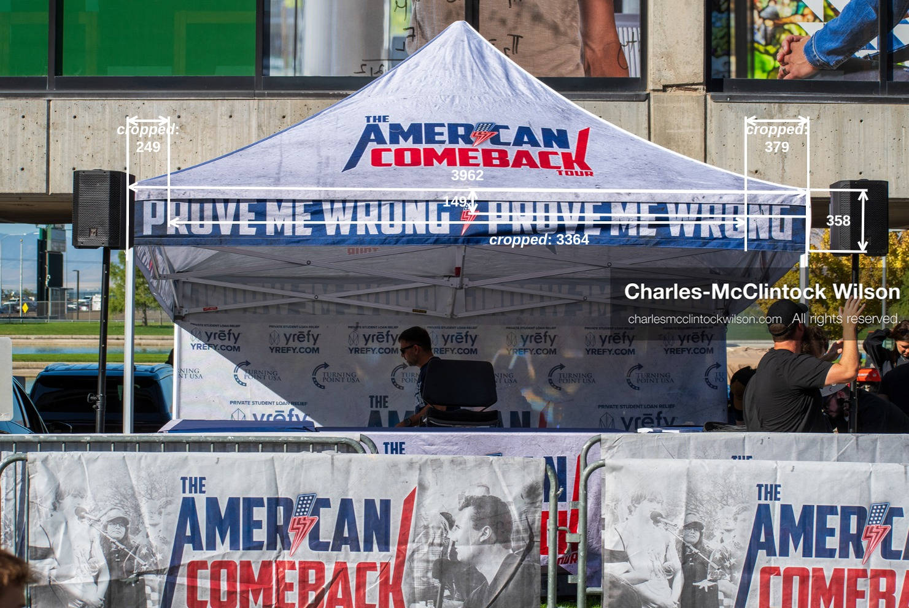
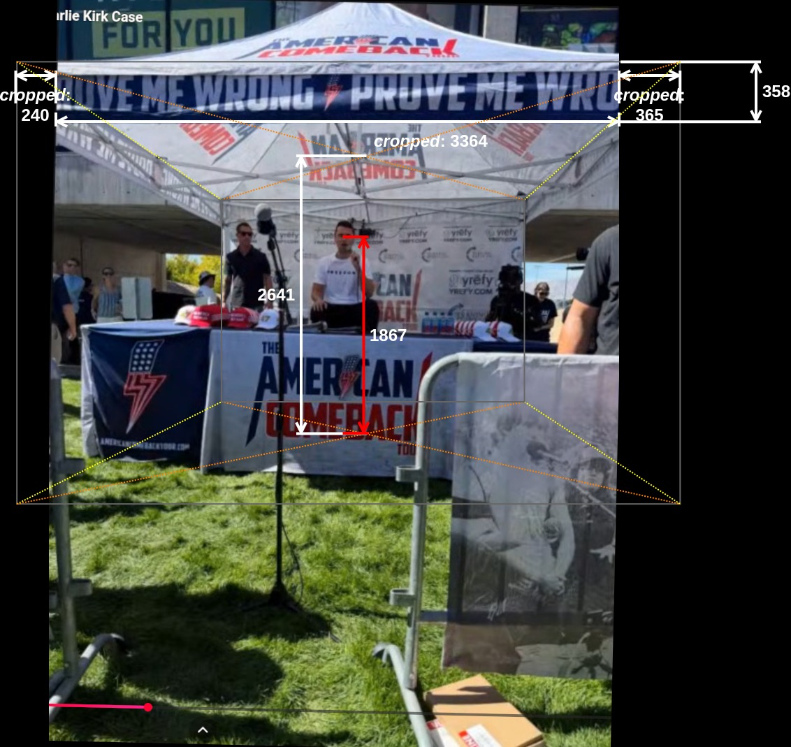
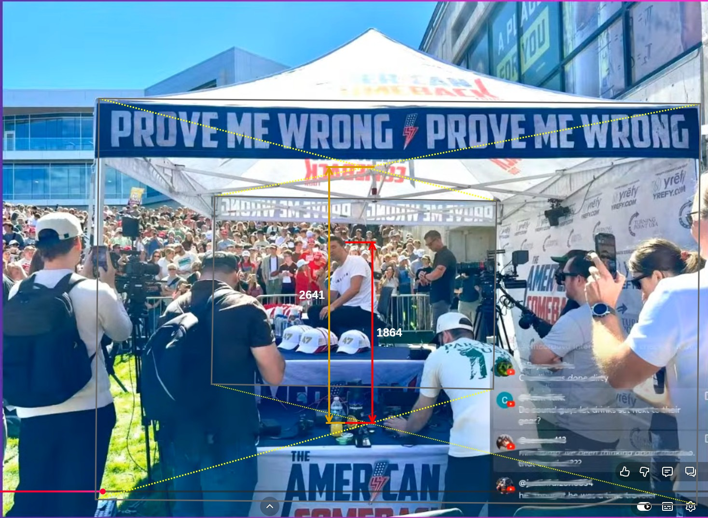
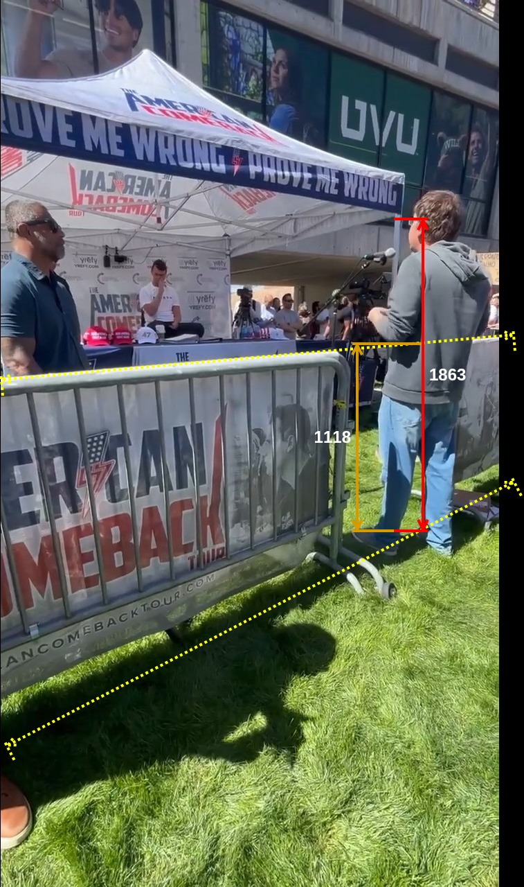

# Measurements for the people on the stage

## Summary

| #  | Feature                               | Editor Size (Pt) | Millimeters |  Ratio | Notes               |
|----|---------------------------------------|------------------|-------------|--------|---------------------|
| 1  | Charlie east side view                |                  |             |        |                     |
| 2  | Tent width                            | 1107.00          | 3961.80     | 3.58   |                     |
| 3  | Cropped central banner                | 940.00           | 3364.13     |        |                     |
| 4  | Cropped south banner                  | 67.00            | 239.78      |        |                     |
| 5  | Cropped north banner                  | 102.00           | 365.04      |        |                     |
| 6  | Banner height                         | 100.00           | 357.89      |        |                     |
| 7  | Banner red lightning rod              | 40.00            | 143.15      |        |                     |
| 8  |                                       |                  |             |        |                     |
| 9  | Charlie east side view                |                  |             |        |                     |
| 10 | Cropped central banner                | 806.00           | 3364.13     | 4.17   |                     |
| 11 | Cropped south banner                  | 57.45            | 239.78      |        |                     |
| 12 | Cropped north banner                  | 87.46            | 365.04      |        |                     |
| 13 | Banner height                         | 85.74            | 357.89      |        |                     |
| 14 | Tent width (wrt east)                 | 949.19           | 3961.80     |        |                     |
| 15 | Tent height (wrt east)                | 632.80           | 2641.20     |        |                     |
| 16 | Tent width (wrt west)                 | 433.50           | 3961.80     | 9.14   |                     |
| 17 | Tent height (wrt west)                | 289.00           | 2641.20     |        |                     |
| 18 | Tent height (wrt center)              | 397.50           | 2641.20     | 6.64   |                     |
| 19 | Charlie’s head height                 | 281.00           | 1867.11     |        |                     |
| 20 |                                       |                  |             |        |                     |
| 21 | Charlie north side view               |                  |             |        |                     |
| 22 | Tent width (wrt north facing)         | 1246.00          | 3961.80     | 3.18   |                     |
| 23 | Tent height (wrt north facing)        | 830.67           | 2641.20     |        |                     |
| 24 | Tent width (wrt south facing)         | 584.00           | 3961.80     | 6.78   |                     |
| 25 | Tent height (wrt south facing)        | 389.33           | 2641.20     |        |                     |
| 26 | Tent height (wrt center)              | 530.00           | 2641.20     | 4.98   | AVG:                |
| 27 | Charlie’s head height                 | 374.00           | 1863.79     |        | 1865.45             |
| 28 |                                       |                  |             |        |                     |
| 29 | Hunter south east view                |                  |             |        |                     |
| 30 | Barricade height (wrt Hunter)         | 270.00           | 1118.00     | 4.14   | Use standard height |
| 31 | Hunter’s height height                | 450.00           | 1863.33     |        |                     |
| 32 |                                       |                  |             |        |                     |
| 33 | Model                                 |                  |             |        |                     |
| 34 | Tent width                            | 297.00           | 3961.80     | 13.34  |                     |
| 35 | Large peoples Head est. front-to-back | 16.49            | 220.00      |        |                     |
| 36 | Large peoples Head est. side-to-side  | 13.49            | 180.00      |        |                     |

Table estimated measurements


| # |                        | P-n-P                   | Millimeters |        |                  |  Ratio            | Base elevation (m) |
|---|------------------------|-------------------------|-------------|--------|------------------|-------------------|--------------------|
| 1 | Google Earth yardstick | 1102.00                 | 14700.00    |        |                  | 13.34             | 1401               |
| 2 |                        |                         |             |        |                  |                   |                    |
| 3 |                        | World-coordinate-system |             |        | Google-earth-GPS |                   |                    |
| 4 | Feature                | x                       | y           | z      | lat              | lon               | elevation          |
| 5 | Charlie’s head         | 3181.00                 | 847.00      | 139.85 | 40.277519073779  | -111.714037375903 | 1402.865450        |
| 6 | Hunter’s height        | 3182.00                 | 1119.00     | 139.69 | 40.277534031752  | -111.71399920292  | 1402.863333        |

Table coordinate system cross-reference


```json people-mapping.json
[
  {
    "Feature": "Charlie Kirk",
    "x": "3134",
    "y": "236"
  },
  {
    "Feature": "Hunter Kozak",
    "x": "3095", 
    "y": "449"
  }
]
```

```bash
$ python ../tools/world-coordinate-system.py -v world-coordinate-system_to_gps_lamp-posts.json people/people-mapping.json  people/people-mapping-out.json
--- Mapping Model Status ---
RMSE: 0.00000129 Degrees
Approximate ground error: 0.143 meters
----------------------------
Successfully processed 2 entries to people/people-mapping-out.json
```

```json people-mapping-out.json
[
    {
        "lat": 40.27751907377901,
        "lon": -111.71403737590329
    },
    {
        "lat": 40.27753403175204,
        "lon": -111.71399920292015
    }
]
```

## Process

1. Establish tent in context
2. Calculate cropped banner sizes for other photos
3. Calculate Charlie's middle of the head height above ground
4. Calculate Hunter's middle of the head height above ground

## 1. Stage overhead view

Figure stage-model.svg


### 2. East side view


Figure east-side-view-measurement.jpg


### 3. Charlie east side view


Figure charlie-east-side-view-measurement.jpg


### 4. Charlie north side view


Figure charlie-north-side-view-measurement.jpg


### 5. Hunter south east view


Figure hunter-south-east-view-measurement.jpg


### 6. People Model


Figure people-model-with-stage.svg

