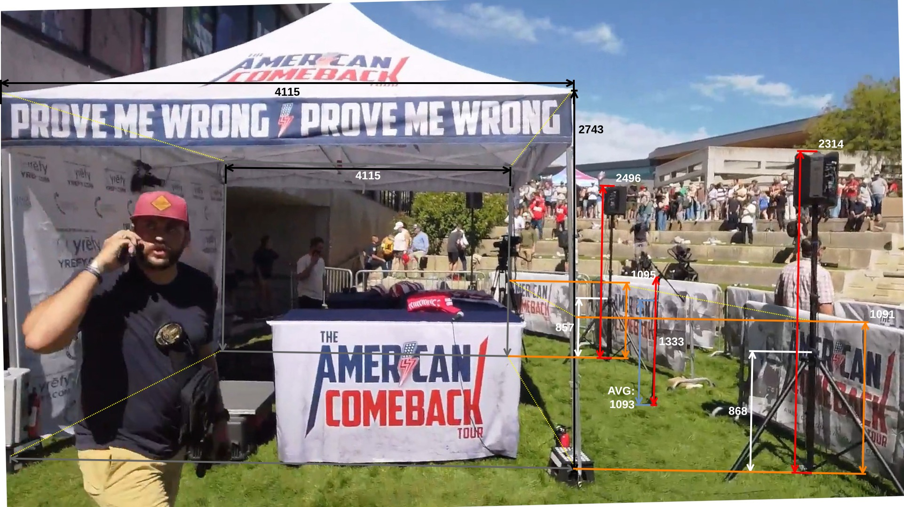
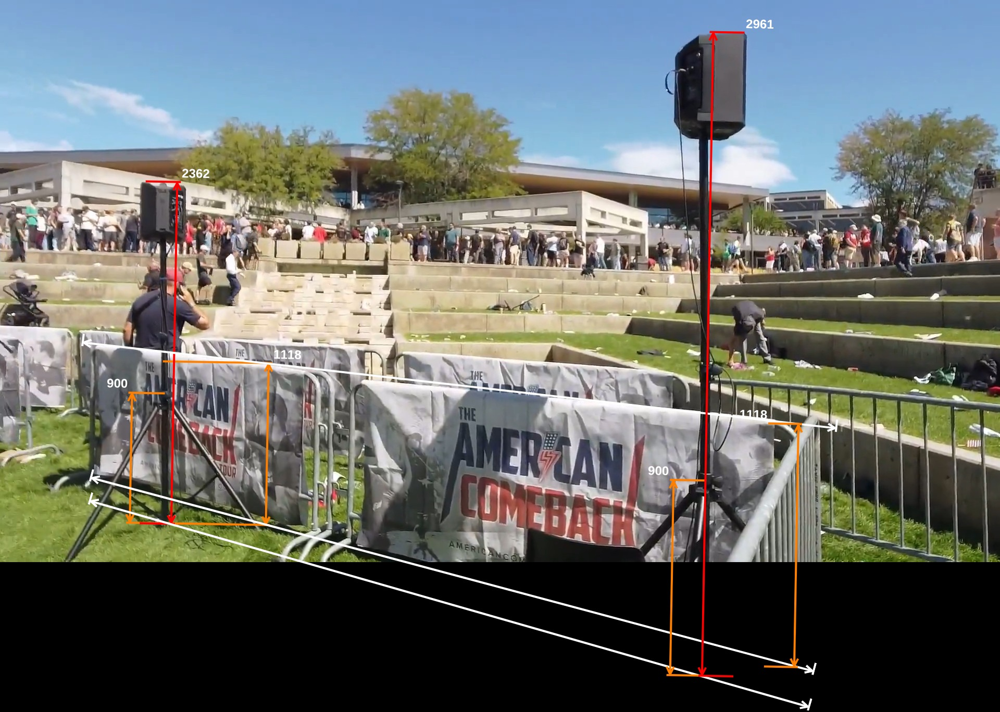
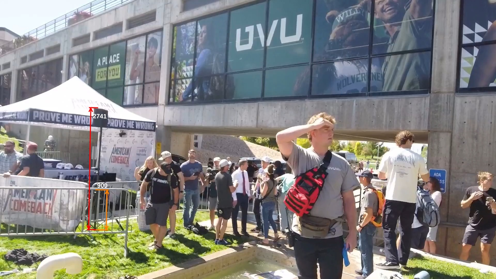
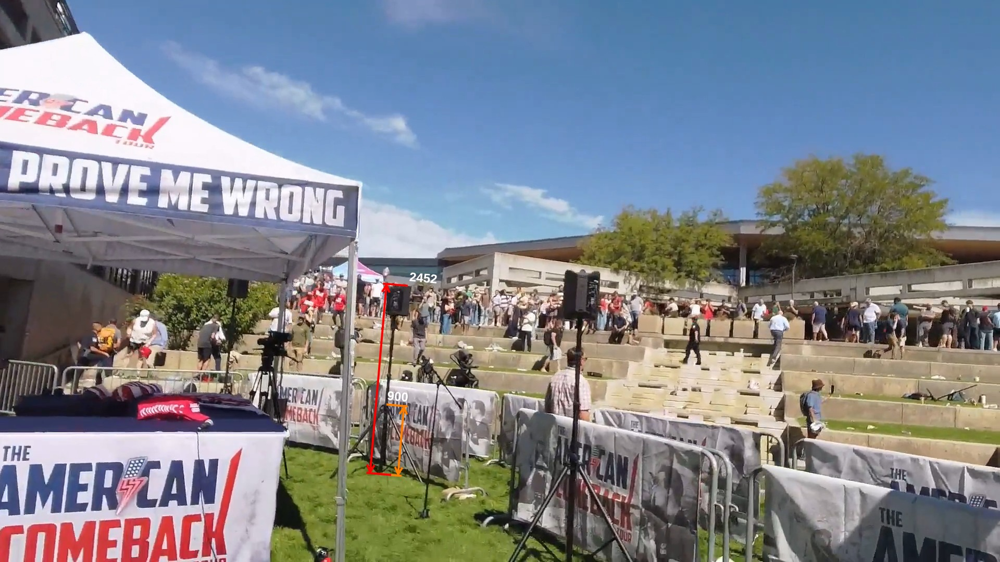
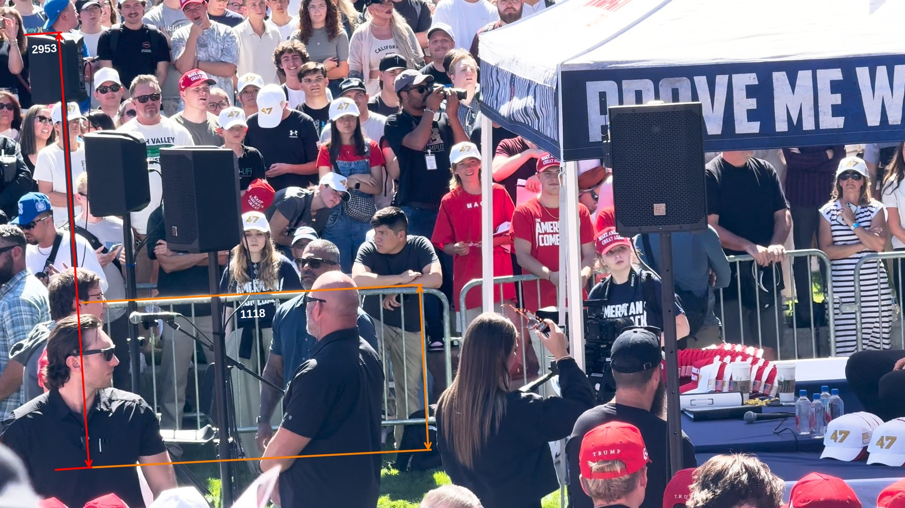

# Measurements for the stage area

## Summary

| #  | Feature                                     | Editor Size (Pt) | Millimeters |  Ratio | Notes                                    |
|----|---------------------------------------------|------------------|-------------|--------|------------------------------------------|
| 1  | South side view                             |                  |             |        |                                          |
| 2  | Tent height (south side)                    | 812.00           | 2743.23     | 3.38   |                                          |
| 3  | barricade height (south side)               | 323.00           | 1091.21     |        |                                          |
| 4  | Center south speaker height                 | 685.00           | 2314.18     |        |                                          |
| 5  | Tent height (north side)                    | 403.33           | 2743.23     | 6.80   |                                          |
| 6  | barricade height (north side)               | 161.00           | 1095.03     |        |                                          |
| 7  | Center north speaker height                 | 367.00           | 2496.13     |        |                                          |
| 8  | barricade height average                    | 223.00           | 1093.12     | 4.90   |                                          |
| 9  | Audience microphone stand                   | 272.00           | 1333.31     |        |                                          |
| 10 | Center south speaker tripod base            | 257.00           | 868.24      |        |                                          |
| 11 | Center north speaker tripod base            | 126.00           | 856.98      |        |                                          |
| 12 |                                             |                  |             |        |                                          |
| 13 | Center south speaker facing north east view |                  |             |        |                                          |
| 14 | barricade height (north side)               | 311.00           | 1118.00     | 3.59   | note, using standard height of barricade |
| 15 | Center south speaker tripod base            | 250.00           | 898.71      |        |                                          |
| 16 | Center south speaker height                 | 657.00           | 2361.82     |        |                                          |
| 17 | barricade height (south side)               | 467.00           | 1118.00     | 2.39   |                                          |
| 18 | South speaker tripod base                   | 375.00           | 897.75      |        |                                          |
| 19 | South speaker height                        | 1237.00          | 2961.38     |        |                                          |
| 20 |                                             |                  |             |        |                                          |
| 21 | North speaker facing south west view        |                  |             |        |                                          |
| 22 | Speaker tripod base                         | 155.00           | 900.00      | 5.81   | using height from previous calc          |
| 23 | North speaker height                        | 472.00           | 2740.65     |        |                                          |
| 24 |                                             |                  |             |        |                                          |
| 25 | Central speakers facing north east view     |                  |             |        |                                          |
| 26 | Speaker tripod base                         | 134.00           | 900.00      | 6.72   | using height from previous calc          |
| 27 | North speaker height                        | 365.00           | 2451.49     |        |                                          |
| 28 |                                             |                  |             |        |                                          |
| 29 | South speaker facing south view             |                  |             |        |                                          |
| 30 | barricade height                            | 351.00           | 1118.00     | 3.19   | note, using standard height of barricade |
| 31 | Center south speaker height                 | 927.00           | 2952.67     |        |                                          |

Table measurements

## Process

1. Calculate barricade height
2. Calculate speaker tripod stand height
3. Calculate central north, south speaker heights & audience microphone stand height
4. Calculate north & south speaker heights

## 1. Stage overhead view

Figure stage-model.svg

### 2. South side view

Figure south-side-view-measurement.jpg

### 3. Center south speaker facing north east view

Figure center-south-speaker-facing-north-east-view-measurement.jpg

### 4. North speaker facing south west view

Figure north-speaker-facing-south-west-view-measurement.jpg

### 5. Central speakers facing north east view

Figure central-speakers-facing-north-east-view-measurement.jpg

### 6. South speaker facing south view

Figure south-speaker-facing-south-view-measurement.jpg

