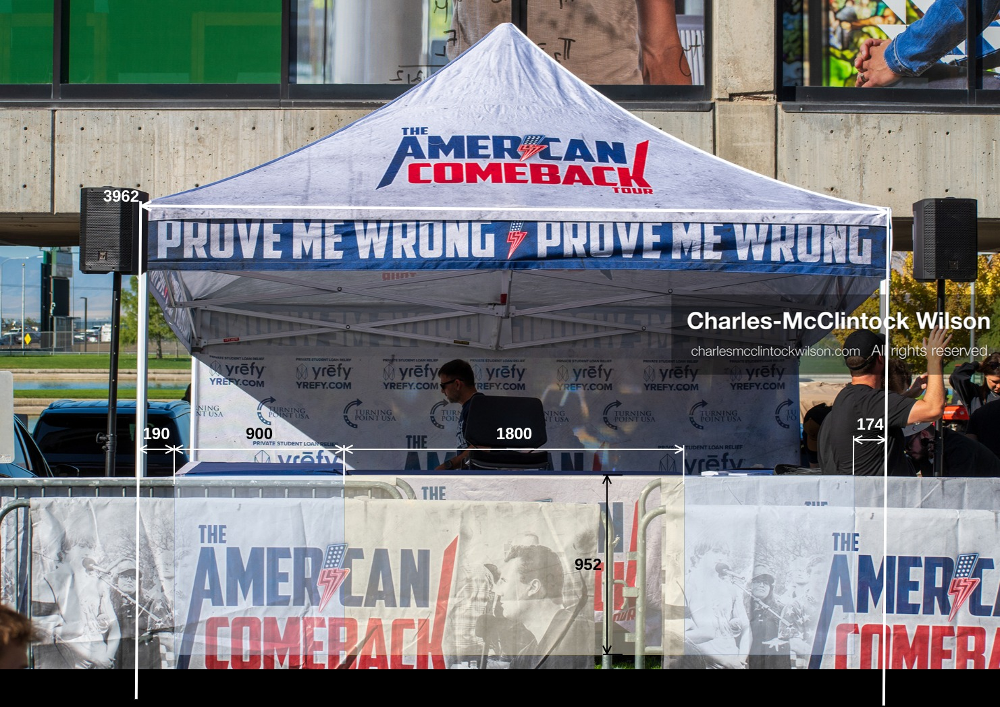
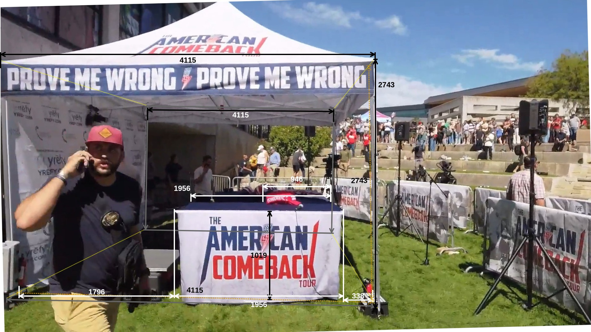
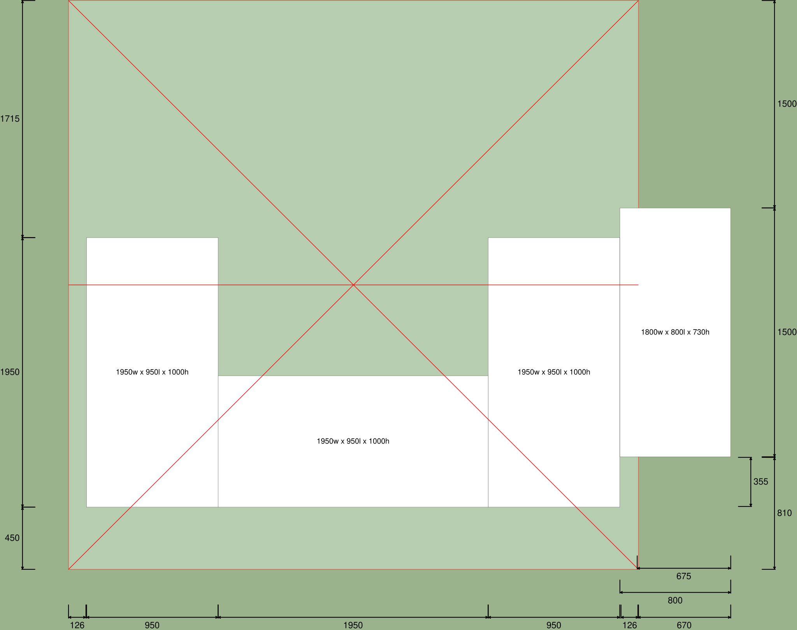
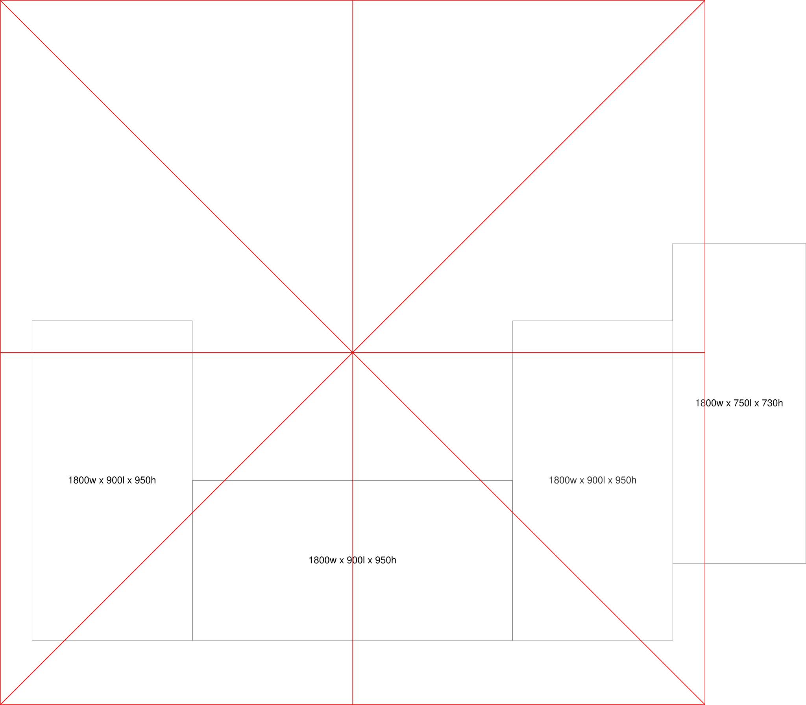

# Measurements for the tent tables

## Summary

| #  | Feature                                        | Editor Size (Pt) | Millimeters |  Ratio | Notes                                            |
|----|------------------------------------------------|------------------|-------------|--------|--------------------------------------------------|
| 1  | East side view                                 |                  |             |        |                                                  |
| 2  | East side Tent width                           | 1107.00          | 3961.80     | 3.58   |                                                  |
| 3  | East side Tent height                          | 738.00           | 2641.20     |        |                                                  |
| 4  | South side Table setback                       | 53.00            | 189.68      |        |                                                  |
| 5  | South side Table depth                         | 251.50           | 900.08      |        |                                                  |
| 6  | East side Table width                          | 503.00           | 1800.17     |        |                                                  |
| 7  | North side Table setback                       | 48.50            | 173.57      |        |                                                  |
| 8  | Avg. north/south table setbacks                | 50.75            | 181.63      |        | Use avg due to camera angle                      |
| 9  | Table height                                   | 266.00           | 951.98      |        |                                                  |
| 10 | AV Table height                                |                  | 730.00      |        | Use 1800 x 750 x 730mm: Standard 6ft (Seats 6–8) |
| 11 |                                                |                  |             |        |                                                  |
| 12 | South side view                                |                  |             |        |                                                  |
| 13 | North side Tent width                          | 605.00           | 3961.80     | 6.55   |                                                  |
| 14 | North side Tent height                         | 403.33           | 2641.20     |        |                                                  |
| 15 | South side Tent width                          | 1218.00          | 3961.80     | 3.25   |                                                  |
| 16 | South side Tent height                         | 812.00           | 2641.20     |        |                                                  |
| 17 | South side Tent width (wrt south-side table)   | 1170.00          | 3961.80     | 3.39   |                                                  |
| 18 | South side Table width                         | 531.50           | 1799.74     |        |                                                  |
| 19 | South side Table front setback (wrt east side) | 106.00           | 358.93      |        |                                                  |
| 20 | South side Table rear setback (wrt west side)  | 532.00           | 1801.43     |        |                                                  |
| 21 | South side Table width (wrt north end)         | 455.00           | 1799.74     | 3.96   |                                                  |
| 22 | East side Table depth                          | 220.00           | 870.20      |        |                                                  |
| 23 | South side Tent height (wrt south-side table)  | 762.00           | 2641.20     | 3.47   | AVG                                              |
| 24 | South side Table height                        | 283.00           | 958.28      |        | 955.13                                           |

Table estimated measurements

## Process

1. Establish tent in context
2. Calculate the triad of stage table widths
3. Calculate the gap to the right of the RHS table
4. Calculate main table heights

## 1. Stage overhead view

Figure stage-model.svg

### 2. East side view

Figure east-side-view-measurement.jpg

### 3. South side view

Figure south-side-view-measurement.jpg

### 4. Tables Model

Figure tables-model.svg

Figure tables-model-no-measurement.svg
