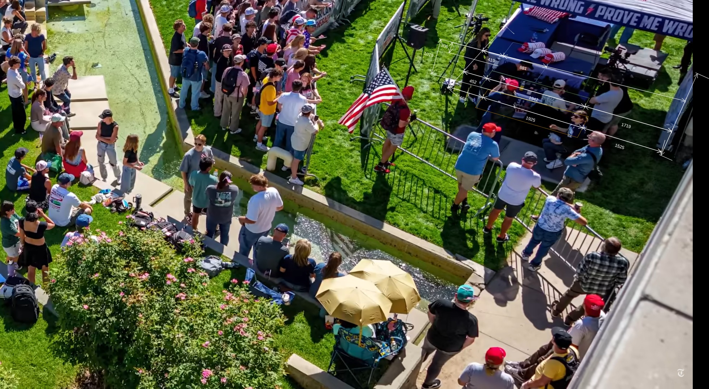
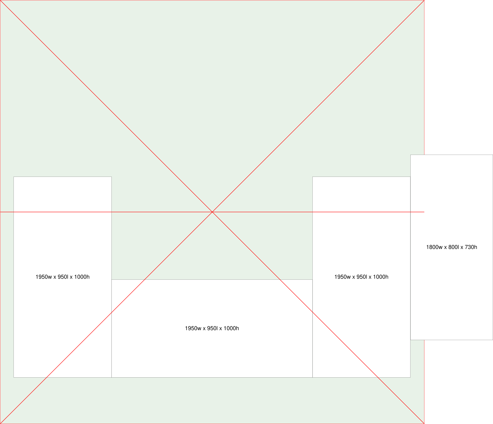

# Measurements for the tent tables

## Summary

| #  | Feature                                        | Editor Size (Pt) | Millimeters |  Ratio | Notes                                         |
|----|------------------------------------------------|------------------|-------------|--------|-----------------------------------------------|
| 1  | East side view                                 |                  |             |        |                                               |
| 2  | East side Tent width                           | 1107.00          | 4114.84     | 3.72   |                                               |
| 3  | East side Tent height                          | 738.00           | 2743.23     |        |                                               |
| 4  | South side Table setback                       | 50.00            | 185.86      |        |                                               |
| 5  | North side Table setback                       | 18.00            | 66.91       |        |                                               |
| 6  | Avg. north/south table setbacks                | 34.00            | 126.38      |        |                                               |
| 7  | South side Table depth                         | 254.50           | 946.00      |        |                                               |
| 8  | East side Table width                          | 530.00           | 1970.07     |        |                                               |
| 9  |                                                |                  |             |        |                                               |
| 10 | South side view                                |                  |             |        |                                               |
| 11 | North side Tent width                          | 605.00           | 4114.84     | 6.80   |                                               |
| 12 | North side Tent height                         | 403.33           | 2743.23     |        |                                               |
| 13 | South side Tent width                          | 1218.00          | 4114.84     | 3.38   |                                               |
| 14 | South side Tent height                         | 812.00           | 2743.23     |        |                                               |
| 15 | South side Tent width (wrt south-side table)   | 1157.00          | 4114.84     | 3.56   |                                               |
| 16 | South side Table width                         | 550.00           | 1956.06     |        |                                               |
| 17 | South side Table front setback (wrt east side) | 95.00            | 337.87      |        |                                               |
| 18 | South side Table rear setback (wrt west side)  | 505.00           | 1796.02     |        |                                               |
| 19 | South side Table width (wrt north end)         | 455.00           | 1956.06     | 4.30   |                                               |
| 20 | East side Table depth                          | 220.00           | 945.79      |        |                                               |
| 21 | South side Tent height (wrt south-side table)  | 762.00           | 2743.23     | 3.60   |                                               |
| 22 | South side Table height                        | 286.50           | 1018.93     |        | Applies to all tables except the AV table     |
| 23 |                                                |                  |             |        |                                               |
| 24 | Elevated north side view                       |                  |             |        |                                               |
| 25 | Tent width (wrt AV Table)                      | 618.00           | 4114.84     | 6.66   |                                               |
| 26 | AV table front setback                         | 119.00           | 792.34      |        |                                               |
| 27 | AV table width                                 | 270.00           | 1797.75     |        |                                               |
| 28 | AV table rear setback                          | 229.00           | 1524.76     |        |                                               |
| 29 | Tent width (wrt RHS Table)                     | 600.00           | 4114.84     | 6.86   |                                               |
| 30 | RHS table front setback                        | 65.91            | 452.02      |        |                                               |
| 31 | RHS table width                                | 283.11           | 1941.59     |        |                                               |
| 32 | RHS table rear setback                         | 250.69           | 1719.25     |        |                                               |
| 33 | Tent width (wrt Center Table)                  | 579.00           | 4114.84     | 7.11   |                                               |
| 34 | Center table front setback                     | 59.00            | 419.30      |        |                                               |
| 35 | Center table depth                             | 124.00           | 881.24      |        |                                               |
| 36 | Tent width (wrt LHS table)                     | 559.00           | 4114.84     | 7.36   |                                               |
| 37 | LHS table front setback                        | 54.00            | 397.50      |        |                                               |
| 38 | LHS table width                                | 260.50           | 1917.56     |        |                                               |
| 39 | LHS table rear setback                         | 244.00           | 1796.10     |        |                                               |
| 40 | RHS table height                               | 100.00           | 1018.93     | 10.19  |                                               |
| 41 | AV table height delta                          | 30.00            | 305.68      |        |                                               |
| 42 | AV table height                                |                  | 713.25      |        | Subtract delta from north facing table height |
 
Table measurements

## Process

1. Establish tent in context
2. Calculate the triad of stage table widths
3. Calculate the gap to the right of the RHS table
4. Calculate main table heights
5. Calculate AV table dimensions

## 1. Stage overhead view

Figure stage-model.svg

### 2. East side view

Figure east-side-view-measurement.jpg

### 3. South side view

Figure south-side-view-measurement.jpg

### 4. Elevated north side view

Figure elevated-north-side-view-measurement.jpg

### 5. Tables Model

Figure tables-model.svg

Figure tables-no-measurement.svg
