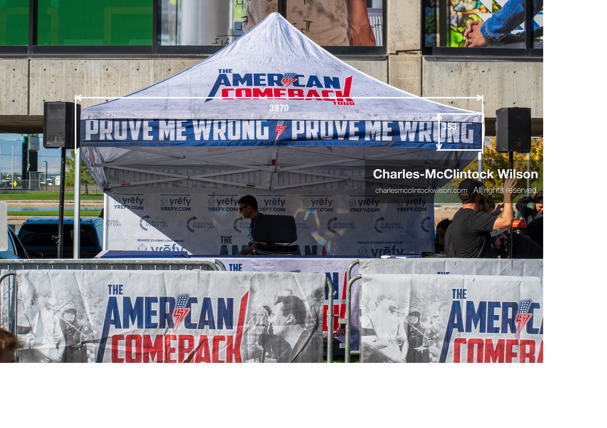
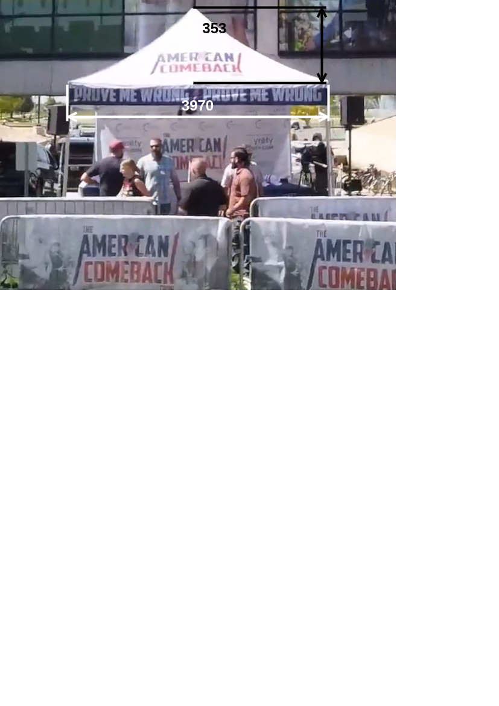

# Measurements for the "Prove Me Wrong" Tent and bounded features

The tent's measurents calculated herein are progressively derived from previously calculated features. Therefore, the order in which features are covered are 

Using the tent length of 3970mm from the [UVU amphitheatre measurements](../uvu-amphitheatre-model/uvu-amphitheatre.md).

| **Feature**   | **Editor Size (Pt)** | **Millimetres** | **Ratio**   |
|---------------|----------------------|-----------------|-------------|
| Banner width  | 1110                 | 3970.00         | 3.58        |
| Banner height | 98.62                | 352.72          |             |
|               |                      |                 |             |
| Roof width    | 656                  | 3970.00         | 6.05        |
| Roof height   | 125                  | 756.48          |             |

