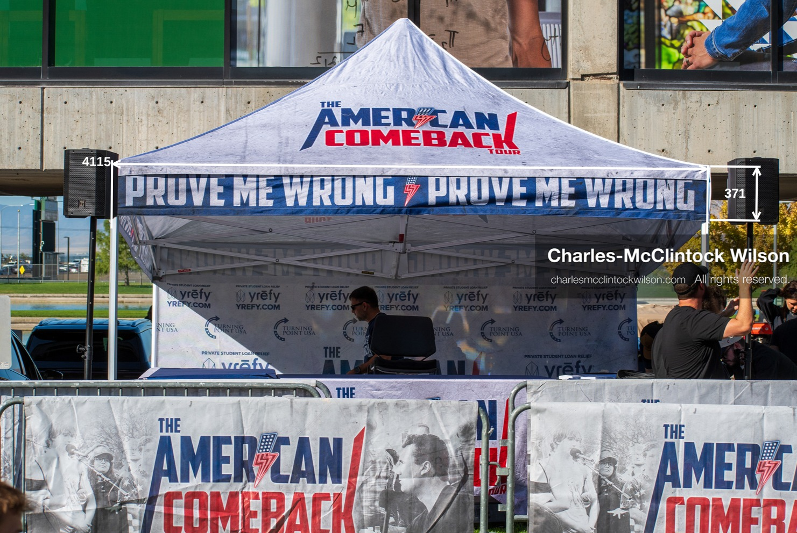
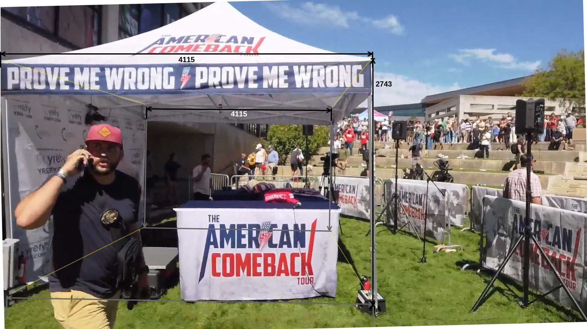
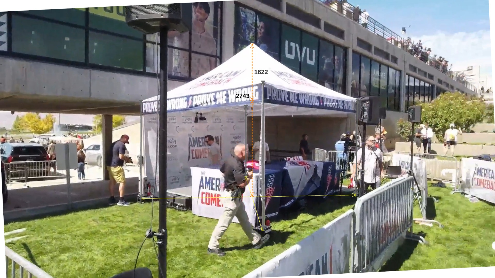
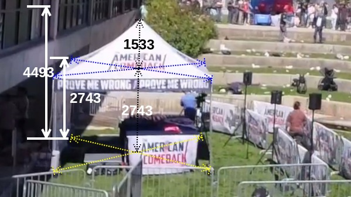

# Measurements for the "Prove Me Wrong" Tent

## Summary

| #  | Feature                                  | Editor Size (Pt) | Millimeters |  Ratio | Notes                  |
|----|------------------------------------------|------------------|-------------|--------|------------------------|
| 1  | East side view                           |                  |             |        |                        |
| 2  | Tent width                               | 1107.00          | 4114.84     | 3.72   |                        |
| 3  | Tent height                              | 738.00           | 2743.23     |        |                        |
| 4  |                                          |                  |             |        |                        |
| 5  | South side view                          |                  |             |        |                        |
| 6  | South side Tent width                    | 1218.00          | 4114.84     | 3.38   |                        |
| 7  | South side Tent height                   | 812.00           | 2743.23     |        |                        |
| 8  | North side Tent width                    | 605.00           | 4114.84     | 6.80   |                        |
| 9  | North side Tent height                   | 403.33           | 2743.23     |        |                        |
| 10 |                                          |                  |             |        |                        |
| 11 | South east side view                     |                  |             |        |                        |
| 12 | Tent height (wrt center)                 | 372.00           | 2743.23     | 7.37   |                        |
| 13 | Tent roof height (wrt center)            | 220.00           | 1622.34     |        | Preferred calculations |
| 14 |                                          |                  |             |        |                        |
| 15 | Elevated south side view                 |                  |             |        |                        |
| 16 | North side Tent height (wrt west facing) | 138.00           | 2743.23     | 19.88  |                        |
| 17 | HoF lower window height                  | 226.00           | 4492.53     |        |                        |
| 18 | Tent height (wrt center)                 | 143.00           | 2743.23     | 19.18  |                        |
| 19 | Tent roof height (wrt center)            | 83.00            | 1592.22     |        |                        |

Table measurements

## Process

1. Establish tent in context
2. Calculate banner sizes
3. Calculate tent height on the south side
4. Calculate tent roof top height
5. Calculate lower Hall of Flags building lower window

## 1. Stage overhead view

Figure stage-model.svg

### 2. East side view

Figure east-side-view-measurement.jpg

### 3. South side view

Figure south-side-view-measurement.jpg

### 4. South-East side view

Figure south-east-side-view-measurement.jpg

### 5. Elevated South side view

Figure elevated-south-side-view-measurement.jpg