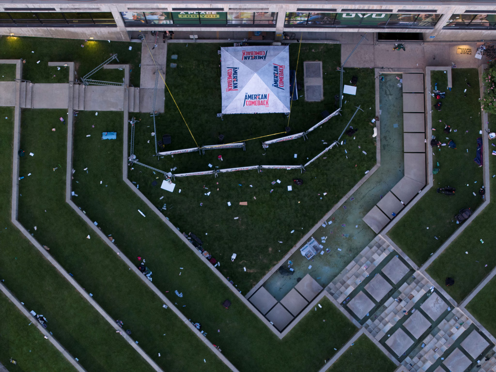

# Measurements for the UVU Amphitheatre

The UVU ampitheatre courtyard by the Hall of Flags building was the venue for the TPUSA "Prove Me Wrong" event.

## Calculated ratios & feature sizes

| **Feature**         | **Editor Size (Pt)** | **Millimetres** | **Ratio** | **Formula** |
|---------------------|----------------------|-----------------|-----------|-------------|
| Google Earth length | 1009.21              | 14700           | 14.57     |=C3/B3       |
| Tent width & depth  | 272.50               | 3969            |           |=B4*$D$3     |
| Barricade length    | 172.00               | 2505            |           |=B5*$D$3     |

