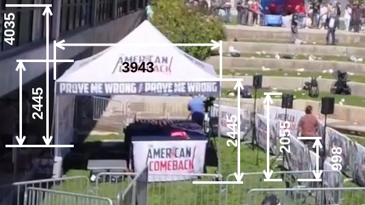
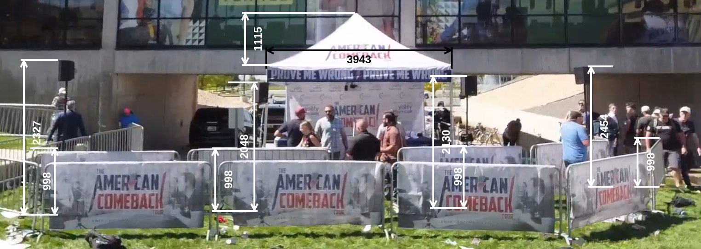
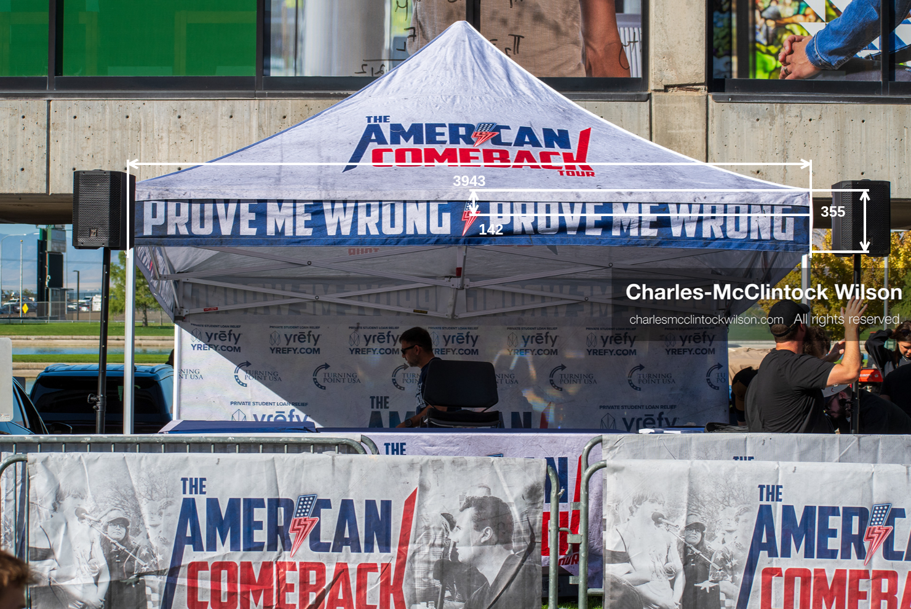
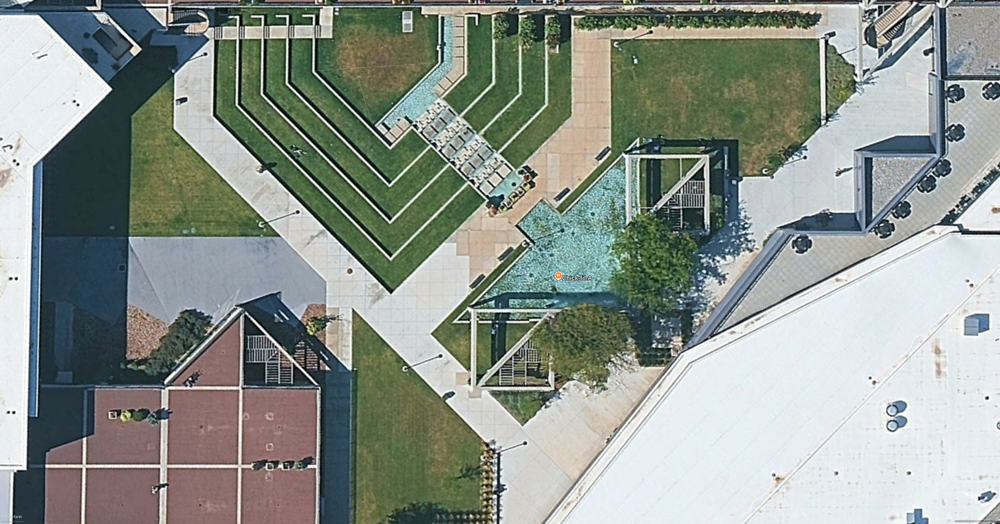

# Measurements for the UVU Amphitheatre

The UVU ampitheatre courtyard by the Hall of Flags building was the venue for the TPUSA "Prove Me Wrong" event.

## Calculated ratios & feature sizes

| #  | Feature                        | Editor Size (Pt) | Millimeters |  Ratio      |
|----|--------------------------------|------------------|-------------|-------------|
| 1  | stage-overhead                 |                  |             |             |
| 2  | Google Earth yardstick         | 1016.00          | 14700.00    | 14.47       |
| 3  | Tent width & depth             | 272.50           | 3942.67     |             |
| 4  | Barricade length               | 172.00           | 2488.58     |             |
| 5  |                                |                  |             |             |
| 6  | tent-barricade-speaker-heights |                  |             |             |
| 7  | Tent banner width              | 272.50           | 3942.67     | 14.47       |
| 8  | Tent height                    | 169.00           | 2445.18     |             |
| 9  | Centre-left speaker height     | 142.00           | 2054.53     |             |
| 10 | Barricade height               | 69.00            | 998.33      |             |
| 11 | Tent height (far side)         | 140.00           | 2445.18     | 17.47       |
| 12 | HoF lower window height        | 231.00           | 4034.54     |             |
| 13 |                                |                  |             |             |
| 14 | roof-speakers-heights          |                  |             |             |
| 15 | Tent banner width              | 403.00           | 3942.67     | 9.78        |
| 16 | Tent roof height               | 114.00           | 1115.30     |             |
| 17 |                                |                  |             |             |
| 18 | Left barricade height          | 145              | 998.33      | 6.89        |
| 19 | Left speaker height            | 338.00           | 2327.13     |             |
| 20 |                                |                  |             |             |
| 21 | Centre-left barricade height   | 137              | 998.33      | 7.29        |
| 22 | Centre-left speaker height     | 281.00           | 2047.66     |             |
| 23 |                                |                  |             |             |
| 24 | Center-right barricade height  | 135              | 998.33      | 7.40        |
| 25 | Centre-right speaker height    | 288.00           | 2129.76     |             |
| 26 |                                |                  |             |             |
| 27 | Barricade height               | 107.00           | 998.33      | 9.33        |
| 28 | Right speaker height           | 263.00           | 2453.83     |             |
| 29 |                                |                  |             |             |
| 30 | tent-banner                    |                  |             |             |
| 31 | Tent banner width              | 1110.00          | 3942.67     | 3.55        |
| 32 | Tent banner height             | 100.00           | 355.20      |             |
| 33 | Lightning center (from top)    | 40.00            | 142.08      |             |

---

Figure stage-overhead

Figure tent-barricade-speaker-heights

Figure roof-speakers-heights

 Figure tent-banner  

---

## Contextual Overhead Views

