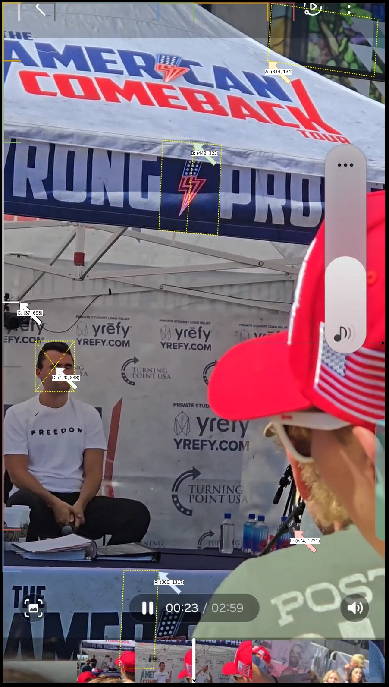
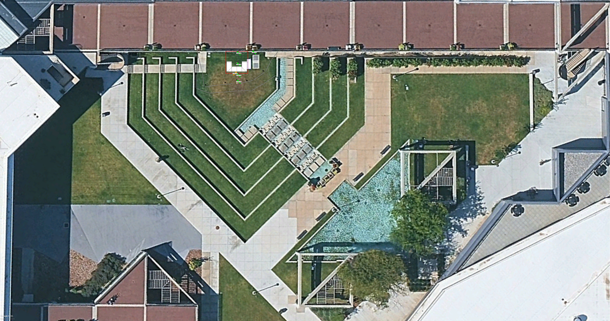
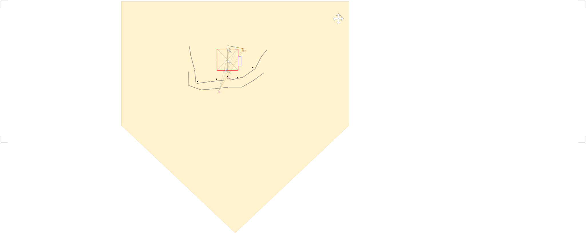
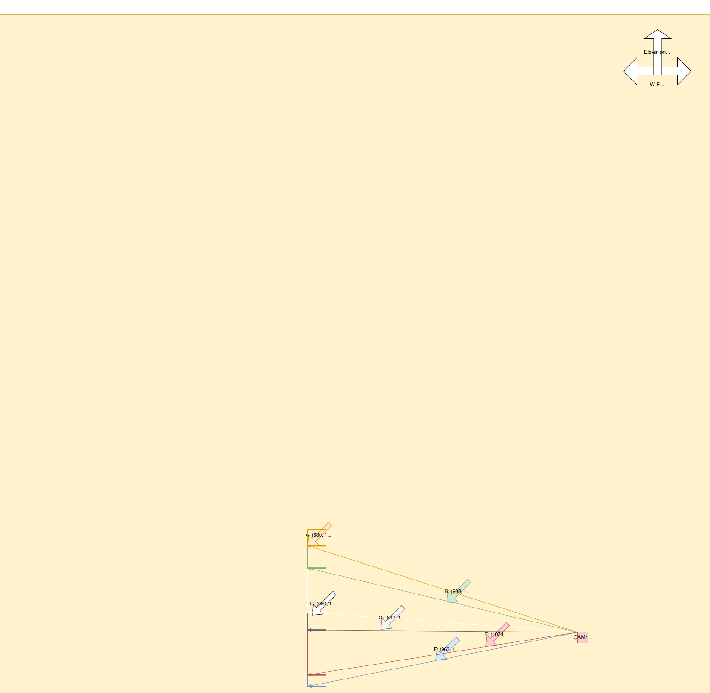

# Analysis

```bash
cd ../2.spatial-analysis
```

Refer [Speadsheet](./calculations.fods)

Update the spreadsheet's wcs-to-gps ad HFOV sections


## 1. Reference Photo 


Figure photo-reference-frame.jpg


Figure camera-coords-query-photo.jpg


Figure camera-coords-query-wcs.jpg


## 2. World Coordinate System to GPS (wcs-to-gps)

| #  | Feature                                   |                         |         | Editor Size (Pt) |  Ratio     | Millimeters |             |                  | Base elevation (m) | Notes |
|----|-------------------------------------------|-------------------------|---------|------------------|------------|-------------|-------------|------------------|--------------------|-------|
| 1  | Amphitheatre                              |                         |         |                  |            |             |             |                  |                    |       |
| 2  | Google Earth yardstick                    |                         |         | 1102.00          | 13.34      | 14700.00    |             |                  | 1401               |       |
| 3  |                                           | World Coordinate System |         |                  |            |             | Photo       |                  |                    |       |
| 4  |                                           | x                       | y       | z                | z-inverted |             | x           | y                |                    |       |
| 5  | Buildings                                 |                         |         | 1500.00          |            |             |             |                  |                    |       |
| 6  | A: HoF lower window (south-bottom corner) | 3390.00                 | 680.00  | 324.26           | 1175.74    | 4325.44     | 614.00      | 134.00           |                    |       |
| 7  |                                           |                         |         |                  |            |             |             |                  |                    |       |
| 8  | Tent                                      |                         |         |                  |            |             |             |                  |                    |       |
| 9  | B: Tent pole (east-top)                   | 3181.00                 | 988.00  | 198.00           | 1302.00    | 2641.20     | 442.00      | 323.00           |                    |       |
| 10 | C: Tent banner height (east)              | 3181.00                 | 690.00  | 171.17           | 1328.83    | 2283.31     | 37.00       | 693.00           |                    |       |
| 11 |                                           |                         |         |                  |            |             |             |                  |                    |       |
| 12 | People                                    |                         |         |                  |            |             |             |                  |                    |       |
| 13 | D: Charlie’s head (center)                | 3181.00                 | 847.00  | 139.85           | 1360.15    | 1865.45     | 120.00      | 843.00           |                    |       |
| 14 |                                           |                         |         |                  |            |             |             |                  |                    |       |
| 15 | Stage-area                                |                         |         |                  |            |             |             |                  |                    |       |
| 16 | E: Audience microphone stand              | 3181.00                 | 1074.00 | 102.69           | 1397.31    | 1369.80     | 674.00      | 1221.00          |                    |       |
| 17 |                                           |                         |         |                  |            |             |             |                  |                    |       |
| 18 | Tables                                    |                         |         |                  |            |             |             |                  |                    |       |
| 19 | F: Tent east table (front-center)         | 3181.00                 | 963.00  | 71.60            | 1428.40    | 955.13      | 360.00      | 1317.00          |                    |       |
| 20 |                                           |                         |         |                  |            |             |             |                  |                    |       |
| 21 | 1.mp4 Camera Location                     | x                       | y       | z                | z-inverted | lat         | lon         | elevation        |                    |       |
| 22 | World Coordinate System                   | 3055.00                 | 1277.00 | 134.00           | 1366.00    |             |             |                  |                    |       |
| 23 | Google Earth GPS                          |                         |         |                  |            | 40.277529   | -111.713968 | 1402.78747731397 |                    |       |

Table measurements & cross referencing


## 3. Configuration

```json camera-coords-query.json
{
    "wcs": {
        "A": [3390, 680, 324.26],
        "B": [3181, 988, 198.00],
        "C": [3181, 690, 171.17],
        "D": [3181, 847, 139.85],
        "E": [3181, 1074, 102.69],
        "F": [3181, 963, 71.60]
    },
    "photo": {
        "width": 886,
        "height": 1575,
        "points": {
            "A": [614, 134],
            "B": [442, 323],
            "C": [37, 693],
            "D": [120, 843],
            "E": [674, 1221],
            "F": [360, 1317]
        },
        "point-closest-to-camera": "E",
        "point-furthest-from-camera": "A"
    }
}
```

## 4. Resolution


Figure camera-coords-query-wcs-xy.svg



Figure camera-coords-query-wcs-yz.svg


```bash 
# use to identify a candidate and then fine-tune manually

$ python ../../tools/2.wcs-camera-solver.py
Refined Camera Pos: [3111.66221448 1225.4178626   142.9004968 ]
Point A:   31.80px [OK]
Point B:  154.48px [OUTLIER]
Point C:   27.77px [OK]
Point D:   30.21px [OK]
Point E:   13.16px [OK]
Point F:   14.50px [OK]
```


```json camera-location.json
[
    {
        "Feature": "1.mp4 camera location",
        "x": 3055.00, 
        "y": 1277.00
    }
]
```

```bash
$ python ../../tools/2.world-coordinate-system.py -v -m ../../spatial-mapping/world-coordinate-system_to_gps_lamp-posts.json -i camera-location.json -o camera-location-gps.json
--- Mapping Model Status ---
RMSE: 0.00000129 Degrees
Approximate ground error: 0.143 meters
----------------------------
Successfully processed 1 entries to camera-location-gps.json
```

```json camera-location-gps.json
[
    {
        "lat": 40.27752892327577,
        "lon": -111.71396799504947
    }
]
```

```json 1.mp4-camera-gps.json
[
    {
        "Feature": "1.mp4 camera location",
        "lat": 40.27752892327577,
        "lon": -111.71396799504947,
        "ele": 1402.78747731397
    }
]
```


## 5. Relative Location

```bash
$ python ../../tools/2.calc-gps-dist.py -from 1.mp4-camera-gps.json -to ../../spatial-mapping/stage-area/stage-area-gps.json -out 1.mp4-gps.csv
Successfully processed 6 pairs. Output saved to 1.mp4-gps.csv
```

```csv 1.mp4-gps.csv
From_Feature,To_Feature,Distance_Meters,Lat_1,Lon_1,Ele_1,Lat_2,Lon_2,Ele_2
1.mp4 camera location,North speaker,7.817,40.27752892327577,-111.71396799504947,1402.78747731397,40.27756276427676,-111.7140478186022,1403.732083
1.mp4 camera location,Center north speaker,4.409,40.27752892327577,-111.71396799504947,1402.78747731397,40.27754661242621,-111.71401361238523,1403.513785
1.mp4 camera location,Center south speaker,2.349,40.27752892327577,-111.71396799504947,1402.78747731397,40.2775165615533,-111.71398935134677,1403.366405
1.mp4 camera location,South speaker,4.483,40.27752892327577,-111.71396799504947,1402.78747731397,40.277489974469745,-111.71396630015255,1403.957025
1.mp4 camera location,CK microphone,5.724,40.27752892327577,-111.71396799504947,1402.78747731397,40.2775203851023,-111.714033649438,1401.955129
1.mp4 camera location,Audience microphone stand,3.226,40.27752892327577,-111.71396799504947,1402.78747731397,40.2775314668336,-111.71400545920922,1402.369802
```


## 6. HFOV & Subject-Camera Configuration

```json target-camera-gps.json
{
    "target": {
        "lat": 40.27751907377901,
        "lon": -111.71403737590329,
        "alt": 1402.865450
    },
    "camera": {
        "lat": 40.27753022102182,
        "lon": -111.71396884475594,
        "alt": 1402.78747731397
    }
}
```