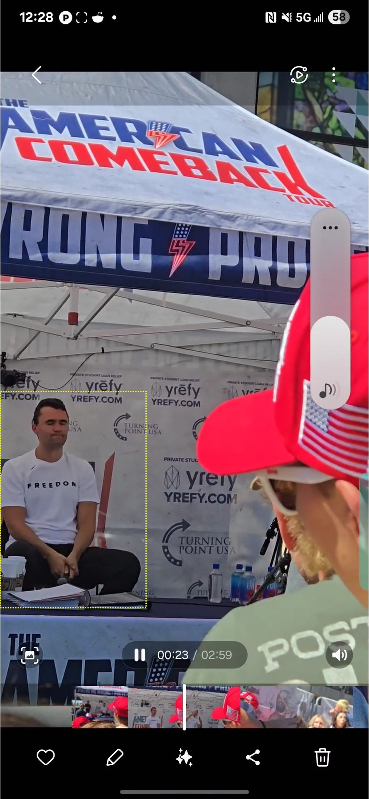

# Video Analysis

```bash
cd ../3.video-analysis
```

## Identify Cropped Video Region
1. open the key-seq-video.mp4 in video player and identify a candidate frame prior to impact
2. export frame as a still image
3. open drawing tool and outline an appropriate crop region using a bounding rectangle
4. note the top, left, width & height coordinates


Figure still-frame-uncropped.jpg



Figure still-frame-cropped-region-outline.jpg


### Crop Region

Width:  350
Height: 520
Top:    0
Left:   940


## Test Cropped Footage

```bash
ffplay -i ../.bin/key-seq-video.mkv -vf "crop=350:520:0:940"
```


## Export Cropped Footage

```bash
export CROP_STR="crop=350:520:0:940"

ffmpeg -i ../.bin/key-seq-video.mkv \
  -vf $CROP_STR \
  -c:v ffv1 -level 3 -g 1 \
  -c:a copy \
  ../.bin/key-seq-video-cropped.mkv

$ python ../../tools/3.verify-lossless-crop.py --orig ../.bin/key-seq-video.mkv --crop_file ../.bin/key-seq-video-cropped.mkv --params $CROP_STR
--- Forensic Crop Integrity Audit ---
Target Crop: crop=350:520:0:940
✓ SUCCESS: Crop is mathematically LOSSLESS.
Result: PSNR = Infinite (0.0 MSE)
```


## Generate Kinetic Motion Vector GIF

```bash
python ../../tools/3.generate-kenetic-overlay-video.py ../.bin/key-seq-video-cropped.mkv -t -fs 0.5
ffmpeg -i ../.bin/key-seq-video-cropped-kenetic-overlay.mp4 -vf "setpts=15*PTS,fps=2,scale=480:-1:flags=lanczos" ./key-seq-video-cropped-kenetic-overlay.gif
```


## Bang Segment Start Marker

```bash
$ python ../../tools/1.identify-quietest-timestamps.py --start 0.680 --duration 0.200 --input ../.bin/key-seq-audio.wav 
File SR: 48000Hz | Window: 480 samples (10ms)
Scanning from 0.68s for 0.2s...

Rank  | Absolute Timestamp   | Peak Level (dB)
--------------------------------------------------
1     | 0.810000             | -29.81         
2     | 0.800000             | -27.17         
3     | 0.790000             | -23.70         
4     | 0.830000             | -22.82         
5     | 0.820000             | -20.57  
```

Use Rank 1 (0.820s) for start marker for bang segment


## Identifying Visual Time Zero t<sub>0</sub> Candidates

Use start as 0.810000 - (0.033 * 10 frames) = 0.480

```bash
$ python ../../tools/3.identify-vt0-candidates.py --video ../.bin/key-seq-video-cropped.mkv -st 0.480
Analyzing from 0.48s at 30.0 FPS...

[!] VISUAL t0 DETECTED: 0.967000s
Detailed sync-check saved to 3.identify-vt0-candidates.csv
```

```csv 3.identify-vt0-candidates.csv
FrameIndex,Timestamp,MotionMetric,Threshold,Status
15,0.500000,3.127371,11.044759,STABLE
16,0.533000,3.800195,11.044759,STABLE
17,0.567000,2.868836,11.044759,STABLE
18,0.600000,1.665965,11.044759,STABLE
19,0.633000,3.231421,11.044759,STABLE
20,0.667000,0.001586,11.044759,STABLE
21,0.700000,1.074298,11.044759,STABLE
22,0.733000,2.916995,11.044759,STABLE
23,0.767000,0.003735,11.044759,STABLE
24,0.800000,4.361578,11.044759,STABLE
25,0.833000,0.003041,11.044759,STABLE
26,0.867000,2.076575,11.044759,STABLE
27,0.900000,0.897609,11.044759,STABLE
28,0.933000,0.507605,11.044759,STABLE
29,0.967000,12.344831,11.044759,DEVIATION_DETECTED
30,1.000000,6.421370,11.044759,STABLE
31,1.033000,9.897811,11.044759,STABLE
32,1.067000,11.977600,11.044759,DEVIATION_DETECTED
33,1.100000,15.699114,11.044759,DEVIATION_DETECTED
34,1.133000,12.689017,11.044759,DEVIATION_DETECTED
35,1.167000,9.142685,11.044759,STABLE
36,1.200000,8.505435,11.044759,STABLE
37,1.233000,7.530118,11.044759,STABLE
38,1.267000,14.918163,11.044759,DEVIATION_DETECTED
39,1.300000,18.812845,11.044759,DEVIATION_DETECTED
40,1.333000,11.168832,11.044759,DEVIATION_DETECTED
41,1.367000,7.528182,11.044759,STABLE
42,1.400000,4.335780,11.044759,STABLE
43,1.433000,4.002197,11.044759,STABLE
```
Dataset 3.identify-vt0-candidates.csv


Frame 29 with timestamp (0.967000s) is the first motion deviation from a stable state. This is a candidate marker for Visual Time Zero for the first strike on a potentially multi-impact event.


## Identify Impact Events

In order to identify the key impact events in the motion we will start from a stable state of 3 frames prior to Frame 29 (ie. Frame 26 0.867000).

```bash
$ python ../../tools/3.identify-impact-events.py --video ../.bin/key-seq-video-cropped.mkv -t0 0.867000 -hfov 19.59 -fs 0.5 -sb 63 --gps ../2.spatial-analysis/target-camera-gps.json 
Dist: 5.94m | Subject-Bearing: 63.00° | Camera-Bearing: 257.96° | relative_angle: 104.96° |  HIGH_CONFIDENCE (Lateral Gain) | Scaling: 0.0059 m/px

Analysis complete with GPS Reference Bearing: 257.96°
- Reports: 3.identify-impact-events-motion-summary.csv
- Visuals: 3.identify-impact-events-kinematic-profile.png, 3 event overlay(s) generated.
```

```csv 3.identify-impact-events.csv
Motion_Ref,V_Time,Offset(ms),Vel_mps,Accel_mps2,Jerk_mps3,Origin
0,0.867,0.0,0.91,27.45,823.38,E (100°)
1,0.9,33.33,0.68,-7.03,-1034.2,E (96°)
2,0.934,66.67,0.3,-11.29,-128.01,SE (156°)
3,0.967,100.0,1.27,29.0,1208.86,SW (227°)
4,1.0,133.33,0.63,-19.1,-1443.15,W (254°)
5,1.034,166.67,0.8,4.93,721.15,N/A
6,1.067,200.0,1.25,13.53,257.77,N (9°)
7,1.1,233.33,2.2,28.53,450.21,W (258°)
8,1.134,266.67,1.88,-9.56,-1142.69,N (341°)
9,1.167,300.0,0.66,-36.64,-812.39,W (284°)
10,1.2,333.33,1.39,21.86,1754.81,NW (307°)
11,1.234,366.67,1.64,7.46,-431.8,E (71°)
12,1.267,400.0,3.88,67.14,1790.22,SW (241°)
13,1.3,433.33,3.78,-2.92,-2101.87,W (259°)
14,1.334,466.67,2.22,-46.84,-1317.5,W (292°)
15,1.367,500.0,1.39,-24.68,664.92,N (338°)
16,1.4,533.33,1.07,-9.59,452.56,NW (318°)
17,1.434,566.67,1.37,8.77,550.75,NE (25°)
```
Dataset 3.identify-impact-events.csv


```csv 3.identify-impact-events-motion-summary.csv
Key_Event#,Motion_Ref,V_Time,Offset(ms),Onset_V_Time,Vel_mps,Accel_mps2,Jerk_mps3,Nature,Tag,Origin
0,3,0.967,100.0,0.9449,1.27,29.0,1208.86,Aggressive Voluntary/Reflexive Movement,REFLEX_ONSET,SW (227°)
1,7,1.1,233.33,1.0299,2.2,28.53,450.21,Aggressive Voluntary/Reflexive Movement,REFLEX_ONSET,W (258°)
2,12,1.267,400.0,1.1888,3.88,67.14,1790.22,Kinetic Strike/Secondary Force (6.8G),TDOA_SYNC_PRIORITY_1,SW (241°)
```
Dataset 3.identify-impact-events-motion-summary.csv


