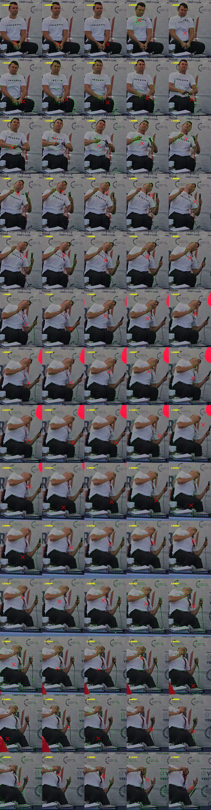
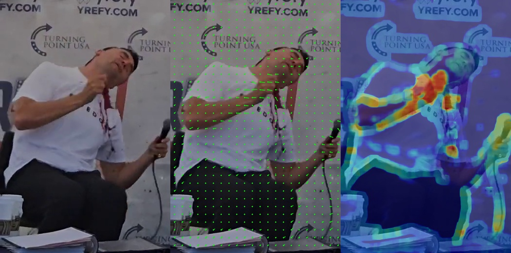
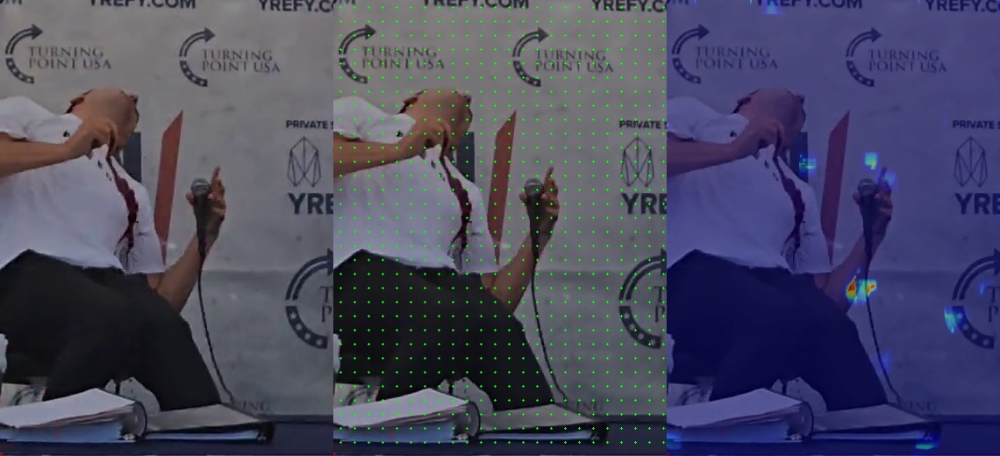
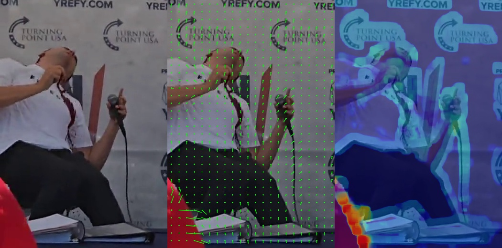
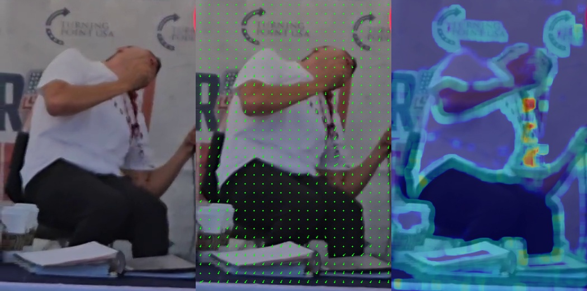

# Video Analysis

```bash
cd ../3.video-analysis
```

## Identify Cropped Video Region
1. open the key-seq-video.mp4 in video player and identify a candidate frame prior to impact
2. export frame as a still image
3. open drawing tool and outline an appropriate crop region using a bounding rectangle
4. note the top, left, width & height coordinates


Figure still-frame-uncropped.jpg


Figure still-frame-cropped-region-outline.jpg


### Crop Region

Width:  380
Height: 520
Top:    0
Left:   940


## Test Cropped Footage

```bash
ffplay -i ../.bin/key-seq-video.mkv -vf "crop=380:520:0:940"
```


## Export Cropped Footage

```bash
$ export CROP_STR="crop=380:520:0:940"

$ ffmpeg -i ../.bin/key-seq-video.mkv \
  -vf $CROP_STR \
  -c:v ffv1 -level 3 -g 1 \
  -c:a copy \
  ../.bin/key-seq-video-cropped.mkv

# Add 'eq' filter after the crop. 
# gamma=2.0 makes dark areas much lighter without clipping highlights as badly as 'brightness'
$ ffmpeg -i ../.bin/key-seq-video.mkv \
  -vf "$CROP_STR,eq=gamma=2.0:brightness=0.05" \
  -c:v ffv1 -level 3 -g 1 \
  -c:a copy \
  ../.bin/key-seq-video-cropped-brightened.mkv

$ ffmpeg -i ../.bin/key-seq-video.mkv \
  -vf "$CROP_STR, unsharp=5:5:1.0:5:5:0.5, eq=contrast=1.4:brightness=0.1:saturation=1.2, histeq=strength=0.3" \
  -c:v ffv1 -level 3 -g 1 -c:a copy \
  ../.bin/key-seq-video-cropped-enh2.mkv


$ python ../../tools/3.verify-lossless-crop.py --orig ../.bin/key-seq-video.mkv --crop_file ../.bin/key-seq-video-cropped.mkv --params $CROP_STR
--- Forensic Crop Integrity Audit ---
Target Crop: crop=380:520:0:940
✓ SUCCESS: Crop is mathematically LOSSLESS.
Result: PSNR = Infinite (0.0 MSE)
```


## Generate Kinetic Motion Vector GIF

```bash
$ python ../../tools/3.generate-kenetic-overlay-video.py ../.bin/key-seq-video-cropped.mkv -t -fs 0.5

$ ffmpeg -i ../.bin/key-seq-video-cropped-kenetic-overlay.mp4 -vf "setpts=15*PTS,fps=30,scale=480:-1:flags=lanczos" ./key-seq-video-cropped-kenetic-overlay.gif

$ ffprobe -v error -show_entries format=duration -of default=noprint_wrappers=1:nokey=1 ./key-seq-video-cropped-kenetic-overlay.gif
48.510000

$ ffprobe -v error -select_streams v:0 -count_packets -show_entries stream=nb_read_packets -of default=noprint_wrappers=1:nokey=1 ./key-seq-video-cropped-kenetic-overlay.gif
1455
```


Figure key-seq-video-cropped-kenetic-overlay.gif


## Bang Segment Start Marker

```bash
$ python ../../tools/1.identify-quietest-timestamps.py --start 0.680 --duration 0.200 --input ../.bin/key-seq-audio.wav 
File SR: 48000Hz | Window: 480 samples (10ms)
Scanning from 0.68s for 0.2s...

Rank  | Absolute Timestamp   | Peak Level (dB)
--------------------------------------------------
1     | 0.810000             | -29.81         
2     | 0.800000             | -27.17         
3     | 0.790000             | -23.70         
4     | 0.830000             | -22.82         
5     | 0.820000             | -20.57 
```

Use Rank 1 (0.810s) for start marker for bang segment


## Identifying Visual Time Zero t<sub>0</sub> Candidates

Use start as 0.810000 - (0.033 * 10 frames) = 0.480

```bash
$ python ../../tools/3.identify-vt0-candidates.py --video ../.bin/key-seq-video-cropped.mkv -st 0.480
Analyzing from 0.48s at 30.0 FPS...

[!] VISUAL t0 DETECTED: 0.967000s
Detailed sync-check saved to 3.identify-vt0-candidates.csv
```

```csv 3.identify-vt0-candidates.csv
FrameIndex,Timestamp,MotionMetric,Threshold,Status
15,0.500000,2.986008,10.510900,STABLE
16,0.533000,3.642441,10.510900,STABLE
17,0.567000,2.745982,10.510900,STABLE
18,0.600000,1.570368,10.510900,STABLE
19,0.633000,2.999259,10.510900,STABLE
20,0.667000,0.001347,10.510900,STABLE
21,0.700000,1.026477,10.510900,STABLE
22,0.733000,2.794150,10.510900,STABLE
23,0.767000,0.003519,10.510900,STABLE
24,0.800000,4.150261,10.510900,STABLE
25,0.833000,0.002791,10.510900,STABLE
26,0.867000,1.974835,10.510900,STABLE
27,0.900000,0.857670,10.510900,STABLE
28,0.933000,0.504709,10.510900,STABLE
29,0.967000,11.894139,10.510900,DEVIATION_DETECTED
30,1.000000,6.185599,10.510900,STABLE
31,1.033000,9.399661,10.510900,STABLE
32,1.067000,11.500084,10.510900,DEVIATION_DETECTED
33,1.100000,14.730410,10.510900,DEVIATION_DETECTED
34,1.133000,12.301466,10.510900,DEVIATION_DETECTED
35,1.167000,8.775907,10.510900,STABLE
36,1.200000,8.041815,10.510900,STABLE
37,1.233000,7.196396,10.510900,STABLE
38,1.267000,14.394171,10.510900,DEVIATION_DETECTED
39,1.300000,17.726843,10.510900,DEVIATION_DETECTED
40,1.333000,10.761601,10.510900,DEVIATION_DETECTED
41,1.367000,7.280268,10.510900,STABLE
42,1.400000,4.181662,10.510900,STABLE
43,1.433000,3.881936,10.510900,STABLE
44,1.467000,4.049256,10.510900,STABLE
45,1.500000,3.143024,10.510900,STABLE
46,1.533000,3.553983,10.510900,STABLE
47,1.567000,4.489592,10.510900,STABLE
48,1.600000,5.528257,10.510900,STABLE
49,1.633000,3.818365,10.510900,STABLE
50,1.667000,4.108876,10.510900,STABLE
51,1.700000,4.875629,10.510900,STABLE
52,1.733000,4.724545,10.510900,STABLE
53,1.767000,1.999370,10.510900,STABLE
54,1.800000,1.922073,10.510900,STABLE
55,1.833000,2.003360,10.510900,STABLE
56,1.867000,2.345082,10.510900,STABLE
57,1.900000,2.188393,10.510900,STABLE
58,1.933000,1.866197,10.510900,STABLE
59,1.967000,1.929635,10.510900,STABLE
60,2.000000,1.914281,10.510900,STABLE
61,2.033000,2.837169,10.510900,STABLE
62,2.067000,3.069445,10.510900,STABLE
63,2.100000,2.192850,10.510900,STABLE
64,2.133000,1.502540,10.510900,STABLE
65,2.167000,1.614249,10.510900,STABLE
66,2.200000,1.518305,10.510900,STABLE
67,2.233000,1.060257,10.510900,STABLE
68,2.267000,1.943766,10.510900,STABLE
69,2.300000,2.209431,10.510900,STABLE
70,2.333000,2.413697,10.510900,STABLE
71,2.367000,1.879720,10.510900,STABLE
72,2.400000,1.351039,10.510900,STABLE
73,2.433000,2.466573,10.510900,STABLE
74,2.467000,1.380320,10.510900,STABLE
75,2.500000,1.773327,10.510900,STABLE
76,2.533000,2.020231,10.510900,STABLE
77,2.567000,3.048308,10.510900,STABLE
78,2.600000,3.463188,10.510900,STABLE
79,2.633000,6.434940,10.510900,STABLE
80,2.667000,8.376096,10.510900,STABLE
81,2.700000,12.301204,10.510900,DEVIATION_DETECTED
82,2.733000,3.881210,10.510900,STABLE
83,2.767000,3.122200,10.510900,STABLE
84,2.800000,5.760485,10.510900,STABLE
85,2.833000,8.413900,10.510900,STABLE
86,2.867000,6.171886,10.510900,STABLE
87,2.900000,5.160377,10.510900,STABLE
88,2.933000,13.550652,10.510900,DEVIATION_DETECTED
89,2.967000,0.002414,10.510900,STABLE
90,3.000000,4.952808,10.510900,STABLE
91,3.033000,7.365307,10.510900,STABLE
92,3.067000,4.126032,10.510900,STABLE
93,3.100000,4.576264,10.510900,STABLE
94,3.133000,8.977468,10.510900,STABLE
95,3.167000,6.652610,10.510900,STABLE
96,3.200000,12.117699,10.510900,DEVIATION_DETECTED
```
Dataset 3.identify-vt0-candidates.csv


Frame 29 with timestamp (0.967000s) is the first motion deviation from a stable state. This is a candidate marker for Visual Time Zero for the first strike on a potentially multi-impact event.


## Storyboard

In order to identify the key impact events in the motion we will start from a stable state of 3 frames prior to Frame 29 (ie. Frame 26 DEVIATION_DETECTED @ 0.867000).

```bash
$ ffmpeg -i ../.bin/key-seq-video-cropped-kenetic-overlay.mp4 -vf "select='between(n,26,96)',scale=240:-1,tile=5x14" -frames:v 1 storyboard.png
```


Figure storyboard.png


## Specify hfov-config.json

```json hfov-config.json
{
    "subject_dimensions": {
        "shoulder_width_m": 0.472,
        "chest_depth_m": 0.318,
        "subject_facing_bearing": 63,
        "pixel_width": 204
    },
    "camera_specs": {
        "frame_width_px": 380,
        "device": "unknown android smart phone",
        "orientation": "portrait",
        "mic_channel_1": "top",
        "mic_channel_2": "bottom"
    },
    "logic_thresholds": {
        "catchment_angle_deg": 45
    }
}
```

## Identify Impact Events

```bash
$ python ../../tools/3.identify-impact-events.py --video ../.bin/key-seq-video-cropped.mkv -t0 0.867000 -lyp -10 -fs 0.4 --gps-json ../2.spatial-analysis/target-camera-gps.json --hfov-json ./hfov-config.json 
Dist: 5.94m | Subject-Bearing: 63.00° | Camera-Bearing: 257.96° | hfov_deg: 8.46° | relative_angle: 165.04° |  SHOULDER_WIDTH | Scaling: 0.0023 m/px

Analysis complete with GPS Reference Bearing: 257.96°
- Reports:
    1. 3.identify-impact-events.csv
    2. 3.identify-impact-events-motion-summary.csv
- Visuals: 3.identify-impact-events-kinematic-profile.png, 9 event overlay(s) generated.
```

```csv 3.identify-impact-events.csv
Motion_Ref,V_Time,Offset(ms),Vel_mps,Accel_mps2,Jerk_mps3,Origin
1,0.9,33.33,1.35,40.51,1215.24,E (100°)
2,0.934,66.67,1.01,-10.07,-1517.47,E (96°)
3,0.967,100.0,0.45,-16.97,-206.74,SE (156°)
4,1.0,133.33,1.88,42.81,1793.23,SW (227°)
5,1.034,166.67,0.93,-28.23,-2131.11,W (254°)
6,1.067,200.0,1.18,7.35,1067.26,N/A
7,1.1,233.33,1.85,20.02,380.25,N (9°)
8,1.134,266.67,3.25,42.03,660.22,W (258°)
9,1.167,300.0,2.81,-13.17,-1655.89,N (341°)
10,1.2,333.33,0.97,-55.08,-1257.27,W (284°)
11,1.234,366.67,2.03,31.74,2604.61,NW (307°)
12,1.267,400.0,2.39,10.8,-628.39,E (70°)
13,1.3,433.33,5.73,100.28,2684.31,SW (241°)
14,1.334,466.67,5.6,-4.02,-3128.82,W (259°)
15,1.367,500.0,3.27,-69.8,-1973.41,W (292°)
16,1.4,533.33,2.07,-36.18,1008.51,N (338°)
17,1.434,566.67,1.58,-14.56,648.69,NW (317°)
18,1.467,600.0,2.02,13.08,829.04,NE (25°)
19,1.5,633.33,1.26,-22.7,-1073.26,NE (49°)
20,1.534,666.67,1.56,8.99,950.71,NE (36°)
21,1.567,700.0,1.23,-10.03,-570.54,NE (39°)
22,1.6,733.33,1.0,-6.76,98.08,NE (35°)
23,1.634,766.67,1.02,0.58,220.19,NW (319°)
24,1.667,800.0,0.7,-9.5,-302.31,N/A
25,1.7,833.33,0.84,3.95,403.23,N (340°)
26,1.734,866.67,1.12,8.39,133.36,NW (313°)
27,1.767,900.0,1.51,11.9,105.28,NW (334°)
28,1.8,933.33,1.53,0.57,-339.9,N (353°)
29,1.834,966.67,0.95,-17.51,-542.5,NW (337°)
30,1.867,1000.0,0.92,-0.91,498.14,S (198°)
31,1.9,1033.33,0.74,-5.4,-134.69,S (183°)
32,1.934,1066.67,0.78,1.34,202.03,N/A
33,1.967,1100.0,0.57,-6.34,-230.37,S (190°)
34,2.0,1133.33,1.54,29.16,1065.1,W (282°)
35,2.034,1166.67,1.29,-7.56,-1101.76,W (285°)
36,2.067,1200.0,1.25,-1.3,187.96,NW (308°)
37,2.1,1233.33,0.96,-8.64,-220.35,NW (310°)
38,2.134,1266.67,0.79,-5.16,104.56,NW (316°)
39,2.167,1300.0,0.7,-2.65,75.18,SW (235°)
40,2.2,1333.33,0.96,7.82,314.08,NW (330°)
41,2.234,1366.67,0.79,-5.0,-384.56,N (350°)
42,2.267,1400.0,1.05,7.84,385.37,NW (297°)
43,2.3,1433.33,0.97,-2.55,-311.82,SW (238°)
44,2.334,1466.67,1.33,10.77,399.68,W (248°)
45,2.367,1500.0,1.58,7.54,-97.07,W (261°)
46,2.4,1533.33,1.03,-16.36,-716.89,W (248°)
47,2.434,1566.67,0.83,-6.01,310.49,SW (221°)
48,2.467,1600.0,1.36,15.68,650.8,SW (225°)
49,2.5,1633.33,0.68,-20.38,-1081.84,S (164°)
50,2.534,1666.67,1.02,10.39,922.92,SE (122°)
51,2.567,1700.0,1.14,3.51,-206.43,SE (131°)
52,2.6,1733.33,0.96,-5.42,-267.8,SE (141°)
53,2.634,1766.67,1.45,14.85,608.26,E (96°)
54,2.667,1800.0,1.42,-0.9,-472.61,SE (131°)
55,2.7,1833.33,1.91,14.46,460.71,SE (132°)
56,2.734,1866.67,2.34,12.87,-47.53,SE (137°)
57,2.767,1900.0,0.98,-40.59,-1603.77,S (162°)
58,2.8,1933.33,1.01,0.88,1244.06,E (110°)
59,2.834,1966.67,1.6,17.74,505.86,SE (137°)
60,2.867,2000.0,2.73,33.9,484.81,SE (131°)
61,2.9,2033.33,2.2,-15.92,-1494.64,N (16°)
62,2.934,2066.67,1.65,-16.6,-20.64,S (177°)
63,2.967,2100.0,3.42,53.13,2092.16,S (179°)
64,3.0,2133.33,0.02,-102.03,-4654.98,W (264°)
65,3.034,2166.67,1.77,52.59,4638.66,S (201°)
66,3.067,2200.0,1.07,-20.96,-2206.38,S (166°)
67,3.1,2233.33,1.7,18.77,1191.8,N (338°)
68,3.134,2266.67,1.91,6.31,-373.77,E (68°)
69,3.167,2300.0,2.05,4.09,-66.5,SE (132°)
70,3.2,2333.33,2.21,4.85,22.78,E (74°)
71,3.234,2366.67,7.44,156.83,4559.42,N (353°)
```
Dataset 3.identify-impact-events.csv


```csv 3.identify-impact-events-motion-summary.csv
Key_Event#,Motion_Ref,V_Time,Offset(ms),Onset_V_Time,Vel_mps,Accel_mps2,Jerk_mps3,Nature,Tag,Origin
0,4,1.0,133.33,0.9775,1.88,42.81,1793.23,Impulse/Electrical Discharge Case,TDOA_SYNC_PRIORITY_2,SW (227°)
1,8,1.134,266.67,1.062,3.25,42.03,660.22,Aggressive Voluntary/Reflexive Movement,REFLEX_ONSET,W (258°)
2,13,1.3,433.33,1.2224,5.73,100.28,2684.31,Kinetic Strike/Secondary Force (10.2G),TDOA_SYNC_PRIORITY_1,SW (241°)
3,34,2.0,1133.33,1.9748,1.54,29.16,1065.1,Aggressive Voluntary/Reflexive Movement,REFLEX_ONSET,W (282°)
4,48,2.467,1600.0,2.4462,1.36,15.68,650.8,Minor Kinetic Deviation,LOW_CONFIDENCE,SW (225°)
5,60,2.867,2000.0,2.8023,2.73,33.9,484.81,Aggressive Voluntary/Reflexive Movement,REFLEX_ONSET,SE (131°)
6,63,2.967,2100.0,2.9428,3.42,53.13,2092.16,Kinetic Strike/Secondary Force (5.4G),TDOA_SYNC_PRIORITY_1,S (179°)
7,65,3.034,2166.67,3.0229,1.77,52.59,4638.66,Kinetic Strike/Secondary Force (5.4G),TDOA_SYNC_PRIORITY_1,S (201°)
8,67,3.1,2233.33,3.0861,1.7,18.77,1191.8,Minor Kinetic Deviation,LOW_CONFIDENCE,N (338°)
```
Dataset 3.identify-impact-events-motion-summary.csv


### Impact Events Kinematic Profile

Context:
1. Charlie Kirk (aka subject/speaker/target) is sitting on a seat positioned on a raised platform
2. Charlie Kirk speaks is last words "gun violence" into his PA wired microphone 
3. Charlie Kirk's staged setup has the platform surrounded by tables that have a cloth banner coverings
4. Charlie Kirk lowers the Shure SM58 XLR dynamic microphone with both hands and between his legs. Note, his left hand is holding the microphone upper housing. His right thumb is wrapped over the left thumb and the index right index finger brushing up agains the microphone upper housing
5. Charlie Kirk closes both eyes and awaits Hunter Kozak's (ie. questioner) response 
6. Hunter Kozak responds by saying "great"
7. The 0.967s is first video frame of visual impact


Figure 3.identify-impact-events-kinematic-profile.png


### Event 0 - visual-time: 1.000, inferred-onset-visual-time: 0.9775

```csv [row]
Key_Event#,Motion_Ref,V_Time,Offset(ms),Onset_V_Time,Vel_mps,Accel_mps2,Jerk_mps3,Nature,Tag,Origin
0,4,1.0,133.33,0.9775,1.88,42.81,1793.23,Impulse/Electrical Discharge Case,TDOA_SYNC_PRIORITY_2,SW (227°)
```


Figure 3.identify-impact-events-motion-overlay-0.jpg

Kinetic directional flow vectors & kinetic energy heatmap summary:
1. The hair having previously moved up and outward, has now moved forward
2. The cheek and jaw line exhibits expansion
3. The upper-left t-shirt collar having lifted to touching the left ear lobe is now retracting  
4. The t-shirt "Freedom" printed label is no longer horizontally alignment and instead following a sine-wave
5. The upper arms and biceps appear to stiffen
6. The hand moves upward whilst still holding the microphone in place
7. The left leg whilst still in the sitting posture pulls inward


### Event 1 - visual-time: 1.134, inferred-onset-visual-time: 1.062

```csv [row]
Key_Event#,Motion_Ref,V_Time,Offset(ms),Onset_V_Time,Vel_mps,Accel_mps2,Jerk_mps3,Nature,Tag,Origin
1,8,1.134,266.67,1.062,3.25,42.03,660.22,Aggressive Voluntary/Reflexive Movement,REFLEX_ONSET,W (258°)
```


Figure 3.identify-impact-events-motion-overlay-1.jpg


Kinetic directional flow vectors & kinetic energy heatmap summary:
1. The head rotates subtly toward the left shoulder, with the neck showing a brief lateral compression.
2. The right side of the t-shirt collar lifts momentarily, revealing a shadow line beneath the jaw.
3. The "Freedom" printed label shifts from horizontal to a slight upward angle on the right side.
4. The microphone remains vertically stable, but the right hand’s index finger appears to tighten against the upper housing.
5. The left knee, visible below the table line, twitches inward without full leg retraction.
6. No major hair displacement is observed, but the forehead skin shows a rapid light reflection change consistent with a small, rapid head turn.


This event corresponds to an aggressive voluntary or reflexive movement (42.03 m/s², 3.25 m/s) from the west (258°), likely a defensive flinch rather than a primary impact. The lower jerk (660 vs. 1793 in Event 0) supports a muscular contraction rather than an external strike.

### Event 2 - visual-time: 1.3, inferred-onset-visual-time: 1.2224

```csv [row]
Key_Event#,Motion_Ref,V_Time,Offset(ms),Onset_V_Time,Vel_mps,Accel_mps2,Jerk_mps3,Nature,Tag,Origin
2,13,1.3,433.33,1.2224,5.73,100.28,2684.31,Kinetic Strike/Secondary Force (10.2G),TDOA_SYNC_PRIORITY_1,SW (241°)
```


Figure 3.identify-impact-events-motion-overlay-2.jpg


Kinetic directional flow vectors & kinetic energy heatmap summary:
1. The hair, previously settled, is thrown upward and leftward in a single, coherent mass.
2. The left ear becomes partially obscured by the t-shirt collar, which has lifted to the earlobe level.
3. The cheek on the left side shows a rapid expansion followed by a rebound, visible as a dark shadow under the zygomatic arch.
4. The "Freedom" label twists into a distinct sine-wave curve, with the right side rising higher than in Event 0.
5. Both upper arms visibly stiffen; the right biceps bulges against the sleeve fabric.
6. The left leg pulls inward and upward, lifting the knee several centimeters above the seat cushion.
7. The microphone briefly tilts rightward by approximately 5–7 degrees before returning to vertical.

This is the most severe kinetic event recorded (100.28 m/s², 10.2G), classified as a Kinetic Strike/Secondary Force from the southwest (241°). The combination of high jerk (2684) and multi-directional tissue displacement is consistent with a transmitted impact through the upper body, not a voluntary movement.

### Event 3 - visual-time: 2.0, inferred-onset-visual-time: 1.9748

```csv [row]
Key_Event#,Motion_Ref,V_Time,Offset(ms),Onset_V_Time,Vel_mps,Accel_mps2,Jerk_mps3,Nature,Tag,Origin
3,34,2.0,1133.33,1.9748,1.54,29.16,1065.1,Aggressive Voluntary/Reflexive Movement,REFLEX_ONSET,W (282°)
```


Figure 3.identify-impact-events-motion-overlay-3.jpg


Kinetic directional flow vectors & kinetic energy heatmap summary:
* TO BE WRITTEN BY LLM using event 0 as an example


### Event 4 - visual-time: 2.467, inferred-onset-visual-time: 2.4462

```csv [row]
Key_Event#,Motion_Ref,V_Time,Offset(ms),Onset_V_Time,Vel_mps,Accel_mps2,Jerk_mps3,Nature,Tag,Origin
4,48,2.467,1600.0,2.4462,1.36,15.68,650.8,Minor Kinetic Deviation,LOW_CONFIDENCE,SW (225°)
```


Figure 3.identify-impact-events-motion-overlay-4.jpg


Kinetic directional flow vectors & kinetic energy heatmap summary:
* TO BE WRITTEN BY LLM using event 0 as an example


### Event 5 - visual-time: 2.867, inferred-onset-visual-time: 2.8023

```csv [row]
Key_Event#,Motion_Ref,V_Time,Offset(ms),Onset_V_Time,Vel_mps,Accel_mps2,Jerk_mps3,Nature,Tag,Origin
5,60,2.867,2000.0,2.8023,2.73,33.9,484.81,Aggressive Voluntary/Reflexive Movement,REFLEX_ONSET,SE (131°)
```


Figure 3.identify-impact-events-motion-overlay-5.jpg


Kinetic directional flow vectors & kinetic energy heatmap summary:
* TO BE WRITTEN BY LLM using event 0 as an example


### Event 6 - visual-time: 2.967, inferred-onset-visual-time: 2.9428

```csv [row]
Key_Event#,Motion_Ref,V_Time,Offset(ms),Onset_V_Time,Vel_mps,Accel_mps2,Jerk_mps3,Nature,Tag,Origin
6,63,2.967,2100.0,2.9428,3.42,53.13,2092.16,Kinetic Strike/Secondary Force (5.4G),TDOA_SYNC_PRIORITY_1,S (179°)
```


Figure 3.identify-impact-events-motion-overlay-6.jpg


Kinetic directional flow vectors & kinetic energy heatmap summary:
* TO BE WRITTEN BY LLM using event 0 as an example


### Event 7 - visual-time: 3.034, inferred-onset-visual-time: 3.0229

```csv [row]
Key_Event#,Motion_Ref,V_Time,Offset(ms),Onset_V_Time,Vel_mps,Accel_mps2,Jerk_mps3,Nature,Tag,Origin
7,65,3.034,2166.67,3.0229,1.77,52.59,4638.66,Kinetic Strike/Secondary Force (5.4G),TDOA_SYNC_PRIORITY_1,S (201°)
```


Figure 3.identify-impact-events-motion-overlay-7.jpg


Kinetic directional flow vectors & kinetic energy heatmap summary:
* TO BE WRITTEN BY LLM using event 0 as an example


### Event 8 - visual-time: 3.1, inferred-onset-visual-time: 3.0861

```csv [row]
Key_Event#,Motion_Ref,V_Time,Offset(ms),Onset_V_Time,Vel_mps,Accel_mps2,Jerk_mps3,Nature,Tag,Origin
8,67,3.1,2233.33,3.0861,1.7,18.77,1191.8,Minor Kinetic Deviation,LOW_CONFIDENCE,N (338°)
```


Figure 3.identify-impact-events-motion-overlay-8.jpg


Kinetic directional flow vectors & kinetic energy heatmap summary:
* TO BE WRITTEN BY LLM using event 0 as an example


---

```bash
python ../../tools/3.prepare-fbf-observation-artifacts.py --motion-summary 3.identify-impact-events-motion-summary.csv --video ../.bin/key-seq-video-cropped-brightened.mkv --output-dir fbf_artifacts --scale-cm 10 --m-per-px 0.0023

python ../..tools/3.populate_measurements.py \
    --landmark-csv fbf_artifacts/event_0_landmarks.csv \
    --template-csv measurement_template.csv \
    --output-csv measurements_prepopulated.csv \
    --px-per-cm $(python -c "print(10 / 10)")  # 10 cm / scale bar pixels (adjust manually)
```


```bash
$ python ../../tools/3.prepare-fbf-observation-artifacts_V3.py --motion-summary 3.identify-impact-events-motion-summary.csv --video ../.bin/key-seq-video-cropped-brightened.mkv --output-dir fbf_artifacts --scale-cm 10 --m-per-px 0.0023 --full-face-mesh --interpolation-range 20


python ../../tools/3.prepare-observation-measurements_v2.py \
    --landmarks-dir ./fbf_artifacts_V3.3b \
    --template measurement_template.csv \
    --m-per-px 0.0023 \
    --output observation-measurement_full.csv

```


```bash
# generate pose measurements
python ../../tools/3.generate-pose-measurements.py --front-facing-subject-standing-img ../../analysis-considerations/features/younger-CK-standing.jpg --subject-height-cm 195.58 --gen-overlay ../../analysis-considerations/features/younger-CK-standing-overlay.png --gen-pose-model ../../analysis-considerations/features/younger-CK-standing-pose_model.csv --gen-pose-metrics ../../analysis-considerations/features/younger-CK-standing-pose_metrics.csv


# generate background strips & pose-model.csv
python ../../tools/3.prepare-fbf-observation-artifacts_v5.py --motion-summary 3.identify-impact-events-motion-summary.csv --video ../.bin/key-seq-video-cropped.mkv --output-dir fbf_artifacts --scale-cm 10 --m-per-px 0.0023 --interpolation-range 20


python ../../tools/3.generate-pose-overlay-strips_v2.py \
    --pose-model ./fbf_artifacts/pose_model.csv \
    --strips-dir ./fbf_artifacts \
    --output-dir ./fbf_artifacts 

# generate original pose-model.csv overlays
python ../../tools/3.generate-pose-overlay-strips_v2.py --pose-model ./fbf_artifacts/pose_model-original.csv --strips-dir ./fbf_artifacts --output-dir ./fbf_artifacts/original --only-strips --skip-background

# generate (fine-tuned) pose_model-finetuned.csv overlays
python ../../tools/3.generate-pose-overlay-strips_v2.py --pose-model ./fbf_artifacts/pose_model-finetuned.csv --strips-dir ./fbf_artifacts --output-dir ./fbf_artifacts/finetuned --only-strips --skip-background


python ../../tools/3.generate-pose-overlay-strips_v2.py --pose-model ./fbf_artifacts/pose_model-finetuned.csv --strips-dir ./fbf_artifacts --output-dir ./fbf_artifacts/overlays --only-strips
```


