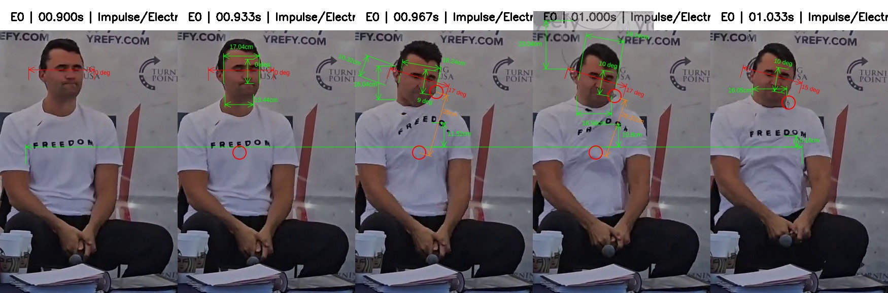
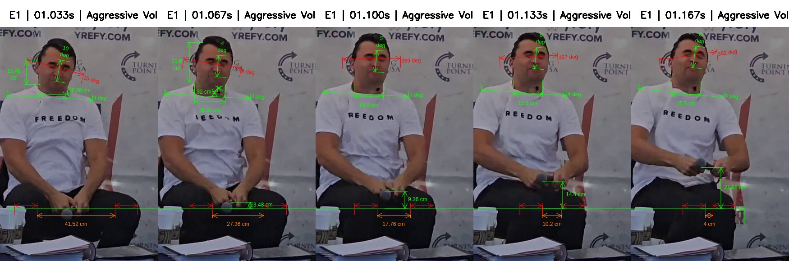
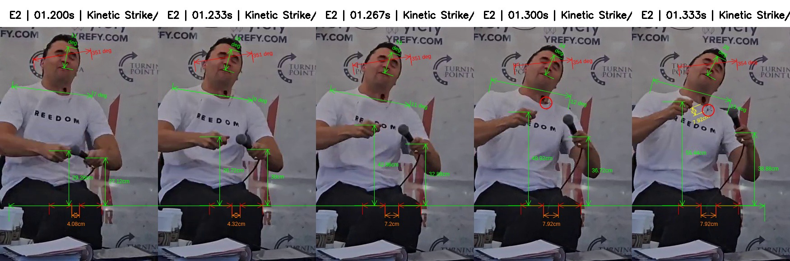
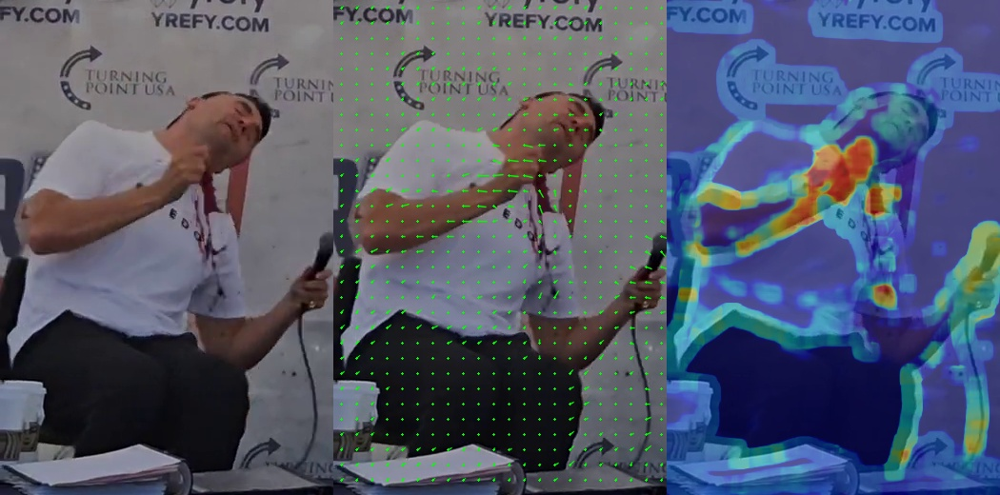
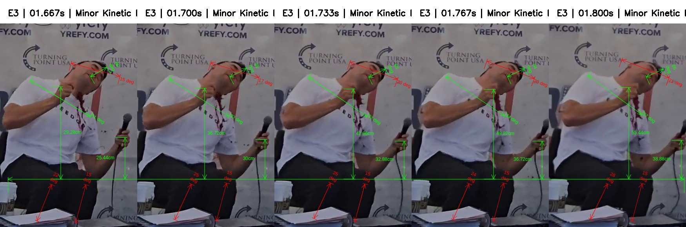
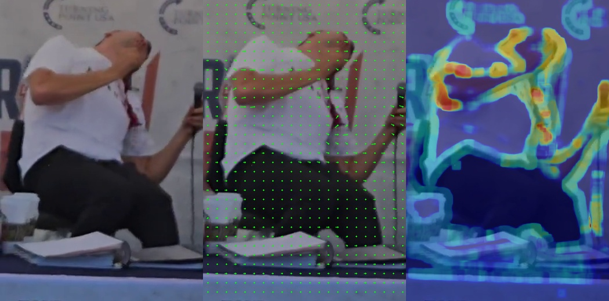
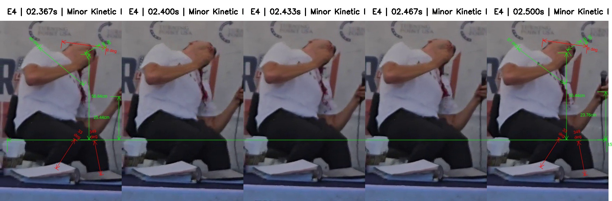

# Frame-By-Frame Observations

**All measurements need to be re-calculated b/c shoulder-to-shoulder width is now 47.2cm**

## Feature of Interest Measurements

## Key Events

Figure 3.identify-impact-events-kinematic-profile.png

Using Scaling: 0.0024 m/px

## Event ID: 0 visual-time: 1.000, inferred-onset-visual-time: 0.9773

Context:
1. Charlie Kirk (aka subject/speaker/target) is sitting on a raised seat having spoken is last words "gun violence" into his PA wired microphone 
2. Charlie Kirk's staged setup is a seat on a platform surrounded by tables that have a cloth banner coverings
3. Charlie Kirk lowers the microphone with both hands and between his legs. Note, his left hand is holding the microphone upper housing. His right thumb is wrapped over the left thumb and the index right index finger brushing up agains the microphone upper housing
4. Charlie Kirk closes both eyes and awaits Hunter Kozak's (ie. questioner) response 
5. Hunter Kozak responds with "great"
6. The 0.967s is first video frame of visual impact

Figure 3.identify-impact-events-motion-overlay-0.jpg

Kinetic directional flow vectors & kinetic energy heatmap summary
1. The hair has moved up and outward
2. The cheek and jaw line exhibits expansion
3. The upper-left area of the t-shirt/chest is lifted visibly distorting the "Freedom" print on the t-shirt
4. The upper arms and biceps appear to stiffen
5. The hand moves upward whilst still holding the microphone capsule module (ie. head) in place
6. The left leg whilst still in the sitting posture moves inward

Figure event_0_evidence_strip-observations.jpg

| #  | Event/strip | Timestamp | Feature of Interest                                           | Editor (px/angle) | cm/diff | Ratio  | Notes                                                                               |
|----|-------------|-----------|---------------------------------------------------------------|-------------------|---------|--------|-------------------------------------------------------------------------------------|
| 1  | 0           | 0.933     | forward/back head tilt (Eartip to closed-eyelid angle)        | 0                 |         |        | baseline                                                                            |
| 2  | 0           | 0.933     | left/right head tilt (tip-of-lip to middle-of-eyebrows angle) | 0                 |         |        | baseline                                                                            |
| 3  | 0           | 0.933     | t-shirt left-collar movement                                  | 0                 |         |        | baseline                                                                            |
| 4  | 0           | 0.933     | face width                                                    | 71                | 17.04   | 0.0024 | baseline                                                                            |
| 5  | 0           | 0.933     | neck diameter                                                 | 56                | 13.44   |        | baseline                                                                            |
| 6  | 0           | 0.933     | necklace pendants movement                                    | 0                 |         |        | baseline                                                                            |
| 7  | 0           | 0.933     | necklace back-of-neck movement                                | 0                 |         |        | baseline                                                                            |
| 8  | 0           | 0.933     | necklace broken chain end movement                            | 0                 |         |        | baseline (not broken)                                                               |
| 9  | 0           | 0.933     | head hair (short)                                             |                   |         |        | baseline (normal)                                                                   |
| 10 |             |           |                                                               |                   |         |        |                                                                                     |
| 11 | 0           | 0.967     | forward/back head tilt (Eartip to closed-eyelid angle)        | 17                | 17      |        | head tilts 17 degrees down                                                          |
| 12 | 0           | 0.967     | left/right head tilt (tip-of-lip to middle-of-eyebrows angle) | 9                 | 9       |        | head tilts 9 degrees left                                                           |
| 13 | 0           | 0.933     | t-shirt left-collar movement                                  | 48                | 11.52   |        | T-shirt left colllar jumps up 12cm towards left ear                                 |
| 14 | 0           | 0.967     | face width                                                    | 76                | 1.2     |        | facial distortion increase by 1.2cm                                                 |
| 15 | 0           | 0.967     | neck diameter                                                 | ?                 | ?       |        | T-shirt covering neck (see next frame)                                              |
| 16 | 0           | 0.967     | necklace pendants movement                                    | 125               | 30      |        | 1 or more pendants propelled 30cm pushing t-shirt left collar                       |
| 17 | 0           | 0.967     | necklace back-of-neck movement                                | 67                | 16.08   |        | necklace positioned at the back of the next moves 16cm upward                       |
| 18 | 0           | 0.967     | necklace broken chain end movement                            | 43                | 10.32   |        | right side of broken chain dangling 10cm down from behind right ear                 |
| 19 | 0           | 0.967     | head hair (short)                                             |                   |         |        | standing on end                                                                     |
| 20 |             |           |                                                               |                   |         |        |                                                                                     |
| 21 | 0           | 1.000     | forward/back head tilt (Eartip to closed-eyelid angle)        | 17                | 0       |        | head tilt is unchanged                                                              |
| 22 | 0           | 1.000     | left/right head tilt (tip-of-lip to middle-of-eyebrows angle) | 10                | 1       |        | head tilts 1 degrees further left                                                   |
| 23 | 0           | 1.000     | t-shirt left-collar movement                                  | 45                | -0.72   |        | T-shirt left colllar drops 1cm back down                                            |
| 24 | 0           | 1.000     | face width                                                    | 75                | -0.24   |        | facial distortion reduces by 0.24cm                                                 |
| 25 | 0           | 1.000     | neck diameter                                                 | 69                | 16.56   | 3.12   | neck diameter increases by 3cm due to cavitation                                    |
| 26 | 0           | 1.000     | necklace pendants movement                                    | 118               | 1.68    |        | 1 or more pendants drop 2cm still pushing against t-shirt left collar               |
| 27 | 0           | 1.000     | necklace back-of-neck movement                                | 67                | 16.08   |        | necklace positioned at the back of the next moves 16cm upward                       |
| 28 | 0           | 1.000     | necklace broken chain end movement                            | 96                | 23.04   |        | right side of broken chain propelled 23cm up from behind right ear (end moves 33cm) |
| 29 | 0           | 1.000     | head hair (short)                                             |                   |         |        | leaning forward                                                                     |
| 30 |             |           |                                                               |                   |         |        |                                                                                     |
| 31 | 0           | 1.033     | forward/back head tilt (Eartip to closed-eyelid angle)        | 15                | -2      |        | head tilt 2 degrees upward                                                          |
| 32 | 0           | 1.033     | t-shirt left-collar movement                                  | 21.5              | -5.64   |        | T-shirt left colllar drops a further 6cm back down                                  |
| 33 | 0           | 1.033     | neck diameter                                                 | 67                | 16.08   | -0.48  | neck diameter reduces 0.5cm after cavitation                                        |
| 34 | 0           | 1.033     | necklace pendants movement                                    |                   |         |        | 1 large pendant and left side of broken chain entangled in t-shirt left collar      |
| 35 | 0           | 1.033     | head hair (short)                                             |                   |         |        | returning back but still offset                                                     |

Table Event 0 Impulse/Electrical Discharge Case

## Event ID: 1 visual-time: 1.134, inferred-onset-visual-time: 1.062

Context:
1. Charlie Kirk is still sitting upright on a raised seat 
2. Charlie Kirk's neck (left of the the adam's apple) exhibits an entry/exit projectile wound. Note, this wound occured between (0.933s - 1.067s), when this part of the neck was covered by the lifted t-shirt collar. The wound was possibly caused by 1 or more necklace pendants that acted as a projectile
3. Charlie Kirk's t-shirt has mostly returned to the original state prior to initial impact with the "Freedom" print aligned again
4. Charlie Kirk's left & right legs remain spread apart with his hands and the microphone resting in between

Figure 3.identify-impact-events-motion-overlay-1.jpg

Kinetic directional flow vectors & kinetic energy heatmap summary
1. The face from the forehead down to the chin moves upward 
2. The front right t-shirt collar moves left and back into standard position
3. The right upper arm moves left. The left upper arm moves left and out slightly
4. The abdomen moves left
5. The right wrist pops outward and the forearm pushes to the left. The right hand's knuckles push forward and down.
6. The legs are clamping together whilst still remaining in the sitting posture; the left leg (from the knee to the shin) moves inward

Figure event_1_evidence_strip-observations.jpg

| #  | Event/strip | Timestamp | Feature of Interest                                           | Editor (px/angle) | cm/diff | Ratio              | Notes                                                                                                                 |
|----|-------------|-----------|---------------------------------------------------------------|-------------------|---------|--------------------|-----------------------------------------------------------------------------------------------------------------------|
| 1  | 1           | 1.033     | forward/back head tilt (Eartip to closed-eyelid angle)        | 15                |         |                    | strip baseline                                                                                                        |
| 2  | 1           | 1.033     | left/right head tilt (tip-of-lip to middle-of-eyebrows angle) | 10                |         |                    | strip baseline                                                                                                        |
| 3  | 1           | 1.033     | neck diameter                                                 | 67                | 16.08   | 0.0024             | strip baseline                                                                                                        |
| 4  | 1           | 1.033     | necklace back-of-neck movement                                | 52                | 12.48   |                    | strip baseline                                                                                                        |
| 5  | 1           | 1.033     | left/right upper-body tilt (Shoulder-to-shoulder angle)       | 3                 |         |                    | strip baseline                                                                                                        |
| 6  | 1           | 1.033     | hands and microphone movement                                 | 0                 | 0       |                    | baseline; left hand holding microphone; right thumb over left thumb;right index finger brushing microphone housing    |
| 7  | 1           | 1.033     | legs clamping together (gap between knee-caps)                | 173               | 41.52   |                    | strip baseline                                                                                                        |
| 8  |             |           |                                                               |                   |         |                    |                                                                                                                       |
| 9  | 1           | 1.067     | forward/back head tilt (Eartip to closed-eyelid angle)        | 9                 | -6      |                    | head tilts 6 degrees up (ie. straightens up)                                                                          |
| 10 | 1           | 1.067     | left/right head tilt (tip-of-lip to middle-of-eyebrows angle) | 4                 | -6      |                    | head tilts 6 degrees left (ie. straightens up)                                                                        |
| 11 | 1           | 1.067     | neck diameter                                                 | 68                | 16.32   | 0.24               | neck cavitation increases by 2.4mm                                                                                    |
| 12 | 1           | 1.067     | neck wound (left of adam’s apple)                             | 5.5               | 1.32    |                    | neck wound 13x13mm appears (cause unknown; possibly st michaels’ pendant projectile)                                  |
| 13 | 1           | 1.067     | necklace back-of-neck movement                                | 90                | -9.12   |                    | necklace at the back of neck jumps up 9cm upward                                                                      |
| 14 | 1           | 1.067     | left/right upper-body tilt (Shoulder-to-shoulder angle)       | 3                 |         |                    | no change to body tilting                                                                                             |
| 15 | 1           | 1.067     | hands and microphone movement                                 | 14.5              | 3.48    | -3.48              | baseline; left hand holding microphone; right thumb over left thumb;right index finger brushing microphone housing    |
| 16 | 1           | 1.067     | legs clamping together (gap between knee-caps)                | 114               | 27.36   | -14.16             | knee caps clamp closer together by 14.16cm                                                                            |
| 17 |             |           |                                                               |                   |         |                    |                                                                                                                       |
| 18 | 1           | 1.100     | forward/back head tilt (Eartip to closed-eyelid angle)        | -1                | -10     |                    | head tilts 10 degrees up (ie. straightens up more)                                                                    |
| 19 | 1           | 1.100     | left/right head tilt (tip-of-lip to middle-of-eyebrows angle) | 5                 | 1       |                    | head tilts 1 degrees more left                                                                                        |
| 20 | 1           | 1.100     | neck diameter                                                 | 65                | 15.6    | -0.719999999999997 | neck cavitation now reduces by 7.2mm                                                                                  |
| 21 | 1           | 1.100     | left/right upper-body tilt (Shoulder-to-shoulder angle)       | 3                 |         |                    | no change to body tilting                                                                                             |
| 22 | 1           | 1.100     | hands and microphone movement                                 | 39                | 9.36    | -5.88              | right thumb still wrapped over left; left hand holding microphone; hands & microphone rises 5.9cm                     |
| 23 | 1           | 1.100     | legs clamping together (gap between knee-caps)                | 74                | 17.76   | -9.6               | knee caps clamp even closer together by 9.6cm                                                                         |
| 24 |             |           |                                                               |                   |         |                    |                                                                                                                       |
| 25 | 1           | 1.133     | forward/back head tilt (Eartip to closed-eyelid angle)        | -3                | -2      |                    | head tilts 2 degrees up (ie. straightens up more)                                                                     |
| 26 | 1           | 1.133     | left/right head tilt (tip-of-lip to middle-of-eyebrows angle) | 6                 | 1       |                    | head tilts 1 degrees more left                                                                                        |
| 27 | 1           | 1.133     | neck diameter                                                 | 65                | 15.6    | 0                  | no changes to neck cavitation                                                                                         |
| 28 | 1           | 1.133     | left/right upper-body tilt (Shoulder-to-shoulder angle)       | 4                 | -1      |                    | upper body tilts 1 degree further left                                                                                |
| 29 | 1           | 1.133     | hands and microphone movement                                 | 60                | 14.4    | -5.04              | right thumb resting on microphone housing; left hand holding microphone; hands & microphone rises another 5cm         |
| 30 | 1           | 1.133     | legs clamping together (gap between knee-caps)                | 42.48             | 10.1952 | -7.5648            | knee caps clamp even closer together by 7.6cm                                                                         |
| 31 |             |           |                                                               |                   |         |                    |                                                                                                                       |
| 32 | 1           | 1.167     | forward/back head tilt (Eartip to closed-eyelid angle)        | -8                | -5      |                    | head tilts 5 degrees up (ie. straightens up more)                                                                     |
| 33 | 1           | 1.167     | left/right head tilt (tip-of-lip to middle-of-eyebrows angle) | 8                 | 2       |                    | head tilts 2 degrees more left                                                                                        |
| 34 | 1           | 1.167     | neck diameter                                                 | 65                | 0       | 15.6               | no changes to neck cavitation                                                                                         |
| 35 | 1           | 1.167     | left/right upper-body tilt (Shoulder-to-shoulder angle)       | 4                 | 0       |                    | upper body tilts 1 degree further left                                                                                |
| 36 | 1           | 1.167     | hands and microphone movement                                 | 91.5              | 21.96   | -7.56              | right hand and fingers clamp into a fist; left hand clamps around microphone; hands 4cm apart and rises another 7.5cm |
| 37 | 1           | 1.167     | legs clamping together (gap between knee-caps)                | 17                | 4.08    | -6.1152            | knee caps clamp even closer together by 7.6cm                                                                         |

Table Event 1 Aggressive Voluntary/Reflexive Movement

## Event ID: 2 visual-time: 1.300, inferred-onset-visual-time: 1.2221

Context:
1. Charlie Kirk is still sitting upright on a raised seat 
2. Charlie Kirk's neck exhibits an entry/exit projectile wound has a necklace and pendant entangled underneath the t-shirt front collar
3. Charlie Kirk's left & right knee caps have at this stage clamped together
4. Charlie Kirk's left hand (which is still holding the microphone) & right hand have separated and raised above the knee

Figure 3.identify-impact-events-motion-overlay-2.jpg

Kinetic directional flow vectors & kinetic energy heatmap summary
1. With the chin as the origin, the head rotates left
2. With the elbow as the origin, the left forearm and hand (still holding the microphone) moves upward
3. With the elbow as the origin, the right forearm with a clenched fist moves upwawrd 
4. The abdomen moves right
5. The right wrist pops outward and the forearm pushes to the right. The right hand's knuckles push forward and down.
6. The legs clamp together whilst still in the sitting posture; the left leg (from the knee to the shin) moves outward/left

Figure event_2_evidence_strip-observations.jpg

| #  | Event/strip | Timestamp | Feature of Interest                                           | Editor (px/angle) | cm/diff | Ratio             | Notes                                                                                                            |
|----|-------------|-----------|---------------------------------------------------------------|-------------------|---------|-------------------|------------------------------------------------------------------------------------------------------------------|
| 1  | 2           | 1.200     | forward/back head tilt (Eartip to closed-eyelid angle)        | -9                |         |                   | strip baseline                                                                                                   |
| 2  | 2           | 1.200     | left/right head tilt (tip-of-lip to middle-of-eyebrows angle) | 11                |         |                   | strip baseline                                                                                                   |
| 3  | 2           | 1.200     | left/right upper-body tilt (Shoulder-to-shoulder angle)       | 7                 |         |                   | strip baseline                                                                                                   |
| 4  | 2           | 1.200     | vertical left hand/microphone movement                        | 106               | 25.44   | 0.0024            | strip baseline; left hand holding microphone 25.44cm above knees                                                 |
| 5  | 2           | 1.200     | vertical right hand movement                                  | 122               | 29.28   |                   | strip baseline; right hand 29.28cm above knees                                                                   |
| 6  | 2           | 1.200     | legs clamping together (gap between knee-caps)                | 17                | 4.08    |                   | strip baseline 4.08cm gap between knees                                                                          |
| 7  |             |           |                                                               |                   |         |                   |                                                                                                                  |
| 8  | 2           | 1.233     | forward/back head tilt (Eartip to closed-eyelid angle)        | -9                | 0       |                   | no change to head tilt                                                                                           |
| 9  | 2           | 1.233     | left/right head tilt (tip-of-lip to middle-of-eyebrows angle) | 16                | 5       |                   | head tilts 5 degrees left                                                                                        |
| 10 | 2           | 1.233     | left/right upper-body tilt (Shoulder-to-shoulder angle)       | 9                 | -2      |                   | upper body tilts 2 degrees further left                                                                          |
| 11 | 2           | 1.233     | vertical left hand/microphone movement                        | 125               | 30      | -4.56             | left hand clamped around microphone rises 4.56cm                                                                 |
| 12 | 2           | 1.233     | vertical right hand movement                                  | 153               | 36.72   | -7.44000000000001 | right hand clamped in a fist rises 7.44cm                                                                        |
| 13 | 2           | 1.233     | legs clamping together (gap between knee-caps)                | 18                | 4.32    | -0.24             | previously clamped knee caps expand by 2.4mm                                                                     |
| 14 | 2           | 1.233     | neck wound                                                    | 18                | 4.32    | -4.32             | spots of blood start leaking from the neck wound                                                                 |
| 15 |             |           |                                                               |                   |         |                   |                                                                                                                  |
| 16 | 2           | 1.267     | forward/back head tilt (Eartip to closed-eyelid angle)        | -9                | 0       |                   | no change to head tilt                                                                                           |
| 17 | 2           | 1.267     | left/right head tilt (tip-of-lip to middle-of-eyebrows angle) | 19                | 3       |                   | head tilts 3 degrees further left                                                                                |
| 18 | 2           | 1.267     | left/right upper-body tilt (Shoulder-to-shoulder angle)       | 11                | -2      |                   | upper body tilts 2 degrees further left                                                                          |
| 19 | 2           | 1.267     | vertical left hand/microphone movement                        | 137               | 32.88   | -2.88             | left hand clamped around microphone rises 2.88cm                                                                 |
| 20 | 2           | 1.267     | vertical right hand movement                                  | 179               | 42.96   | -6.24             | right hand clamped in a fist rises 6.24cm                                                                        |
| 21 | 2           | 1.267     | legs clamping together (gap between knee-caps)                | 30                | 7.2     | -2.88             | previously clamped knee caps expand by 2.88mm                                                                    |
| 22 | 2           | 1.267     | neck wound                                                    | 18                | 4.32    | 0                 | more spots of blood start leaking from the neck wound                                                            |
| 23 |             |           |                                                               |                   |         |                   |                                                                                                                  |
| 24 | 2           | 1.300     | forward/back head tilt (Eartip to closed-eyelid angle)        | -6                | 3       |                   | the head straighten slighly                                                                                      |
| 25 | 2           | 1.300     | left/right head tilt (tip-of-lip to middle-of-eyebrows angle) | 24                | 5       |                   | head tilts 5 degrees further left                                                                                |
| 26 | 2           | 1.300     | left/right upper-body tilt (Shoulder-to-shoulder angle)       | 12                | -1      |                   | upper body tilts 1 degrees further left                                                                          |
| 27 | 2           | 1.300     | vertical left hand/microphone movement                        | 153               | 36.72   | -3.84             | left hand clamped around microphone rises 3.84cm                                                                 |
| 28 | 2           | 1.300     | vertical right hand movement                                  | 208               | 49.92   | -6.95999999999999 | right hand clamped in a fist rises 6.96cm                                                                        |
| 29 | 2           | 1.300     | legs clamping together (gap between knee-caps)                | 33                | 7.92    | -0.72             | previously clamped knee caps expand by 7.2mm                                                                     |
| 30 | 2           | 1.300     | neck wound                                                    | 18                | 4.32    | 0                 | pressure build up pushes out the projectile (possibly pendant) causing the block at the entry/exit wound opening |
| 31 |             |           |                                                               |                   |         |                   |                                                                                                                  |
| 32 | 2           | 1.333     | forward/back head tilt (Eartip to closed-eyelid angle)        | -6                | 0       |                   | no change to head tilt from previous frame                                                                       |
| 33 | 2           | 1.333     | left/right head tilt (tip-of-lip to middle-of-eyebrows angle) | 28                | 4       |                   | head tilts 4 degrees further left                                                                                |
| 34 | 2           | 1.333     | left/right upper-body tilt (Shoulder-to-shoulder angle)       | 15                | -3      |                   | upper body tilts 3 degrees further left                                                                          |
| 35 | 2           | 1.333     | vertical left hand/microphone movement                        | 162               | 38.88   | -2.16             | left hand clamped around microphone rises 2.16cm                                                                 |
| 36 | 2           | 1.333     | vertical right hand movement                                  | 231               | 55.44   | -5.52             | right hand clamped in a fist rises 5.52cm                                                                        |
| 37 | 2           | 1.333     | legs clamping together (gap between knee-caps)                | 33                | 7.92    | 0                 | no change to leg clamping                                                                                        |
| 38 | 2           | 1.333     | projectile                                                    | 18                | 4.32    |                   | projectile has now fallen 4,32cm from previous position at the opening of the wound                              |

Table Event 2 Kinetic Strike/Secondary Force (10.5G)

## Event ID: 3 visual-time: 1.767, inferred-onset-visual-time: 1.6949

Context:
1. Charlie Kirk is still sitting upright on a raised seat 
2. Charlie Kirk's blood started flowing from the neck wound at 1.400s; blood started spirting out at 1.533s; blood starts gushing out from the neck wound at 1.600s. I estimate that between 1.533s to 1.600s there was approx. 50ml lost through the wound
3. Charlie Kirk's hinged wedding ring became detached from left hand's index finger at 1.400s; ring gets entangled on pinky finger at 1.433s
4. Charlie Kirk's head has tilted fully left

Figure 3.identify-impact-events-motion-overlay-3.jpg

Kinetic directional flow vectors & kinetic energy heatmap summary
1. The whole head already fully tilted, moves left
2. Approx. 50+ml of blood pours out of the neck wound in a single frame
3. Charlie's right forearm and right hand still clenched as a fist moves right
4. The left hand clenching the microphone moves left
5. The left knee moves up and left 

Figure event_3_evidence_strip-observations.jpg

| #  | Event/strip | Timestamp | Feature of Interest                                           | Editor (px/angle) | cm/diff | Ratio             | Notes                                                            |
|----|-------------|-----------|---------------------------------------------------------------|-------------------|---------|-------------------|------------------------------------------------------------------|
| 1  | 3           | 1.667     | forward/back head tilt (Eartip to closed-eyelid angle)        | 15                |         |                   | strip baseline; head tilting 15 degrees forward                  |
| 2  | 3           | 1.667     | left/right head tilt (tip-of-lip to middle-of-eyebrows angle) | 60                |         |                   | strip baseline; head tilting 60 degrees left                     |
| 3  | 3           | 1.667     | left/right upper-body tilt (Shoulder-to-shoulder angle)       | 31                |         |                   | strip baseline; upper body tilts 31 degrees left                 |
| 4  | 3           | 1.667     | vertical left hand/microphone movement                        | 106               | 25.44   | 0.0024            | strip baseline; left hand holding microphone 25.44cm above knees |
| 5  | 3           | 1.667     | vertical right hand movement                                  | 236               | 56.64   |                   | strip baseline; right hand 56.64cm above knees                   |
| 6  | 3           | 1.667     | left leg tilt                                                 | 15                |         |                   | strip baseline left leg tilts 15 degrees left                    |
| 7  | 3           | 1.667     | right leg tilt                                                | 22                |         |                   | strip baseline right leg tilts 22 degrees left                   |
| 8  |             |           |                                                               |                   |         |                   |                                                                  |
| 9  | 3           | 1.700     | forward/back head tilt (Eartip to closed-eyelid angle)        | 17                | 2       |                   | head tilts 2 degrees forward                                     |
| 10 | 3           | 1.700     | left/right head tilt (tip-of-lip to middle-of-eyebrows angle) | 62                | -2      |                   | head tilts 2 degrees left                                        |
| 11 | 3           | 1.700     | left/right upper-body tilt (Shoulder-to-shoulder angle)       | 32                | -1      |                   | upper body tilts 1 degree further left                           |
| 12 | 3           | 1.700     | vertical left hand/microphone movement                        | 101               | 24.24   | 1.2               | left hand holding microphone drops 1.2cm closer to knees         |
| 13 | 3           | 1.700     | vertical right hand movement                                  | 232               | 55.68   | 0.960000000000001 | right hand holding microphone drops 0.96cm closer to knees       |
| 14 | 3           | 1.700     | left leg tilt                                                 | 15                |         | 0                 | no change to tilt                                                |
| 15 | 3           | 1.700     | right leg tilt                                                | 25                |         | -3                | right leg tilts 3 degrees further left                           |
| 16 |             |           |                                                               |                   |         |                   |                                                                  |
| 17 | 3           | 1.733     | forward/back head tilt (Eartip to closed-eyelid angle)        | 20                | 3       |                   | head tilts 3 degrees more forward                                |
| 18 | 3           | 1.733     | left/right head tilt (tip-of-lip to middle-of-eyebrows angle) | 63                | -1      |                   | head tilts 1 degree further left                                 |
| 19 | 3           | 1.733     | left/right upper-body tilt (Shoulder-to-shoulder angle)       | 33                | -1      |                   | upper body tilts 1 degree further left                           |
| 20 | 3           | 1.733     | vertical left hand/microphone movement                        | 97                | 23.28   | 0.960000000000001 | left hand holding microphone drops 0.96cm closer to knees        |
| 21 | 3           | 1.733     | vertical right hand movement                                  | 230               | 55.2    | 0.479999999999997 | right hand holding microphone drops 0.48cm closer to knees       |
| 22 | 3           | 1.733     | left leg tilt                                                 | 15                |         | 0                 | no change to tilt                                                |
| 23 | 3           | 1.733     | right leg tilt                                                | 25                |         | 0                 | no change to tilt                                                |
| 24 |             |           |                                                               |                   |         |                   |                                                                  |
| 25 | 3           | 1.767     | forward/back head tilt (Eartip to closed-eyelid angle)        | 20                | 0       |                   | no change to tilt                                                |
| 26 | 3           | 1.767     | left/right head tilt (tip-of-lip to middle-of-eyebrows angle) | 64                | -1      |                   | head tilts 1 degree further left                                 |
| 27 | 3           | 1.767     | left/right upper-body tilt (Shoulder-to-shoulder angle)       | 34                | -1      |                   | upper body tilts 1 degree further left                           |
| 28 | 3           | 1.767     | vertical left hand/microphone movement                        | 97                | 23.28   | 0                 | no change to hand lift                                           |
| 29 | 3           | 1.767     | vertical right hand movement                                  | 229               | 54.96   | 0.239999999999995 | right hand holding microphone drops 0.24cm closer to knees       |
| 30 | 3           | 1.767     | left leg tilt                                                 | 15                |         | 0                 | no change to tilt                                                |
| 31 | 3           | 1.767     | right leg tilt                                                | 24                |         | 1                 | right leg tilts 1 degree right (ie. slighly straightening)       |
| 32 |             |           |                                                               |                   |         |                   |                                                                  |
| 33 | 3           | 1.800     | forward/back head tilt (Eartip to closed-eyelid angle)        | 21                | -1      |                   | head tilts 1 degree more forward                                 |
| 34 | 3           | 1.800     | left/right head tilt (tip-of-lip to middle-of-eyebrows angle) | 65                | -1      |                   | head tilts 1 degree further left                                 |
| 35 | 3           | 1.800     | left/right upper-body tilt (Shoulder-to-shoulder angle)       | 37                | -3      |                   | upper body tilts 3 degrees further left                          |
| 36 | 3           | 1.800     | vertical left hand/microphone movement                        | 99                | 23.76   | -0.48             | left hand holding microphone lifts up 0.48cm further above knees |
| 37 | 3           | 1.800     | vertical right hand movement                                  | 229               | 54.96   | 0                 | no change to hand lift                                           |
| 38 | 3           | 1.800     | left leg tilt                                                 | 15                |         | 0                 | no change to tilt                                                |
| 39 | 3           | 1.800     | right leg tilt                                                | 26                |         | -2                | right leg tilts 2 degrees further left                           |

Table Event 3 Minor Kinetic Deviation

## Event ID: 4 visual-time: 2.467, inferred-onset-visual-time: 2.4461

Context:
1. Charlie Kirk is still sitting on a raised seat although his body is heavily leaning left and his head is tilted back/left
2. After the initial pressure build up on the neck wound, Charlie Kirk's blood kept flowing at a rate of approx 13.5ml per frame (ie. 33.33ms). Recall the neck wound appears to be a 13x13mm squarish hole
3. Charlie Kirk's knee caps remain clamped together

Figure 3.identify-impact-events-motion-overlay-4.jpg

Kinetic directional flow vectors & kinetic energy heatmap summary
1. After the body has tilted back and left whilst seated, it starts to slowly pull back to center
2. The head whilst fully tilted slightly rotates on a horizontal plane between the neck and the forehead 
3. The right arm is positioned almost horizontally with the right fist near his neck; both elbow and fist exhibit slight movement right (ie. back to center)
4. The blood pouring from the neck is tracking slighting right with the body 
5. The left fore arm at 45 degree angle is still clenching the microphone; the left hand tilting right such that the microphone is held vertically

Figure event_4_evidence_strip-observations.jpg

Note, measurements for only the first and last frame in the strip have been calculated because there is such little variance in measurements.

| #  | Event/strip | Timestamp | Feature of Interest                                           | Editor (px/angle) | cm/diff | Ratio              | Notes                                                           |
|----|-------------|-----------|---------------------------------------------------------------|-------------------|---------|--------------------|-----------------------------------------------------------------|
| 1  | 4           | 2.367     | forward/back head tilt (Eartip to closed-eyelid angle)        | 8                 |         |                    | strip baseline; head tilting 8 degrees forward                  |
| 2  | 4           | 2.367     | left/right head tilt (tip-of-lip to middle-of-eyebrows angle) | 60                |         |                    | strip baseline; head tilting 60 degrees left                    |
| 3  | 4           | 2.367     | left/right upper-body tilt (Shoulder-to-shoulder angle)       | 40                |         |                    | strip baseline; upper body tilts 40 degrees left                |
| 4  | 4           | 2.367     | vertical left hand/microphone movement                        | 125               | 30      | 0.0024             | strip baseline; left hand holding microphone 30cm above knees   |
| 5  | 4           | 2.367     | vertical right hand movement                                  | 247               | 59.28   |                    | strip baseline; right hand 59.28cm above knees                  |
| 6  | 4           | 2.367     | left leg tilt                                                 | -11               |         |                    | strip baseline left leg tilts 11 degrees right                  |
| 7  | 4           | 2.367     | right leg tilt                                                | 33                |         |                    | strip baseline right leg tilts 33 degrees left                  |
| 8  |             |           |                                                               |                   |         |                    |                                                                 |
| 9  | 4           | 2.500     | forward/back head tilt (Eartip to closed-eyelid angle)        | 8                 | 0       |                    | no change to tilt                                               |
| 10 | 4           | 2.500     | left/right head tilt (tip-of-lip to middle-of-eyebrows angle) | 55                | 5       |                    | head tilting 5 degrees left                                     |
| 11 | 4           | 2.500     | left/right upper-body tilt (Shoulder-to-shoulder angle)       | 37                | 3       |                    | upper body tilts 3 degree further right                         |
| 12 | 4           | 2.500     | vertical left hand/microphone movement                        | 139               | 33.36   | -3.35999999999999  | left hand holding microphone rises 3.4cm higher above the knees |
| 13 | 4           | 2.500     | vertical right hand movement                                  | 251               | 60.24   | -0.959999999999994 | right hand holding microphone drops 0.96cm closer to knees      |
| 14 | 4           | 2.500     | left leg tilt                                                 | -11               |         | 0                  | strip baseline left leg tilts 11 degrees right                  |
| 15 | 4           | 2.500     | right leg tilt                                                | 33                |         | 0                  | strip baseline right leg tilts 33 degrees left                  |

Table Event 4 Minor Kinetic Deviation