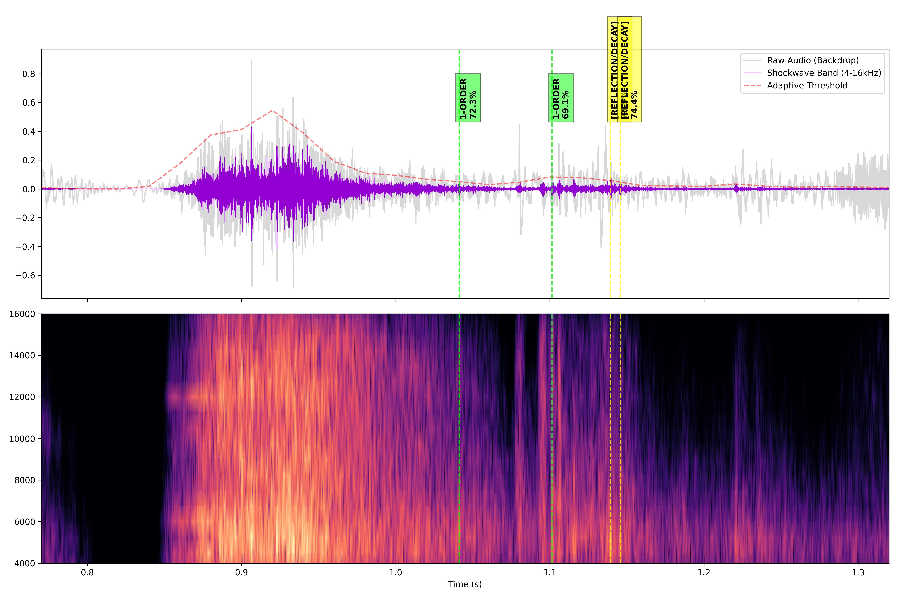
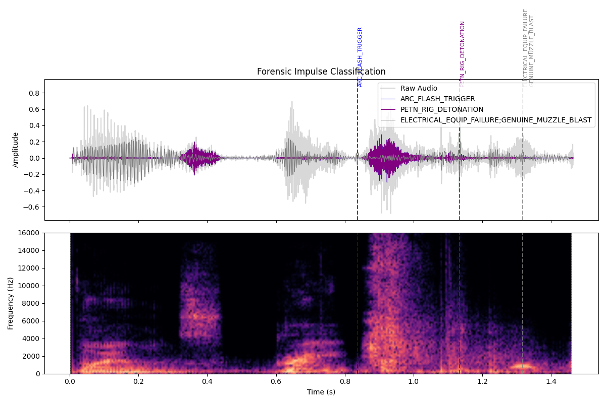
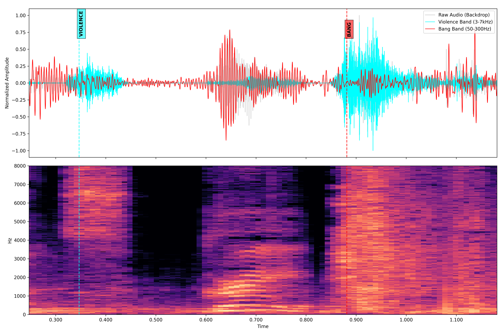

# Audio Analysis

```bash
cd ../4.audio-analysis
```

## Audio Channel Selection

```bash
ffmpeg -i ../.bin/key-seq-audio.wav -af astats -f null - 2> key-seq-audio.wav.astat.txt
```

```txt key-seq-audio.wav.astat.txt
ffmpeg version 5.1.8-0+deb12u1 Copyright (c) 2000-2025 the FFmpeg developers
  built with gcc 12 (Debian 12.2.0-14+deb12u1)
  configuration: --prefix=/usr --extra-version=0+deb12u1 --toolchain=hardened --libdir=/usr/lib/x86_64-linux-gnu --incdir=/usr/include/x86_64-linux-gnu --arch=amd64 --enable-gpl --disable-stripping --enable-gnutls --enable-ladspa --enable-libaom --enable-libass --enable-libbluray --enable-libbs2b --enable-libcaca --enable-libcdio --enable-libcodec2 --enable-libdav1d --enable-libflite --enable-libfontconfig --enable-libfreetype --enable-libfribidi --enable-libglslang --enable-libgme --enable-libgsm --enable-libjack --enable-libmp3lame --enable-libmysofa --enable-libopenjpeg --enable-libopenmpt --enable-libopus --enable-libpulse --enable-librabbitmq --enable-librist --enable-librubberband --enable-libshine --enable-libsnappy --enable-libsoxr --enable-libspeex --enable-libsrt --enable-libssh --enable-libsvtav1 --enable-libtheora --enable-libtwolame --enable-libvidstab --enable-libvorbis --enable-libvpx --enable-libwebp --enable-libx265 --enable-libxml2 --enable-libxvid --enable-libzimg --enable-libzmq --enable-libzvbi --enable-lv2 --enable-omx --enable-openal --enable-opencl --enable-opengl --enable-sdl2 --disable-sndio --enable-libjxl --enable-pocketsphinx --enable-librsvg --enable-libmfx --enable-libdc1394 --enable-libdrm --enable-libiec61883 --enable-chromaprint --enable-frei0r --enable-libx264 --enable-libplacebo --enable-librav1e --enable-shared
  libavutil      57. 28.100 / 57. 28.100
  libavcodec     59. 37.100 / 59. 37.100
  libavformat    59. 27.100 / 59. 27.100
  libavdevice    59.  7.100 / 59.  7.100
  libavfilter     8. 44.100 /  8. 44.100
  libswscale      6.  7.100 /  6.  7.100
  libswresample   4.  7.100 /  4.  7.100
  libpostproc    56.  6.100 / 56.  6.100
Guessed Channel Layout for Input Stream #0.0 : stereo
Input #0, wav, from '../.bin/key-seq-audio.wav':
  Metadata:
    encoder         : Lavf59.27.100
  Duration: 00:00:01.46, bitrate: 1536 kb/s
  Stream #0:0: Audio: pcm_s16le ([1][0][0][0] / 0x0001), 48000 Hz, stereo, s16, 1536 kb/s
Stream mapping:
  Stream #0:0 -> #0:0 (pcm_s16le (native) -> pcm_s16le (native))
Press [q] to stop, [?] for help
Output #0, null, to 'pipe:':
  Metadata:
    encoder         : Lavf59.27.100
  Stream #0:0: Audio: pcm_s16le, 48000 Hz, stereo, s16, 1536 kb/s
    Metadata:
      encoder         : Lavc59.37.100 pcm_s16le
size=N/A time=00:00:00.02 bitrate=N/A speed=N/A    
size=N/A time=00:00:01.46 bitrate=N/A speed= 152x    
video:0kB audio:275kB subtitle:0kB other streams:0kB global headers:0kB muxing overhead: unknown
[Parsed_astats_0 @ 0x55eafcf38a40] Channel: 1
[Parsed_astats_0 @ 0x55eafcf38a40] DC offset: 0.000019
[Parsed_astats_0 @ 0x55eafcf38a40] Min level: -22373.000000
[Parsed_astats_0 @ 0x55eafcf38a40] Max level: 29225.000000
[Parsed_astats_0 @ 0x55eafcf38a40] Min difference: 0.000000
[Parsed_astats_0 @ 0x55eafcf38a40] Max difference: 15403.000000
[Parsed_astats_0 @ 0x55eafcf38a40] Mean difference: 430.554998
[Parsed_astats_0 @ 0x55eafcf38a40] RMS difference: 877.589962
[Parsed_astats_0 @ 0x55eafcf38a40] Peak level dB: -0.993643
[Parsed_astats_0 @ 0x55eafcf38a40] RMS level dB: -19.691682
[Parsed_astats_0 @ 0x55eafcf38a40] RMS peak dB: -14.755002
[Parsed_astats_0 @ 0x55eafcf38a40] RMS trough dB: -33.609859
[Parsed_astats_0 @ 0x55eafcf38a40] Crest factor: 8.607994
[Parsed_astats_0 @ 0x55eafcf38a40] Flat factor: 0.000000
[Parsed_astats_0 @ 0x55eafcf38a40] Peak count: 2
[Parsed_astats_0 @ 0x55eafcf38a40] Noise floor dB: -27.262171
[Parsed_astats_0 @ 0x55eafcf38a40] Noise floor count: 704
[Parsed_astats_0 @ 0x55eafcf38a40] Entropy: 0.809191
[Parsed_astats_0 @ 0x55eafcf38a40] Bit depth: 16/16
[Parsed_astats_0 @ 0x55eafcf38a40] Dynamic range: 95.335690
[Parsed_astats_0 @ 0x55eafcf38a40] Zero crossings: 4375
[Parsed_astats_0 @ 0x55eafcf38a40] Zero crossings rate: 0.062230
[Parsed_astats_0 @ 0x55eafcf38a40] Channel: 2
[Parsed_astats_0 @ 0x55eafcf38a40] DC offset: 0.000371
[Parsed_astats_0 @ 0x55eafcf38a40] Min level: -24786.000000
[Parsed_astats_0 @ 0x55eafcf38a40] Max level: 22217.000000
[Parsed_astats_0 @ 0x55eafcf38a40] Min difference: 0.000000
[Parsed_astats_0 @ 0x55eafcf38a40] Max difference: 14605.000000
[Parsed_astats_0 @ 0x55eafcf38a40] Mean difference: 377.113438
[Parsed_astats_0 @ 0x55eafcf38a40] RMS difference: 774.405734
[Parsed_astats_0 @ 0x55eafcf38a40] Peak level dB: -2.424605
[Parsed_astats_0 @ 0x55eafcf38a40] RMS level dB: -20.348683
[Parsed_astats_0 @ 0x55eafcf38a40] RMS peak dB: -14.984603
[Parsed_astats_0 @ 0x55eafcf38a40] RMS trough dB: -35.043090
[Parsed_astats_0 @ 0x55eafcf38a40] Crest factor: 7.874154
[Parsed_astats_0 @ 0x55eafcf38a40] Flat factor: 0.000000
[Parsed_astats_0 @ 0x55eafcf38a40] Peak count: 2
[Parsed_astats_0 @ 0x55eafcf38a40] Noise floor dB: -28.580742
[Parsed_astats_0 @ 0x55eafcf38a40] Noise floor count: 1932
[Parsed_astats_0 @ 0x55eafcf38a40] Entropy: 0.798196
[Parsed_astats_0 @ 0x55eafcf38a40] Bit depth: 16/16
[Parsed_astats_0 @ 0x55eafcf38a40] Dynamic range: 93.904729
[Parsed_astats_0 @ 0x55eafcf38a40] Zero crossings: 4158
[Parsed_astats_0 @ 0x55eafcf38a40] Zero crossings rate: 0.059143
[Parsed_astats_0 @ 0x55eafcf38a40] Overall
[Parsed_astats_0 @ 0x55eafcf38a40] DC offset: 0.000371
[Parsed_astats_0 @ 0x55eafcf38a40] Min level: -24786.000000
[Parsed_astats_0 @ 0x55eafcf38a40] Max level: 29225.000000
[Parsed_astats_0 @ 0x55eafcf38a40] Min difference: 0.000000
[Parsed_astats_0 @ 0x55eafcf38a40] Max difference: 15403.000000
[Parsed_astats_0 @ 0x55eafcf38a40] Mean difference: 403.834218
[Parsed_astats_0 @ 0x55eafcf38a40] RMS difference: 827.607510
[Parsed_astats_0 @ 0x55eafcf38a40] Peak level dB: -0.993643
[Parsed_astats_0 @ 0x55eafcf38a40] RMS level dB: -20.007771
[Parsed_astats_0 @ 0x55eafcf38a40] RMS peak dB: -14.755002
[Parsed_astats_0 @ 0x55eafcf38a40] RMS trough dB: -35.043090
[Parsed_astats_0 @ 0x55eafcf38a40] Flat factor: 0.000000
[Parsed_astats_0 @ 0x55eafcf38a40] Peak count: 2.000000
[Parsed_astats_0 @ 0x55eafcf38a40] Noise floor dB: -27.262171
[Parsed_astats_0 @ 0x55eafcf38a40] Noise floor count: 1318.000000
[Parsed_astats_0 @ 0x55eafcf38a40] Entropy: 0.803693
[Parsed_astats_0 @ 0x55eafcf38a40] Bit depth: 16/16
[Parsed_astats_0 @ 0x55eafcf38a40] Number of samples: 70304
```

```bash
$ python ../../tools/4.forensic-audio-channel-selector.py --astat key-seq-audio.wav.astat.txt --input ../.bin/key-seq-audio.wav --output ../.bin/key-seq-audio-preferred-channel.wav --mode best-mono

--- FORENSIC AUDIT: key-seq-audio.wav ---
Phase Correlation: 0.0000 (SAFE)
ACTION: Extracting Channel 1 for Signal ID. Applying anlmdn.
✓ Processed: ../.bin/key-seq-audio-preferred-channel.wav

$ python ../../tools/4.forensic-audio-channel-selector.py --astat key-seq-audio.wav.astat.txt --input ../.bin/key-seq-audio.wav --output ../.bin/key-seq-audio-stereo-clean.wav --mode stereo-clean

--- FORENSIC AUDIT: key-seq-audio.wav ---
Phase Correlation: 0.0000 (SAFE)
ACTION: Preserving Stereo for TDOA analysis. Applying anlmdn.
✓ Processed: ../.bin/key-seq-audio-stereo-clean.wav
```

```csv 4.forensic-audio-channel-selector.csv
Source,Mode,Correlation,Logic
../.bin/key-seq-audio-preferred-channel.wav,MONO (Ch 1),0.0,Denoised via anlmdn
../.bin/key-seq-audio-stereo-clean.wav,STEREO (Denoised),0.0,Denoised via anlmdn
```


## Bang Segment Start Marker

```bash
$ python ../../tools/1.identify-quietest-timestamps.py --start 0.680 --duration 0.200 --input ../.bin/key-seq-audio-preferred-channel.wav
File SR: 48000Hz | Window: 480 samples (10ms)
Scanning from 0.68s for 0.2s...

Rank  | Absolute Timestamp   | Peak Level (dB)
--------------------------------------------------
1     | 0.820000             | -28.78         
2     | 0.810000             | -28.67         
3     | 0.840000             | -23.97         
4     | 0.800000             | -23.96         
5     | 0.830000             | -20.80 
```

Use Rank 1 (0.820s) for start marker for bang segment


## Shockwave Analysis

```bash
$ python ../../tools/4.identify-shockwaves-if-present.py --audio-mono-best-channel ../.bin/key-seq-audio-preferred-channel.wav --audio-stereo-clean ../.bin/key-seq-audio-stereo-clean.wav --v0 0.820

V1 Forensic Classification (MIT=0.06s, AED=0.25)

     Time_s   TDOA_ms  Conf                Type  Energy_Ratio
0  1.041167 -0.708333  72.3             1-ORDER         1.000
1  1.101312 -3.333333  69.1             1-ORDER         2.291
2  1.139354 -0.562500  73.9  [REFLECTION/DECAY]         1.536
3  1.145792 -0.187500  74.4  [REFLECTION/DECAY]         0.514
```

```csv 4.identify-shockwaves-if-present.csv
Time_s,TDOA_ms,Conf,Type,Energy_Ratio
1.0411666666666666,-0.7083333333333334,72.3,1-ORDER,1.0
1.1013125,-3.3333333333333335,69.1,1-ORDER,2.291
1.1393541666666667,-0.5625,73.9,[REFLECTION/DECAY],1.536
1.1457916666666668,-0.1875,74.4,[REFLECTION/DECAY],0.514
```


Figure 4.identify-shockwaves-if-present.png


## Bang Segment Analysis

```bash
$ python ../../tools/4.classify-bang-segment.py --audio ../.bin/key-seq-audio-preferred-channel.wav --v0 0.820
Discern Nature Analysis: 3 classifications in csv and Multiview Plot generated.
```

```csv 4.classify-bang-segment-key-seq-audio-preferred-channel.wav.csv
A_Time,Muzzle_Ratio,PA_Bias,e_low,e_mid,e_high,Decay_Factor,Source_Type,Classification
0.8366,102.97,0.08,0.54,0.04,0.01,0.25,1-ORDER,ARC_FLASH_TRIGGER
1.1335,42.53,0.2,5.09,1.04,0.12,2.82,1-ORDER,PETN_RIG_DETONATION
1.3174,758.87,18.68,0.83,15.58,0.0,4.45,1-ORDER,ELECTRICAL_EQUIP_FAILURE;GENUINE_MUZZLE_BLAST
```


Figure 4.classify-bang-segment-key-seq-audio-preferred-channel.wav.png


## Violence-to-Bang Key Sequences

```bash
$ python ../../tools/4.capture-key-sequence-onsets.py --audio ../.bin/key-seq-audio-preferred-channel.wav --violence-srch-seg 0.240-0.522 --bang-srch-seg 0.828-1.4 --shockwave-csv ./4.identify-shockwaves-if-present.csv
Forensic markers captured successfully.
```

```csv 4.capture-key-sequence-onsets.csv
filename,violence_sibilance_timestamp,bang_onset_timestamp,lag_ms
../.bin/key-seq-audio-preferred-channel.wav,0.3466666666666667,0.8813333333333333,534.6666666666666
```


Figure 4.capture-key-sequence-onsets.png


---
# RESUME HERE
---


<!-- 
```bash
$ python ../../tools/4b.check-bang-for-muzzleblast.py --audio ../.bin/key-seq-audio-preferred-channel.wav --v0 0.967 --temp_c 30.00 --motion-csv ../video-analysis/3b.analyze-motion-behavior-forensic-event-summary.csv
V7 Success. Temporal Floor enforced for 3 strikes.
```

```csv
Event,V_Time,A_Time,Lag_ms,Dist_m,Ratio,Origin,Status,Classification
V-0,0.967,1.1256,158.56,55.34,15.59,West (Behind),VALIDATED_BY_MOTION,MUZZLE_BLAST
V-1,1.1003,1.1256,25.25,8.81,15.59,West (Behind),VALIDATED_BY_MOTION,MUZZLE_BLAST
V-2,1.267,1.3094,42.44,14.81,152.58,West (Behind),VALIDATED_BY_MOTION,MUZZLE_BLAST
``` -->
<!-- 

Figure 4b.check-bang-for-muzzleblast-forensic-triangulation-strike_1.png


Figure 4b.check-bang-for-muzzleblast-forensic-triangulation-strike_2.png


Figure 4b.check-bang-for-muzzleblast-forensic-triangulation-strike_3.png

 -->


```bash
$ python ../../tools/4b.discern-nature-of-bang-segment.py --audio ../.bin/key-seq-audio-preferred-channel.wav --v0 0.967
V11: Forensic Classification complete. Nature identified for 2 pulses.

```

```csv 4b.discern-nature-key-seq-audio-preferred-channel.wav.csv
A_Time,Muzzle_Ratio,PA_Bias,Decay_Factor,Classification,Dist_m
1.1255,40.47,0.21,2.79,PETN_RIG_DETONATION,N/A
1.3094,694.97,18.71,4.37,GENUINE_MUZZLE_BLAST,N/A
```

```bash
$ python ../../tools/4c.ballistic-chain-reaction-reconciler.py --v0 0.967 --motion-csv ../video-analysis/3b.analyze-motion-behavior-forensic-event-summary.csv --nature-csv 4b.discern-nature-key-seq-audio-preferred-channel.wav.csv 
V12.2 Reconciler: Staged vs Kinetic differentiation complete.
```

```csv 4c.reconciled-4b.discern-nature-key-seq-audio-preferred-channel.wav.csv
Shot_ID,A_Time,Nature,Dist_m,Status,True_Range,Origin
1,1.1255,PETN_RIG_DETONATION,8.78,PROBABLE_STAGED_EVENT,0.0,West (Behind)
2,1.3094,GENUINE_MUZZLE_BLAST,14.8,VERIFIED_STRIKE,14.8,West (Behind)
```


```bash
$ python ../../tools/4d.forensic-geospatial-projector.py --reconciled-csv ./4c.reconciled-4b.discern-nature-key-seq-audio-preferred-channel.wav.csv --cam-lat 40.277530 --cam-lon -111.7
13969 --cam-ele 1402.78747731397
--- V13 PROJECTOR SUCCESS ---
Shot 1 (PETN_RIG_DETONATION): 40.27753, -111.71407224 at 8.78m
Shot 2 (GENUINE_MUZZLE_BLAST): 40.27753, -111.71414302 at 14.8m
```

```csv 4d.final-map-coords-4c.reconciled-4b.discern-nature-key-seq-audio-preferred-channel.wav.csv
Shot_ID,Nature,Range_m,Lat,Lon,Alt_m,Forensic_Status
1,PETN_RIG_DETONATION,8.78,40.27753,-111.71407224,1402.79,PROBABLE_STAGED_EVENT
2,GENUINE_MUZZLE_BLAST,14.8,40.27753,-111.71414302,1402.79,VERIFIED_STRIKE
```


```bash
$ python ../../tools/4e.forensic-conclusion.py --v0 0.967 --reconciled-csv ./4c.reconciled-4b.discern-nature-key-seq-audio-preferred-channel.wav.csv --motion-csv ../video-analysis/3b.a
nalyze-motion-behavior-forensic-event-summary.csv --shockwave-csv ./4a.check-bang-for-shockwave-key-seq-audio-preferred-channel.wav.csv --nature-csv 4b.discern-nature-key-seq-audio-pre
ferred-channel.wav.csv 

--- FORENSIC CONCLUSION GENERATED ---
Sequence Audit: 7 unique timestamps explained.
Review 4e.forensic-conclusion-report.csv for the line-by-line verdict.
```

```csv 4e.forensic-conclusion-report.csv
Timestamp,Event,Details
0.8667,Shockwave Precursor,Supersonic arrival (HF Ratio: 5881.36)
0.8973,Shockwave Precursor,Supersonic arrival (HF Ratio: 77.04)
0.9217,Shockwave Precursor,Supersonic arrival (HF Ratio: 366.55)
0.967,Visual Impact (Event 0),Direct Kinetic Transfer. Origin: West (Behind)
1.1255,Acoustic: PETN_RIG_DETONATION,"Verdict: STAGED BALLISTIC EVENT. Non-causal delay of 158.5ms identified. Body moved at 0.967s, but PETN_RIG_DETONATION sound arrived at 1.1255s. Mimics 55.2m distance."
1.267,Visual Impact (Event 2),Kinetic Strike. Origin: West (Behind)
1.3094,Acoustic: GENUINE_MUZZLE_BLAST,Verdict: REAL KINETIC EVENT. Causal delay of 42.4ms. Sharp decay (4.37) confirms a genuine muzzle blast at 14.8m.
```