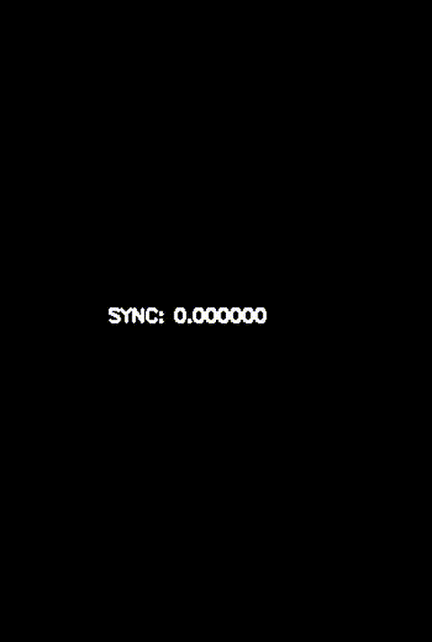
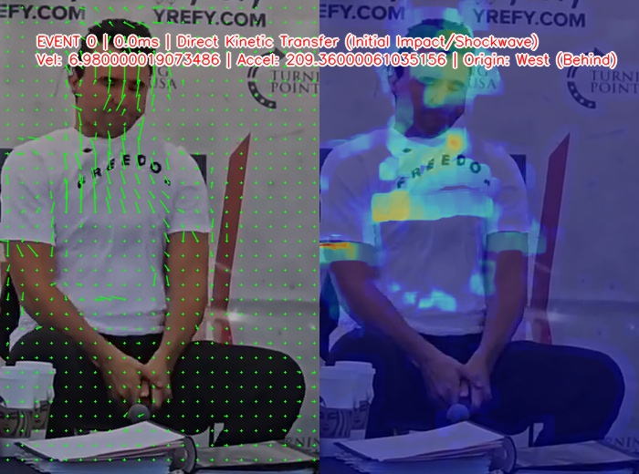
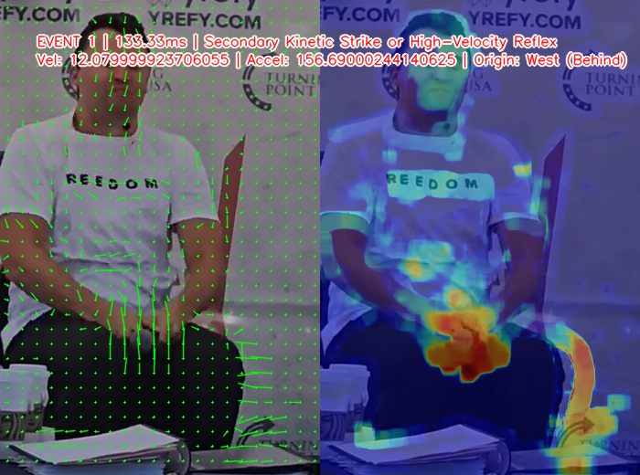
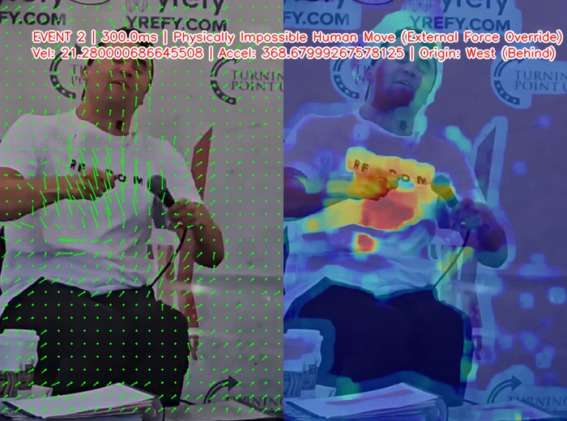
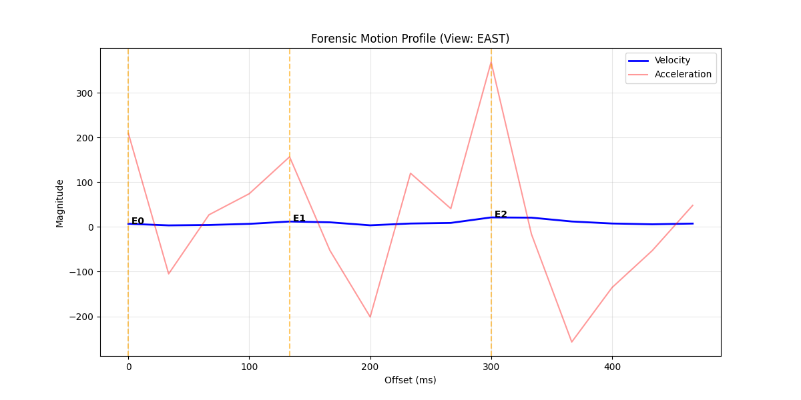

# Analysis of 1.mp4


## 0. Authenticity
```bash
python ../tools/0.assert-media-authenticity.py --media ../../sources/archive.org/1.mp4
```

| # | Test Name               | Measured Value  | Result Status |
|---|-------------------------|-----------------|---------------|
| 1 | Sample Rate Check       | 44100Hz         | PASS          |
| 2 | Clipping Analysis       | 0.0000% clipped | PASS          |
| 3 | DC Offset               | 0.000061        | PASS          |
| 4 | Digital Silence Check   | 2.54% silent    | PASS          |
| 5 | Crest Factor (AGC Test) | 6               | PASS          |
| 6 | Video Frame Rate        | 30.0 fps        | PASS          |

Table 1.assert-media-authenticity.csv


### Executive Summary
The media file has passed all standard integrity checks. The audio and video signals are consistent with a clean, high-quality recording from a standard device (like a smartphone or digital camera).


| # | Test Name             | What it Means in Plain English                                                                                                                                                                                  | Verdict  |
|---|-----------------------|-----------------------------------------------------------------------------------------------------------------------------------------------------------------------------------------------------------------|----------|
| 1 | Sample Rate Check     | Digital Resolution: Confirms the audio was recorded at a standard industry frequency (44.1kHz). This is the standard for CDs and high-quality digital files.                                                    | Healthy  |
| 2 | Clipping Analysis     | Distortion Check: Looks for "blown out" audio where the sound was too loud for the microphone. 0% means the audio is clear and contains all original waveform data without digital "crunch."                    | Clean    |
| 3 | DC Offset             | Hardware Integrity: Checks if the microphone or recording hardware was malfunctioning. A near-zero value (0.000061) indicates the electrical signal was perfectly balanced.                                     | Stable   |
| 4 | Digital Silence Check | Edit Detection: Looks for "dead air" that might indicate parts of the recording were cut out and replaced with empty space. 2.54% is normal for natural pauses in speech or environment.                        | Original |
| 5 | Crest Factor (AGC)    | Volume Manipulation: Determines if "Auto-Gain" or heavy compression was used to flatten the sound. A score of 6.00 confirms the audio retains its natural "peaks" (like a clap or loud word) vs. its "valleys." | Natural  |
| 6 | Video Frame Rate      | Motion Smoothness: Confirms the video runs at 30 frames per second which is the standard for modern digital video. There is no evidence of "dropped frames" or jitter.                                          | Smooth   |

Table Understanding 1.assert-media-authenticity

### Conclusion for Reviewer
The file appears to be a continuous, unedited original recording. There are no technical "red flags" (such as excessive silence, digital distortion, or hardware errors) that would suggest the file has been spliced, compressed, or manipulated post-recording.


## 1. Metadata

```bash
exiftool ../../sources/archive.org/1.mp4 > metadata.txt # follow up with \s+:\s(?=.) -> |
```

| #  | ExifTool Version Number     | 12.57                                 |
|----|-----------------------------|---------------------------------------|
| 1  | File Name                   | 1.mp4                                 |
| 2  | Directory                   | ../../sources/archive.org             |
| 3  | File Size                   | 2.2 MB                                |
| 4  | File Modification Date/Time | 2025:12:13 19:42:21+11:00             |
| 5  | File Access Date/Time       | 2026:01:17 19:46:04+11:00             |
| 6  | File Inode Change Date/Time | 2026:01:17 19:46:04+11:00             |
| 7  | File Permissions            | -rw-r--r--                            |
| 8  | File Type                   | MP4                                   |
| 9  | File Type Extension         | mp4                                   |
| 10 | MIME Type                   | video/mp4                             |
| 11 | Major Brand                 | MP4 Base Media v1 [IS0 14496-12:2003] |
| 12 | Minor Version               | 0.2.0                                 |
| 13 | Compatible Brands           | isom, iso2, avc1, mp41                |
| 14 | Movie Header Version        | 0                                     |
| 15 | Create Date                 | 0000:00:00 00:00:00                   |
| 16 | Modify Date                 | 0000:00:00 00:00:00                   |
| 17 | Time Scale                  | 1000                                  |
| 18 | Duration                    | 4.53 s                                |
| 19 | Preferred Rate              | 1                                     |
| 20 | Preferred Volume            | 100.00%                               |
| 21 | Preview Time                | 0 s                                   |
| 22 | Preview Duration            | 0 s                                   |
| 23 | Poster Time                 | 0 s                                   |
| 24 | Selection Time              | 0 s                                   |
| 25 | Selection Duration          | 0 s                                   |
| 26 | Current Time                | 0 s                                   |
| 27 | Next Track ID               | 3                                     |
| 28 | Track Header Version        | 0                                     |
| 29 | Track Create Date           | 0000:00:00 00:00:00                   |
| 30 | Track Modify Date           | 0000:00:00 00:00:00                   |
| 31 | Track ID                    | 1                                     |
| 32 | Track Duration              | 4.53 s                                |
| 33 | Track Layer                 | 0                                     |
| 34 | Track Volume                | 0.00%                                 |
| 35 | Image Width                 | 886                                   |
| 36 | Image Height                | 1920                                  |
| 37 | Graphics Mode               | srcCopy                               |
| 38 | Op Color                    | 0 0 0                                 |
| 39 | Compressor ID               | avc1                                  |
| 40 | Source Image Width          | 886                                   |
| 41 | Source Image Height         | 1920                                  |
| 42 | X Resolution                | 72                                    |
| 43 | Y Resolution                | 72                                    |
| 44 | Bit Depth                   | 24                                    |
| 45 | Color Profiles              | nclx                                  |
| 46 | Color Primaries             | BT.470 System B, G (historical)       |
| 47 | Transfer Characteristics    | BT.601                                |
| 48 | Matrix Coefficients         | BT.470 System B, G (historical)       |
| 49 | Buffer Size                 | 0                                     |
| 50 | Max Bitrate                 | 3729615                               |
| 51 | Average Bitrate             | 3729615                               |
| 52 | Video Frame Rate            | 30                                    |
| 53 | Matrix Structure            | 1 0 0 0 1 0 0 0 1                     |
| 54 | Media Header Version        | 0                                     |
| 55 | Media Create Date           | 0000:00:00 00:00:00                   |
| 56 | Media Modify Date           | 0000:00:00 00:00:00                   |
| 57 | Media Time Scale            | 48000                                 |
| 58 | Media Duration              | 4.44 s                                |
| 59 | Media Language Code         | und                                   |
| 60 | Handler Description         | SoundHandler                          |
| 61 | Balance                     | 0                                     |
| 62 | Audio Format                | mp4a                                  |
| 63 | Audio Channels              | 2                                     |
| 64 | Audio Bits Per Sample       | 16                                    |
| 65 | Audio Sample Rate           | 48000                                 |
| 66 | Handler Type                | Metadata                              |
| 67 | Handler Vendor ID           | Apple                                 |
| 68 | Media Data Size             | 2186007                               |
| 69 | Media Data Offset           | 6329                                  |
| 70 | Image Size                  | 886x1920                              |
| 71 | Megapixels                  | 1.7                                   |
| 72 | Avg Bitrate                 | 3.86 Mbps                             |
| 73 | Rotation                    | 0                                     |

Table metadata


## 2. Spatial Analysis


Figure camera-coords-query-wcs-xy.svg


| # | From_Feature              |                 | Lat_1            | Lon_1             | Ele_1            |
|---|---------------------------|-----------------|------------------|-------------------|------------------|
| 1 | 1.mp4 camera location     |                 | 40.2775302210218 | -111.713968844756 | 1402.78747731397 |
| 2 |                           |                 |                  |                   |                  |
| 3 | To_Feature                | Distance_Meters | Lat_2            | Lon_2             | Ele_2            |
| 4 | North speaker             | 7.685           | 40.2775627642768 | -111.714047818602 | 1403.732083      |
| 5 | Center north speaker      | 4.282           | 40.2775466124262 | -111.714013612385 | 1403.513785      |
| 6 | Center south speaker      | 2.383           | 40.2775165615533 | -111.713989351347 | 1403.366405      |
| 7 | South speaker             | 4.625           | 40.2774899744697 | -111.713966300153 | 1403.957025      |
| 8 | CK microphone             | 5.68            | 40.2775203851023 | -111.714033649438 | 1401.955129      |
| 9 | Audience microphone stand | 3.145           | 40.2775314668336 | -111.714005459209 | 1402.369802      |

Table 1.mp4 camera location with respect to stage


Refer to [Perspective-n-point](./spatial-analysis/perspective-n-point.md) for further details.


## 3. Clip media for forensic media analysis

The key sequence of ("violence" -> momentary silence -> "great" -> momentary silence -> bang segment)

The preceeding sequence is ("gang" -> "violence") delivered only by CK. Split point should be between 0.673 and 0.873. Note, line 65 from the metadata table reveals an Audio Sample Rate of 48000.

```bash
# use asetnsamples=n=960 for 48K & n=882 for 44.1kHz
ffprobe -v error -f lavfi -i "amovie='../../sources/archive.org/1.mp4',atrim=start=0.74:duration=0.2,asetpts=PTS-STARTPTS,asetnsamples=n=960,astats=metadata=1:reset=1" -show_entries frame=pts_time:frame_tags=lavfi.astats.Overall.RMS_level -of csv=p=0 | sort -t',' -k2,2n | head -n 1

0.040000,-22.175363
```

The key sequence should start around 0.78s. Note, line 52 from the metadata table reveals a Video Frame Rate of 30. Therefore, the immediate timestamp preceeding 0.78 is 0.766667 and the end timestamp (ie. +1.5s) will be 2.233337 (duration 2.233337 - 0.766667 = 1.46667).


```bash
ffmpeg -i ../../sources/archive.org/1.mp4 \
  -filter_complex \
  "[0:v]trim=start=0.766667:duration=1.466667,setpts=PTS-STARTPTS[v]; \
   [0:a:0]atrim=start=0.766667:duration=1.466667,asetpts=PTS-STARTPTS,aresample=48000,asplit=2[a1][a2]" \
  -map "[v]" -c:v ffv1 -level 3 -g 1 \
  -map "[a1]" -c:a pcm_s16le ./.bin/key-seq-video.mkv \
  -map "[a2]" -c:a pcm_s16le ./.bin/key-seq-audio.wav \
  -y
```

Check for consistency in generated output durations.
```bash
ffprobe -v error -show_entries format=duration -of default=noprint_wrappers=1:nokey=1 ./.bin/key-seq-video.mkv
# 1.467000
ffprobe -v error -show_entries format=duration -of default=noprint_wrappers=1:nokey=1 ./.bin/key-seq-audio.wav
# 1.464667
```


## 4. Visual Time Zero

| #  | FrameIndex | Timestamp | MotionMetric | Threshold | Status             |
|----|------------|-----------|--------------|-----------|--------------------|
| 1  | 18         | 0.6       | 1.665965     | 10.249804 | STABLE             |
| 2  | 19         | 0.633     | 3.231421     | 10.249804 | STABLE             |
| 3  | 20         | 0.667     | 0.001586     | 10.249804 | STABLE             |
| 4  | 21         | 0.7       | 1.074298     | 10.249804 | STABLE             |
| 5  | 22         | 0.733     | 2.916995     | 10.249804 | STABLE             |
| 6  | 23         | 0.767     | 0.003735     | 10.249804 | STABLE             |
| 7  | 24         | 0.8       | 4.361578     | 10.249804 | STABLE             |
| 8  | 25         | 0.833     | 0.003041     | 10.249804 | STABLE             |
| 9  | 26         | 0.867     | 2.076575     | 10.249804 | STABLE             |
| 10 | 27         | 0.9       | 0.897609     | 10.249804 | STABLE             |
| 11 | 28         | 0.933     | 0.507605     | 10.249804 | STABLE             |
| 12 | 29         | 0.967     | 12.344831    | 10.249804 | DEVIATION_DETECTED |
| 13 | 30         | 1         | 6.42137      | 10.249804 | STABLE             |
| 14 | 31         | 1.033     | 9.897811     | 10.249804 | STABLE             |
| 15 | 32         | 1.067     | 11.9776      | 10.249804 | DEVIATION_DETECTED |
| 16 | 33         | 1.1       | 15.699114    | 10.249804 | DEVIATION_DETECTED |
| 17 | 34         | 1.133     | 12.689017    | 10.249804 | DEVIATION_DETECTED |
| 18 | 35         | 1.167     | 9.142685     | 10.249804 | STABLE             |
| 19 | 36         | 1.2       | 8.505435     | 10.249804 | STABLE             |
| 20 | 37         | 1.233     | 7.530118     | 10.249804 | STABLE             |
| 21 | 38         | 1.267     | 14.918163    | 10.249804 | DEVIATION_DETECTED |
| 22 | 39         | 1.3       | 18.812845    | 10.249804 | DEVIATION_DETECTED |
| 23 | 40         | 1.333     | 11.168832    | 10.249804 | DEVIATION_DETECTED |
| 24 | 41         | 1.367     | 7.528182     | 10.249804 | STABLE             |
| 25 | 42         | 1.4       | 4.33578      | 10.249804 | STABLE             |
| 26 | 43         | 1.433     | 4.002197     | 10.249804 | STABLE             |

Table impact detection


In the table above, row 12 outlines that the first frame that exhibits a significant deviation from the previous motion measurements. Therefore, frame 29 with timestamp 0.967 will be applied as visual time zero.


## 5. Motion & Behavior Assessment

| #  | Offset(ms) | Vel   | Accel   | Jerk      | Curl    | Type    | Origin        |
|----|------------|-------|---------|-----------|---------|---------|---------------|
| 1  | 0          | 6.98  | 209.36  | 6280.75   | 0.0367  | KINETIC | West (Behind) |
| 2  | 33.33      | 3.48  | -104.91 | -9428.06  | -0.0248 |         | West (Behind) |
| 3  | 66.67      | 4.38  | 27.09   | 3960.12   | 0.0743  |         | N/A           |
| 4  | 100        | 6.86  | 74.28   | 1415.54   | -0.0544 |         | South         |
| 5  | 133.33     | 12.08 | 156.69  | 2472.28   | -0.005  |         | West (Behind) |
| 6  | 166.67     | 10.33 | -52.48  | -6275     | 0.072   |         | South         |
| 7  | 200        | 3.63  | -201.18 | -4461.17  | 0.0257  |         | West (Behind) |
| 8  | 233.33     | 7.63  | 120.03  | 9636.4    | -0.0351 |         | South         |
| 9  | 266.67     | 9     | 40.99   | -2371.22  | 0.0111  |         | East (Front)  |
| 10 | 300        | 21.28 | 368.68  | 9830.83   | -0.0161 | KINETIC | West (Behind) |
| 11 | 333.33     | 20.75 | -16.06  | -11542.28 | 0.0918  |         | West (Behind) |
| 12 | 366.67     | 12.18 | -257.23 | -7234.95  | 0.0409  |         | West (Behind) |
| 13 | 400        | 7.66  | -135.51 | 3651.38   | -0.1218 |         | South         |
| 14 | 433.33     | 5.9   | -52.67  | 2485.22   | -0.067  |         | South         |
| 15 | 466.67     | 7.51  | 48.14   | 3024.38   | -0.0784 |         | South         |

Table Motion analysis


| Event Number | Offset(ms) | Velocity | Accel  | Jerk    | Nature                                                     | Origin        |
|--------------|------------|----------|--------|---------|------------------------------------------------------------|---------------|
| 0            | 0          | 6.98     | 209.36 | 6280.75 | Direct Kinetic Transfer (Initial Impact/Shockwave)         | West (Behind) |
| 1            | 133.33     | 12.08    | 156.69 | 2472.28 | Secondary Kinetic Strike or High-Velocity Reflex           | West (Behind) |
| 2            | 300        | 21.28    | 368.68 | 9830.83 | Physically Impossible Human Move (External Force Override) | West (Behind) |

Table Forensic event summary



Figure key-seq-video-cropped-kenetic-overlay.gif


Figure Event 0


Figure Event 1


Figure Event 2


Figure Kinematic profile


The motion and behavioral analysis of CK's body indicates that there forces applied from both the west (ie. behind CK) and south (ie. to the right of CK). These are analysed as three seperate events.