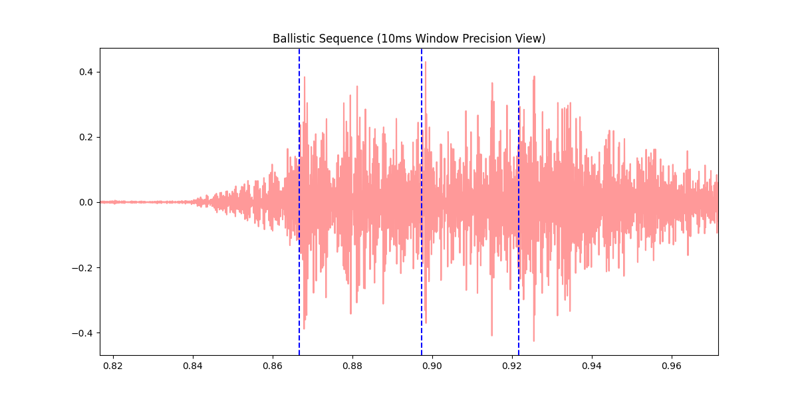
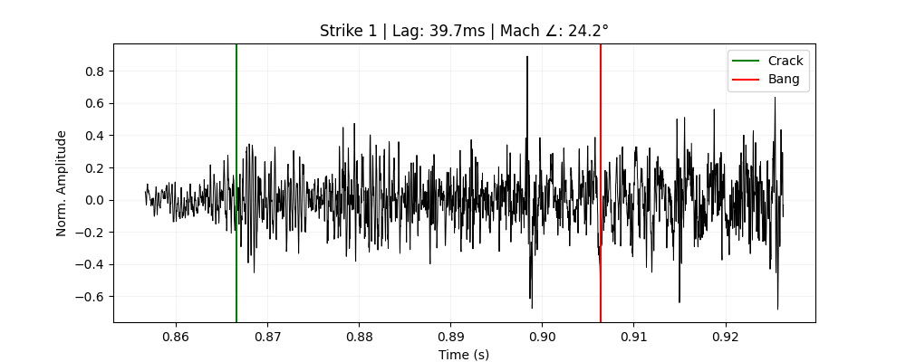
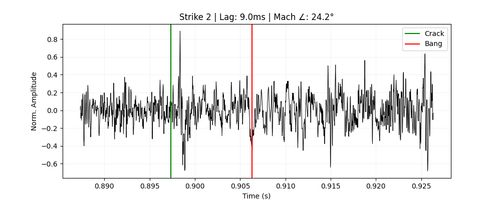
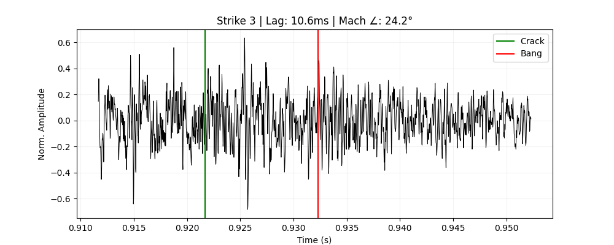
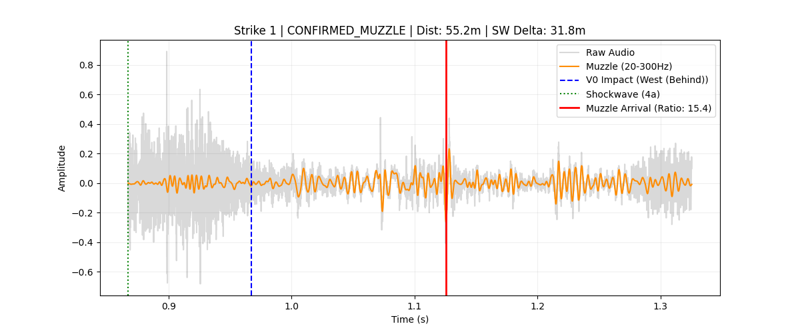
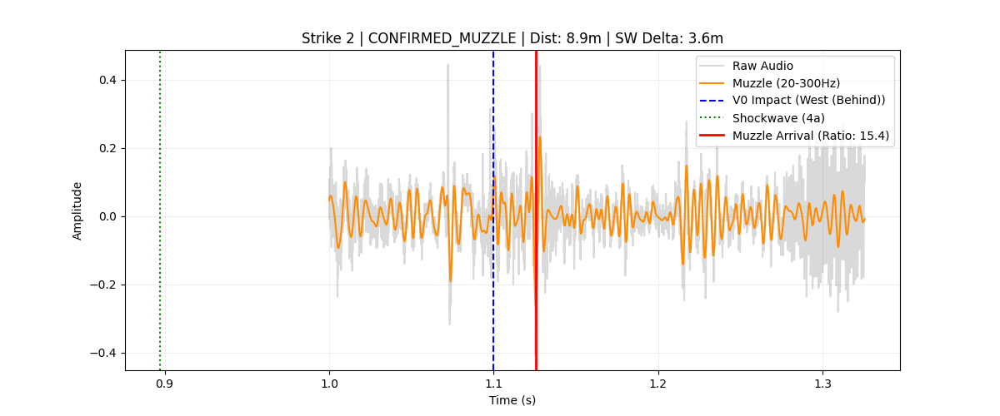
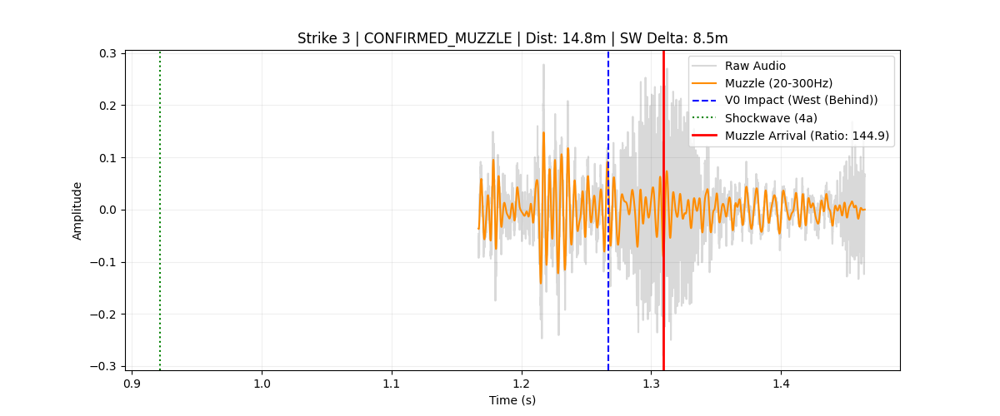

# Audio Analysis

## Preferred channel selection

```bash
ffmpeg -i ../.bin/key-seq-audio.wav -af astats -f null - 2> key-seq-audio.wav.astat.txt
```

```txt
ffmpeg version 5.1.8-0+deb12u1 Copyright (c) 2000-2025 the FFmpeg developers
  built with gcc 12 (Debian 12.2.0-14+deb12u1)
  configuration: --prefix=/usr --extra-version=0+deb12u1 --toolchain=hardened --libdir=/usr/lib/x86_64-linux-gnu --incdir=/usr/include/x86_64-linux-gnu --arch=amd64 --enable-gpl --disable-stripping --enable-gnutls --enable-ladspa --enable-libaom --enable-libass --enable-libbluray --enable-libbs2b --enable-libcaca --enable-libcdio --enable-libcodec2 --enable-libdav1d --enable-libflite --enable-libfontconfig --enable-libfreetype --enable-libfribidi --enable-libglslang --enable-libgme --enable-libgsm --enable-libjack --enable-libmp3lame --enable-libmysofa --enable-libopenjpeg --enable-libopenmpt --enable-libopus --enable-libpulse --enable-librabbitmq --enable-librist --enable-librubberband --enable-libshine --enable-libsnappy --enable-libsoxr --enable-libspeex --enable-libsrt --enable-libssh --enable-libsvtav1 --enable-libtheora --enable-libtwolame --enable-libvidstab --enable-libvorbis --enable-libvpx --enable-libwebp --enable-libx265 --enable-libxml2 --enable-libxvid --enable-libzimg --enable-libzmq --enable-libzvbi --enable-lv2 --enable-omx --enable-openal --enable-opencl --enable-opengl --enable-sdl2 --disable-sndio --enable-libjxl --enable-pocketsphinx --enable-librsvg --enable-libmfx --enable-libdc1394 --enable-libdrm --enable-libiec61883 --enable-chromaprint --enable-frei0r --enable-libx264 --enable-libplacebo --enable-librav1e --enable-shared
  libavutil      57. 28.100 / 57. 28.100
  libavcodec     59. 37.100 / 59. 37.100
  libavformat    59. 27.100 / 59. 27.100
  libavdevice    59.  7.100 / 59.  7.100
  libavfilter     8. 44.100 /  8. 44.100
  libswscale      6.  7.100 /  6.  7.100
  libswresample   4.  7.100 /  4.  7.100
  libpostproc    56.  6.100 / 56.  6.100
Guessed Channel Layout for Input Stream #0.0 : stereo
Input #0, wav, from '../.bin/key-seq-audio.wav':
  Metadata:
    encoder         : Lavf59.27.100
  Duration: 00:00:01.46, bitrate: 1536 kb/s
  Stream #0:0: Audio: pcm_s16le ([1][0][0][0] / 0x0001), 48000 Hz, stereo, s16, 1536 kb/s
Stream mapping:
  Stream #0:0 -> #0:0 (pcm_s16le (native) -> pcm_s16le (native))
Press [q] to stop, [?] for help
Output #0, null, to 'pipe:':
  Metadata:
    encoder         : Lavf59.27.100
  Stream #0:0: Audio: pcm_s16le, 48000 Hz, stereo, s16, 1536 kb/s
    Metadata:
      encoder         : Lavc59.37.100 pcm_s16le
size=N/A time=00:00:00.02 bitrate=N/A speed=2.13e+04x    
size=N/A time=00:00:01.46 bitrate=N/A speed= 203x    
video:0kB audio:275kB subtitle:0kB other streams:0kB global headers:0kB muxing overhead: unknown
[Parsed_astats_0 @ 0x55afd70a9a40] Channel: 1
[Parsed_astats_0 @ 0x55afd70a9a40] DC offset: 0.000019
[Parsed_astats_0 @ 0x55afd70a9a40] Min level: -22373.000000
[Parsed_astats_0 @ 0x55afd70a9a40] Max level: 29225.000000
[Parsed_astats_0 @ 0x55afd70a9a40] Min difference: 0.000000
[Parsed_astats_0 @ 0x55afd70a9a40] Max difference: 15403.000000
[Parsed_astats_0 @ 0x55afd70a9a40] Mean difference: 430.554998
[Parsed_astats_0 @ 0x55afd70a9a40] RMS difference: 877.589962
[Parsed_astats_0 @ 0x55afd70a9a40] Peak level dB: -0.993643
[Parsed_astats_0 @ 0x55afd70a9a40] RMS level dB: -19.691682
[Parsed_astats_0 @ 0x55afd70a9a40] RMS peak dB: -14.755002
[Parsed_astats_0 @ 0x55afd70a9a40] RMS trough dB: -33.609859
[Parsed_astats_0 @ 0x55afd70a9a40] Crest factor: 8.607994
[Parsed_astats_0 @ 0x55afd70a9a40] Flat factor: 0.000000
[Parsed_astats_0 @ 0x55afd70a9a40] Peak count: 2
[Parsed_astats_0 @ 0x55afd70a9a40] Noise floor dB: -27.262171
[Parsed_astats_0 @ 0x55afd70a9a40] Noise floor count: 704
[Parsed_astats_0 @ 0x55afd70a9a40] Entropy: 0.809191
[Parsed_astats_0 @ 0x55afd70a9a40] Bit depth: 16/16
[Parsed_astats_0 @ 0x55afd70a9a40] Dynamic range: 95.335690
[Parsed_astats_0 @ 0x55afd70a9a40] Zero crossings: 4375
[Parsed_astats_0 @ 0x55afd70a9a40] Zero crossings rate: 0.062230
[Parsed_astats_0 @ 0x55afd70a9a40] Channel: 2
[Parsed_astats_0 @ 0x55afd70a9a40] DC offset: 0.000371
[Parsed_astats_0 @ 0x55afd70a9a40] Min level: -24786.000000
[Parsed_astats_0 @ 0x55afd70a9a40] Max level: 22217.000000
[Parsed_astats_0 @ 0x55afd70a9a40] Min difference: 0.000000
[Parsed_astats_0 @ 0x55afd70a9a40] Max difference: 14605.000000
[Parsed_astats_0 @ 0x55afd70a9a40] Mean difference: 377.113438
[Parsed_astats_0 @ 0x55afd70a9a40] RMS difference: 774.405734
[Parsed_astats_0 @ 0x55afd70a9a40] Peak level dB: -2.424605
[Parsed_astats_0 @ 0x55afd70a9a40] RMS level dB: -20.348683
[Parsed_astats_0 @ 0x55afd70a9a40] RMS peak dB: -14.984603
[Parsed_astats_0 @ 0x55afd70a9a40] RMS trough dB: -35.043090
[Parsed_astats_0 @ 0x55afd70a9a40] Crest factor: 7.874154
[Parsed_astats_0 @ 0x55afd70a9a40] Flat factor: 0.000000
[Parsed_astats_0 @ 0x55afd70a9a40] Peak count: 2
[Parsed_astats_0 @ 0x55afd70a9a40] Noise floor dB: -28.580742
[Parsed_astats_0 @ 0x55afd70a9a40] Noise floor count: 1932
[Parsed_astats_0 @ 0x55afd70a9a40] Entropy: 0.798196
[Parsed_astats_0 @ 0x55afd70a9a40] Bit depth: 16/16
[Parsed_astats_0 @ 0x55afd70a9a40] Dynamic range: 93.904729
[Parsed_astats_0 @ 0x55afd70a9a40] Zero crossings: 4158
[Parsed_astats_0 @ 0x55afd70a9a40] Zero crossings rate: 0.059143
[Parsed_astats_0 @ 0x55afd70a9a40] Overall
[Parsed_astats_0 @ 0x55afd70a9a40] DC offset: 0.000371
[Parsed_astats_0 @ 0x55afd70a9a40] Min level: -24786.000000
[Parsed_astats_0 @ 0x55afd70a9a40] Max level: 29225.000000
[Parsed_astats_0 @ 0x55afd70a9a40] Min difference: 0.000000
[Parsed_astats_0 @ 0x55afd70a9a40] Max difference: 15403.000000
[Parsed_astats_0 @ 0x55afd70a9a40] Mean difference: 403.834218
[Parsed_astats_0 @ 0x55afd70a9a40] RMS difference: 827.607510
[Parsed_astats_0 @ 0x55afd70a9a40] Peak level dB: -0.993643
[Parsed_astats_0 @ 0x55afd70a9a40] RMS level dB: -20.007771
[Parsed_astats_0 @ 0x55afd70a9a40] RMS peak dB: -14.755002
[Parsed_astats_0 @ 0x55afd70a9a40] RMS trough dB: -35.043090
[Parsed_astats_0 @ 0x55afd70a9a40] Flat factor: 0.000000
[Parsed_astats_0 @ 0x55afd70a9a40] Peak count: 2.000000
[Parsed_astats_0 @ 0x55afd70a9a40] Noise floor dB: -27.262171
[Parsed_astats_0 @ 0x55afd70a9a40] Noise floor count: 1318.000000
[Parsed_astats_0 @ 0x55afd70a9a40] Entropy: 0.803693
[Parsed_astats_0 @ 0x55afd70a9a40] Bit depth: 16/16
[Parsed_astats_0 @ 0x55afd70a9a40] Number of samples: 70304
```

```bash
$ python ../../tools/2a.forensic-audio-channel-selector.py --astat key-seq-audio.wav.astat.txt --input ../.bin/key-seq-audio.wav --output ../.bin/key-seq-audio-preferred-channel.wav

--- FORENSIC AUDIT: key-seq-audio.wav ---
Phase Correlation: 0.0000 (SAFE)
ACTION: Extracting Channel 1 (Logic: C1 lower DC Offset; C1 better Dynamic Range; C2 lower Noise Floor)
```

```csv
Source_File,Selected_Channel,C1_Noise,C2_Noise,C1_Dyn,C2_Dyn,C1_DC,C2_DC,Reasoning
../.bin/key-seq-audio.wav,1,-27.262171,-28.580742,95.33569,93.904729,1.9e-05,0.000371,"Channel 1 chosen: Noise Floor -27.262171 dB, Dyn Range 95.33569 dB."
../.bin/key-seq-audio.wav,SINGLE CHANNEL (1),0.0,C1 lower DC Offset; C1 better Dynamic Range; C2 lower Noise Floor
```

## Shockwave analysis

```bash
$ python ../../tools/4a.check-bang-for-shockwave.py --audio ../.bin/key-seq-audio-preferred-channel.wav --v0 0.967 --expected_offsets 0,133,300 --temp_c 28.33
V13 Final Precision Success. Scanned 3 strikes.
```

```csv 4a.check-bang-for-shockwave-key-seq-audio-preferred-channel.wav.csv
Strike,TS,V0_Rel_ms,Precedence,HF_Ratio,Lag_ms,Dist_m,Logic
1,0.8667,-100.33,100.33,5881.36,39.69,23.39,Strike 1: High-Precision 5881.4% HF Ratio leads V0 by 100.3ms. Dist=23.4m.
2,0.8973,-69.67,69.67,77.04,9.0,5.3,Strike 2: High-Precision 77.0% HF Ratio leads V0 by 69.7ms. Dist=5.3m.
3,0.9217,-45.33,45.33,366.55,10.65,6.27,Strike 3: High-Precision 366.6% HF Ratio leads V0 by 45.3ms. Dist=6.3m.
```


Figure 4a.check-bang-for-shockwave-sequence_zoom_view.png


Figure 4a.check-bang-for-shockwave-strike_1-analysis.png


Figure 4a.check-bang-for-shockwave-strike_2-analysis.png


Figure 4a.check-bang-for-shockwave-strike_3-analysis.png


## Muzzle analysis

```bash
$ python ../../tools/4b.check-bang-for-muzzleblast.py --audio ../.bin/key-seq-audio-preferred-channel.wav --v0 0.967 --expected_offsets 0,133,300 --temp_c 28.33 --motion-event-summa
ry-csv ../video-analysis/3b.analyze-motion-behavior-forensic-event-summary.csv --shockwave-csv ./4a.check-bang-for-shockwave-key-seq-audio-preferred-channel.wav.csv 
V7 Success. Temporal Floor enforced for 3 strikes.
```

```csv
Strike,V0_Strike,Bang_TS,Lag_ms,Dist_m,SW_Delta_m,Status
1,0.967,1.1256,158.56,55.19,31.8,CONFIRMED_MUZZLE
2,1.1,1.1256,25.56,8.9,3.6,CONFIRMED_MUZZLE
3,1.267,1.3094,42.44,14.77,8.5,CONFIRMED_MUZZLE
```


Figure 4b.check-bang-for-muzzleblast-forensic-triangulation-strike_1.png


Figure 4b.check-bang-for-muzzleblast-forensic-triangulation-strike_2.png


Figure 4b.check-bang-for-muzzleblast-forensic-triangulation-strike_3.png
