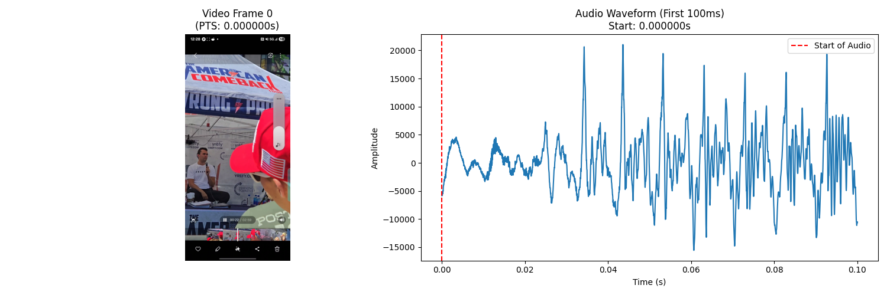
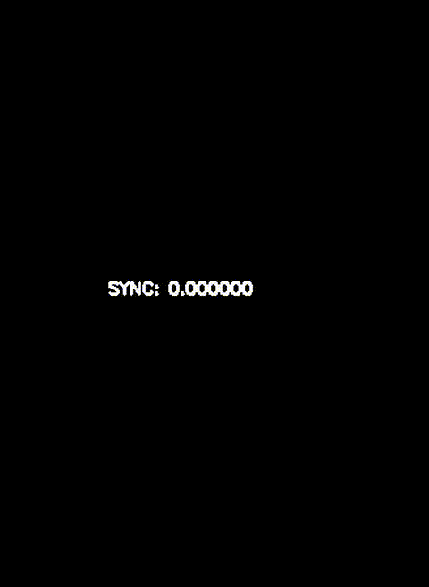
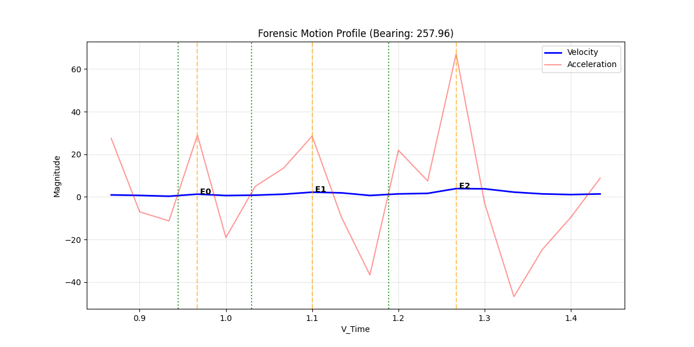
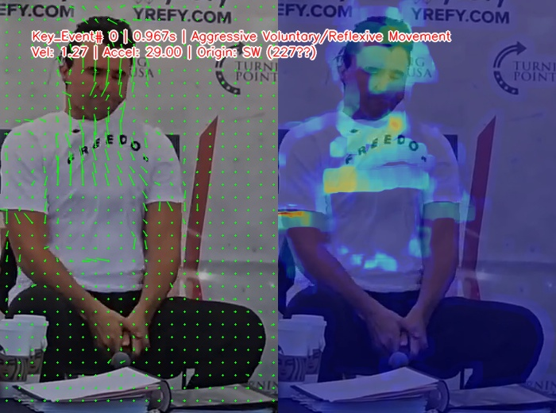
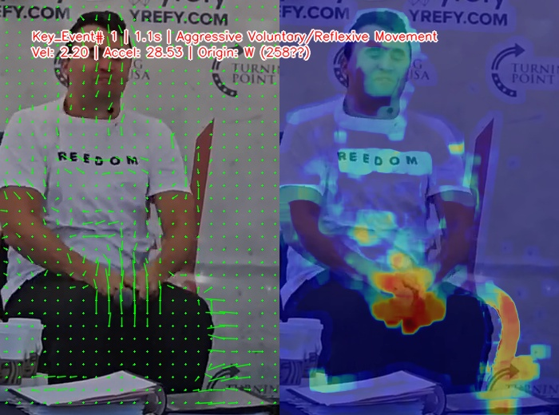

# Media Analysis of 1.mp4

## 1. Metadata

### Authentication 

Refer [authentication source](./1.metadata/analysis.md#authentication)

| # | Test/Metric            | Value                                                            | Result Status         |
|---|------------------------|------------------------------------------------------------------|-----------------------|
| 1 | SHA-256 Hash           | 2a43ccfa0667bb1fe925e8f31775bc981980aaa01ef3665ab8c43f802d46eb71 | VERIFIED              |
| 2 | Encoder Signature      | Unknown                                                          | PASS (Native/Unknown) |
| 3 | Video Codec            | h264                                                             | INFO                  |
| 4 | Frame Rate             | 30/01/26                                                         | PASS                  |
| 5 | Freeze/Pause Detection | 0 detected                                                       | PASS                  |
| 6 | Creation Metadata      | Missing                                                          | WARNING               |

Table 1.authenticate-media.csv

### File-level Metadata

Refer [metadata source](./1.metadata/analysis.md#metadata)

| #  | ExifTool Version Number     | 12.57                                 |
|----|-----------------------------|---------------------------------------|
| 1  | File Name                   | 1.mp4                                 |
| 2  | Directory                   | ../../../sources/archive.org          |
| 3  | File Size                   | 2.2 MB                                |
| 4  | File Modification Date/Time | 2025:12:13 19:42:21+11:00             |
| 5  | File Access Date/Time       | 2026:01:17 19:46:04+11:00             |
| 6  | File Inode Change Date/Time | 2026:01:17 19:46:04+11:00             |
| 7  | File Permissions            | -rw-r--r--                            |
| 8  | File Type                   | MP4                                   |
| 9  | File Type Extension         | mp4                                   |
| 10 | MIME Type                   | video/mp4                             |
| 11 | Major Brand                 | MP4 Base Media v1 [IS0 14496-12:2003] |
| 12 | Minor Version               | 0.2.0                                 |
| 13 | Compatible Brands           | isom, iso2, avc1, mp41                |
| 14 | Movie Header Version        | 0                                     |
| 15 | Create Date                 | 0000:00:00 00:00:00                   |
| 16 | Modify Date                 | 0000:00:00 00:00:00                   |
| 17 | Time Scale                  | 1000                                  |
| 18 | Duration                    | 4.53 s                                |
| 19 | Preferred Rate              | 1                                     |
| 20 | Preferred Volume            | 100.00%                               |
| 21 | Preview Time                | 0 s                                   |
| 22 | Preview Duration            | 0 s                                   |
| 23 | Poster Time                 | 0 s                                   |
| 24 | Selection Time              | 0 s                                   |
| 25 | Selection Duration          | 0 s                                   |
| 26 | Current Time                | 0 s                                   |
| 27 | Next Track ID               | 3                                     |
| 28 | Track Header Version        | 0                                     |
| 29 | Track Create Date           | 0000:00:00 00:00:00                   |
| 30 | Track Modify Date           | 0000:00:00 00:00:00                   |
| 31 | Track ID                    | 1                                     |
| 32 | Track Duration              | 4.53 s                                |
| 33 | Track Layer                 | 0                                     |
| 34 | Track Volume                | 0.00%                                 |
| 35 | Image Width                 | 886                                   |
| 36 | Image Height                | 1920                                  |
| 37 | Graphics Mode               | srcCopy                               |
| 38 | Op Color                    | 0 0 0                                 |
| 39 | Compressor ID               | avc1                                  |
| 40 | Source Image Width          | 886                                   |
| 41 | Source Image Height         | 1920                                  |
| 42 | X Resolution                | 72                                    |
| 43 | Y Resolution                | 72                                    |
| 44 | Bit Depth                   | 24                                    |
| 45 | Color Profiles              | nclx                                  |
| 46 | Color Primaries             | BT.470 System B, G (historical)       |
| 47 | Transfer Characteristics    | BT.601                                |
| 48 | Matrix Coefficients         | BT.470 System B, G (historical)       |
| 49 | Buffer Size                 | 0                                     |
| 50 | Max Bitrate                 | 3729615                               |
| 51 | Average Bitrate             | 3729615                               |
| 52 | Video Frame Rate            | 30                                    |
| 53 | Matrix Structure            | 1 0 0 0 1 0 0 0 1                     |
| 54 | Media Header Version        | 0                                     |
| 55 | Media Create Date           | 0000:00:00 00:00:00                   |
| 56 | Media Modify Date           | 0000:00:00 00:00:00                   |
| 57 | Media Time Scale            | 48000                                 |
| 58 | Media Duration              | 4.44 s                                |
| 59 | Media Language Code         | und                                   |
| 60 | Handler Description         | SoundHandler                          |
| 61 | Balance                     | 0                                     |
| 62 | Audio Format                | mp4a                                  |
| 63 | Audio Channels              | 2                                     |
| 64 | Audio Bits Per Sample       | 16                                    |
| 65 | Audio Sample Rate           | 48000                                 |
| 66 | Handler Type                | Metadata                              |
| 67 | Handler Vendor ID           | Apple                                 |
| 68 | Media Data Size             | 2186007                               |
| 69 | Media Data Offset           | 6329                                  |
| 70 | Image Size                  | 886x1920                              |
| 71 | Megapixels                  | 1.7                                   |
| 72 | Avg Bitrate                 | 3.86 Mbps                             |
| 73 | Rotation                    | 0                                     |

Table metadata.txt

### Visual/Audio Alignment Verification

Figure alignment_verification.png

## 2. Spatial Analysis

Refer [resolution source](./2.spatial-analysis/analysis.md#4-resolution)

Figure camera-coords-query-wcs-xy.svg

| # | From_Feature              |                 | Lat_1            | Lon_1             | Ele_1            |
|---|---------------------------|-----------------|------------------|-------------------|------------------|
| 1 | 1.mp4 camera location     |                 | 40.2775302210218 | -111.713968844756 | 1402.78747731397 |
| 2 |                           |                 |                  |                   |                  |
| 3 | To_Feature                | Distance_Meters | Lat_2            | Lon_2             | Ele_2            |
| 4 | North speaker             | 7.685           | 40.2775627642768 | -111.714047818602 | 1403.732083      |
| 5 | Center north speaker      | 4.282           | 40.2775466124262 | -111.714013612385 | 1403.513785      |
| 6 | Center south speaker      | 2.383           | 40.2775165615533 | -111.713989351347 | 1403.366405      |
| 7 | South speaker             | 4.625           | 40.2774899744697 | -111.713966300153 | 1403.957025      |
| 8 | CK microphone             | 5.68            | 40.2775203851023 | -111.714033649438 | 1401.955129      |
| 9 | Audience microphone stand | 3.145           | 40.2775314668336 | -111.714005459209 | 1402.369802      |

Table 1.mp4 camera location with respect to stage features

Use 19.58 as HFOV

## 3. Video Analysis

### Kinetic Motion Vector

Refer [kinetic source](./3.video-analysis/analysis.md#generate-kinetic-motion-vector-gif)

Figure key-seq-video-cropped-kenetic-overlay.gif

### Impact Events

Refer [impact source](./3.video-analysis/analysis.md#identify-impact-events)

| #  | Motion_Ref | V_Time | Offset(ms) | Vel_mps | Accel_mps2 | Jerk_mps3 | Origin    |
|----|------------|--------|------------|---------|------------|-----------|-----------|
| 1  | 0          | 0.867  | 0          | 0.91    | 27.45      | 823.38    | E (100°)  |
| 2  | 1          | 0.9    | 33.33      | 0.68    | -7.03      | -1034.2   | E (96°)   |
| 3  | 2          | 0.934  | 66.67      | 0.3     | -11.29     | -128.01   | SE (156°) |
| 4  | 3          | 0.967  | 100        | 1.27    | 29         | 1208.86   | SW (227°) |
| 5  | 4          | 1      | 133.33     | 0.63    | -19.1      | -1443.15  | W (254°)  |
| 6  | 5          | 1.034  | 166.67     | 0.8     | 4.93       | 721.15    | N/A       |
| 7  | 6          | 1.067  | 200        | 1.25    | 13.53      | 257.77    | N (9°)    |
| 8  | 7          | 1.1    | 233.33     | 2.2     | 28.53      | 450.21    | W (258°)  |
| 9  | 8          | 1.134  | 266.67     | 1.88    | -9.56      | -1142.69  | N (341°)  |
| 10 | 9          | 1.167  | 300        | 0.66    | -36.64     | -812.39   | W (284°)  |
| 11 | 10         | 1.2    | 333.33     | 1.39    | 21.86      | 1754.81   | NW (307°) |
| 12 | 11         | 1.234  | 366.67     | 1.64    | 7.46       | -431.8    | E (71°)   |
| 13 | 12         | 1.267  | 400        | 3.88    | 67.14      | 1790.22   | SW (241°) |
| 14 | 13         | 1.3    | 433.33     | 3.78    | -2.92      | -2101.87  | W (259°)  |
| 15 | 14         | 1.334  | 466.67     | 2.22    | -46.84     | -1317.5   | W (292°)  |
| 16 | 15         | 1.367  | 500        | 1.39    | -24.68     | 664.92    | N (338°)  |
| 17 | 16         | 1.4    | 533.33     | 1.07    | -9.59      | 452.56    | NW (318°) |
| 18 | 17         | 1.434  | 566.67     | 1.37    | 8.77       | 550.75    | NE (25°)  |

Table impact events

### Visual Time Zero(s) / Impact Events

Refer [visual time zero source](./3.video-analysis/analysis.md#identifying-visual-time-zero-t0-candidates)

Use timestamp 0.967s as initial Visual Time Zero going forward.

| # | Key_Event# | Motion_Ref | V_Time | Offset(ms) | Onset_V_Time | Vel_mps | Accel_mps2 | Jerk_mps3 | Nature                                  | Tag                  | Origin    |
|---|------------|------------|--------|------------|--------------|---------|------------|-----------|-----------------------------------------|----------------------|-----------|
| 1 | 0          | 3          | 0.967  | 100        | 0.9449       | 1.27    | 29         | 1208.86   | Aggressive Voluntary/Reflexive Movement | REFLEX_ONSET         | SW (227°) |
| 2 | 1          | 7          | 1.1    | 233.33     | 1.0299       | 2.2     | 28.53      | 450.21    | Aggressive Voluntary/Reflexive Movement | REFLEX_ONSET         | W (258°)  |
| 3 | 2          | 12         | 1.267  | 400        | 1.1888       | 3.88    | 67.14      | 1790.22   | Kinetic Strike/Secondary Force (6.8G)   | TDOA_SYNC_PRIORITY_1 | SW (241°) |

Table Visual Time Zero(s) for multi-impact event

Figure Kinematic Motion Profile

Figure Motion Event 0

Figure Motion Event 1

Figure Motion Event 2

## 4. Audio Analysis

### Channel Selection & Stereo Use

Refer [channel selection source](./4.audio-analysis/analysis.md#audio-channel-selection)

| Source                                      | Mode              | Correlation | Logic               |
|---------------------------------------------|-------------------|-------------|---------------------|
| ../.bin/key-seq-audio-preferred-channel.wav | MONO (Ch 1)       | 0           | Denoised via anlmdn |
| ../.bin/key-seq-audio-stereo-clean.wav      | STEREO (Denoised) | 0           | Denoised via anlmdn |

Table Denoised Audio Sources

### Shockwave Analysis

Refer [shockwave source](./4.audio-analysis/analysis.md#shockwave-analysis)

| # | Time_s           | TDOA_ms            | Conf | Type               | Energy_Ratio |
|---|------------------|--------------------|------|--------------------|--------------|
| 1 | 1.04116666666667 | -0.708333333333333 | 72.3 | 1-ORDER            | 1            |
| 2 | 1.1013125        | -3.33333333333333  | 69.1 | 1-ORDER            | 2.291        |
| 3 | 1.13935416666667 | -0.5625            | 73.9 | [REFLECTION/DECAY] | 1.536        |
| 4 | 1.14579166666667 | -0.1875            | 74.4 | [REFLECTION/DECAY] | 0.514        |

Table Shockwave Detection

Row 2 at 1.0412s timestamp is the first order shockwave with a high energy ratio.

## Bang Segment Analysis

Refer [bang segment source](./4.audio-analysis/analysis.md#bang-segment-analysis)

| # | A_Time | Muzzle_Ratio | PA_Bias | Decay_Factor | Classification       |
|---|--------|--------------|---------|--------------|----------------------|
| 1 | 0.8366 | 102.97       | 0.08    | 0.25         | PETN_RIG_DETONATION  |
| 2 | 1.1335 | 42.53        | 0.2     | 2.82         | PETN_RIG_DETONATION  |
| 3 | 1.3174 | 758.87       | 18.68   | 4.45         | GENUINE_MUZZLE_BLAST |

Table Bang Segment

### Violence-to-Bang Key Sequence

Refer [key sequence source](./4.audio-analysis/analysis.md#key-sequences)

| # | filename                                    | violence_sibilance_timestamp | bang_onset_timestamp | lag_ms           |
|---|---------------------------------------------|------------------------------|----------------------|------------------|
| 1 | ../.bin/key-seq-audio-preferred-channel.wav | 0.346666666666667            | 0.881333333333333    | 534.666666666667 |

Table Violence-to-Bang Key Sequence

Figure Violence-to-Bang Key Sequence

