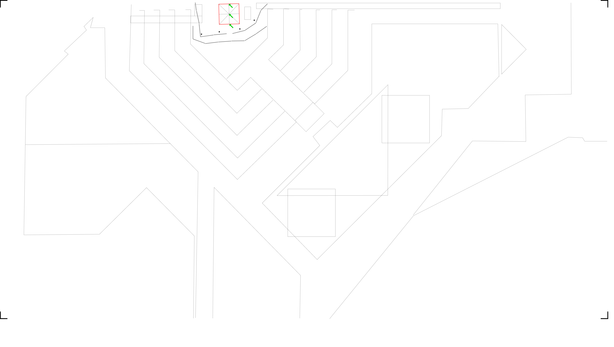

# Perspective-n-Point

## Key landmarks

### Reference 1


Figure Photo




Figure Landmarks


Landmarks:
1. Tent back center banner frame
2. Tent middle center banner frame
3. Front Banner Lightning


| # | Feature                         | Editor Size (Pt) | Millimeters |  Ratio |
|---|---------------------------------|------------------|-------------|--------|
| 1 | Google Earth yardstick          | 1016.00          | 14700.00    | 14.47  |
| 2 | Z-origin (as zero)              | 1401.00          |             |        |
| 3 |                                 |                  |             |        |
| 4 | Feature                         | Z-axis Pt        | Z-axis mm   |        |
| 5 | Tent back center banner frame   | 144.45           | 2090.00     |        |
| 6 | Tent middle center banner frame | 144.45           | 2090.00     |        |
| 7 | Front Banner Lightning          | 159.17           | 2303.00     |        |


```json camera-coords-query.json
{
    "landmarks_grid": {
        "Tent back center banner frame": [3083, 53, 144.45],
        "Tent middle center banner frame": [3087, 189, 144.45],
        "Front Banner Lightning": [3090, 325, 159.17]
    },
    "photo1": {
        "width": 886,
        "height": 1920,
        "points": {
            "Tent back center banner frame": [36, 862],
            "Tent middle center banner frame": [175, 813],
            "Front Banner Lightning": [432, 588]
        }
    }
}
```


```bash
$ python ../../gps-camera-solver.py 
Camera Estimated World Position (X, Y, Z): 3222.63, 452.52, 85.53
```

### Reference 2


Landmarks:
1. Centre tent post
2. Tent back right corner
3. Hall of flags window frame or mic stand
