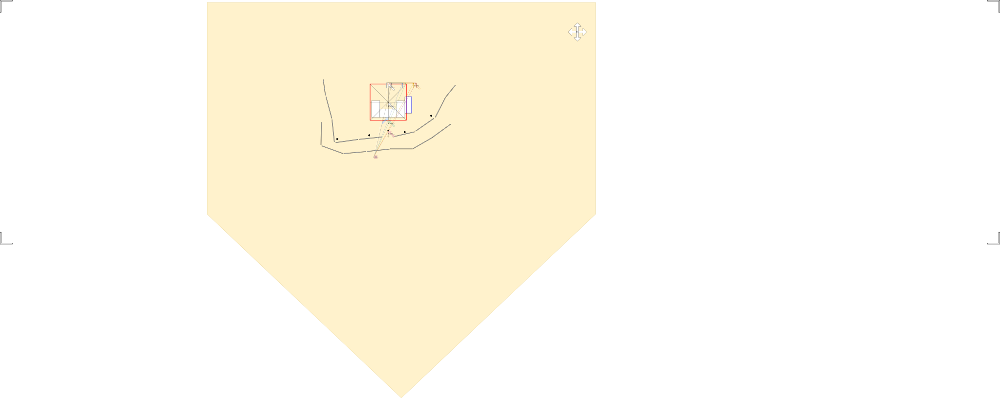

# Perspective-n-Point

## 1. Reference photo 


Figure photo-reference-frame.jpg


Figure camera-coords-query-photo.jpg


Figure camera-coords-query-wcs.jpg


## 2. Summary

| #  | Feature                                    | P-n-P height | Millimeters | Elevation Offset | POI-Elevation |  Ratio         | Base elevation (m) | Notes                                             |
|----|--------------------------------------------|--------------|-------------|------------------|---------------|----------------|--------------------|---------------------------------------------------|
| 1  | Amphitheatre                               |              |             |                  |               |                |                    |                                                   |
| 2  | Google Earth yardstick                     | 1102.00      | 14700.00    |                  |               | 13.34          | 1401               |                                                   |
| 3  |                                            |              |             |                  |               |                |                    |                                                   |
| 4  |                                            | Z-value      |             |                  |               | Z-val inverted |                    |                                                   |
| 5  | Buildings                                  | 1500.00      |             |                  |               |                |                    |                                                   |
| 6  | A: HoF lower window height                 | 324.26       | 4325.44     | 0                | 1401.00       | 1175.74        |                    |                                                   |
| 7  |                                            |              |             |                  |               |                |                    |                                                   |
| 8  | Tent                                       |              |             |                  |               |                |                    |                                                   |
| 9  | B: Tent banner lightning rod center height | 187.27       | 2498.04     | 0                | 1401.00       | 1312.73        |                    |                                                   |
| 10 | C: Tent banner bottom height               | 171.17       | 2283.31     | 0                | 1401.00       | 1328.83        |                    |                                                   |
| 11 |                                            |              |             |                  |               |                |                    |                                                   |
| 12 | People                                     |              |             |                  |               |                |                    |                                                   |
| 13 | D: Charlie’s head height (center)          | 139.85       | 1865.45     | 0                | 1401.00       | 1360.15        |                    |                                                   |
| 14 |                                            |              |             |                  |               |                |                    |                                                   |
| 15 | Stage-area                                 |              |             |                  |               |                |                    |                                                   |
| 16 | E: Audience microphone stand               | 102.69       | 1369.80     | 0                | 1401.00       | 1397.31        |                    |                                                   |
| 17 |                                            |              |             |                  |               |                |                    |                                                   |
| 18 | Tables                                     |              |             |                  |               |                |                    |                                                   |
| 19 | F: Charlie’s Table height                  | 71.60        | 955.13      | 0                | 1401.00       | 1428.40        |                    | This feature’s measurement is proving problematic |
| 20 |                                            |              |             |                  |               |                |                    |                                                   |
| 21 | 1.mp4 Camera Location                      | x            | y           | z                | lat           | lon            | elevation          |                                                   |
| 22 | World Coordinate System                    | 3079.00      | 1262.00     | 117.00           |               |                | 1402.56070780399   |                                                   |
| 23 | Google Earth GPS                           |              |             |                  | 40.277532     | -111.713973    |                    |                                                   |


Table measurements


## 3. Configuration

```json camera-coords-query.json
{
    "wcs": {
        "A": [3390, 680, 324.26],
        "B": [3182, 988, 187.27],
        "C": [3182, 690, 171.17],
        "D": [3182, 842, 139.85],
        "E": [3182, 1074, 102.69],
        "F": [3182, 963, 71.60]
    },
    "photo": {
        "width": 886,
        "height": 1575,
        "points": {
            "A": [606, 140],
            "B": [427, 419],
            "C": [31, 693],
            "D": [125, 847],
            "E": [675, 1251],
        //     "F": [382, 1315]
        },
        "point-closest-to-camera": "E",
        "point-furthest-from-camera": "A"
    }
}

```

## 4. Resolution


Figure camera-coords-query-wcs-xy.svg


Figure camera-coords-query-wcs-yz.svg


```bash
$ python ../../tools/gps-camera-solver.py 
Verified Solution Found near [3130 1270  120]:
   Optimized F: 3724.34 | Error: 378.89
   Final World Pos (X, Y, Z): 3163.56, 1256.52, -6.96
```


```json camera-location.json
[
    {
        "Feature": "1.mp4 camera location",
        "x": 3079.00, 
        "y": 1262.00
    }
]
```

```bash
$ python ../../tools/world-coordinate-system.py -v ../../spatial-mapping/world-coordinate-system_to_gps_lamp-posts.json camera-location.json camera-location-gps.json 
--- Mapping Model Status ---
RMSE: 0.00000129 Degrees
Approximate ground error: 0.143 meters
```

```json camera-location-gps.json
[
    {
        "lat": 40.27753069984355,
        "lon": -111.71397180349506
    }
]
```
