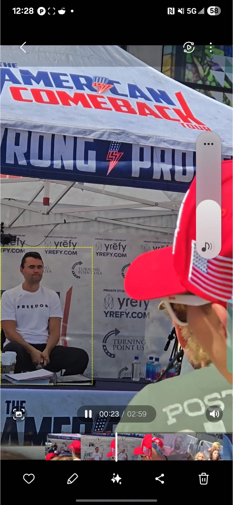

# Video Analysis

## List the key sequence timestamps

```bash
ffprobe -v error -select_streams v:0 -show_entries frame=pts_time,pict_type -of csv=p=0 ../../../sources/archive.org/1.mp4 | awk -F',' '$1 >= 0.766667 && $1 <= 2.266667 {print $0}' > absolute-visual-timestamps.csv
```

```csv absolute-visual-timestamps.csv
0.766667,B
0.800000,B
0.833333,P
0.866667,B
0.900000,B
0.933333,B
0.966667,P
1.000000,B
1.033333,B
1.066667,B
1.100000,P
1.133333,B
1.166667,B
1.200000,B
1.233333,P
1.266667,B
1.300000,B
1.333333,B
1.366667,P
1.400000,B
1.433333,B
1.466667,B
1.500000,P
1.533333,B
1.566667,B
1.600000,B
1.633333,P
1.666667,B
1.700000,B
1.733333,B
1.766667,P
1.800000,B
1.833333,B
1.866667,B
1.900000,P
1.933333,B
1.966667,P
2.000000,I
2.033333,B
2.066667,B
2.100000,B
2.133333,P
2.166667,B
2.200000,B
2.233333,B
2.266667,P
```

## Identify cropped video region for improved signal to noise ratio
1. open the key-seq-video.mp4 in video player and identify a candidate frame prior to impact
2. export frame as a still image
3. open drawing tool and outline an appropriate crop region using a bounding rectangle
4. note the top, left, width & height coordinates


Figure still-frame-uncropped.jpg



Figure still-frame-cropped-region-outline.jpg


## Test cropped footage

```bash
ffplay -i key-seq-video.mov -vf "crop=350:520:0:940"
```


## Export a cropped focus region for improved signal to noise ration

```bash
ffmpeg -i key-seq-video.mov -vf "crop=350:520:0:940" -c:a copy key-seq-video-cropped.mov
```

## Generate kinetic movement analysis video

```bash

python ../../../tools/video-forensic-analysis.py key-seq-video-cropped.mov -t -fs 0.5
ffmpeg -i key-seq-video-cropped-kenetic-overlay.mp4 -vf "fps=15,scale=480:-1:flags=lanczos" key-seq-video-cropped-kenetic-overlay.gif
```


Figure key-seq-video-cropped-kenetic-overlay.gif


## Identifying Visual Time Zero (t~0~)

```bash
python ../../tools/3a.identify-visual-t0.py --video key-seq-video-cropped.mov -st 0.566667
```

```csv 3a.visual-motion-analysis.csv
FrameIndex,Timestamp,MotionMetric,Threshold,Status
18,0.600000,1.717317,10.173344,STABLE
19,0.633333,3.301683,10.173344,STABLE
20,0.666667,0.002090,10.173344,STABLE
21,0.700000,1.131566,10.173344,STABLE
22,0.733333,3.152664,10.173344,STABLE
23,0.766667,0.004656,10.173344,STABLE
24,0.800000,4.080758,10.173344,STABLE
25,0.833333,0.007464,10.173344,STABLE
26,0.866667,2.198040,10.173344,STABLE
27,0.900000,0.871338,10.173344,STABLE
28,0.933333,0.534649,10.173344,STABLE
29,0.966667,12.726921,10.173344,DEVIATION_DETECTED
30,1.000000,6.887399,10.173344,STABLE
31,1.033333,10.650967,10.173344,DEVIATION_DETECTED
32,1.066667,11.587164,10.173344,DEVIATION_DETECTED
33,1.100000,15.929962,10.173344,DEVIATION_DETECTED
34,1.133333,12.095077,10.173344,DEVIATION_DETECTED
35,1.166667,9.545898,10.173344,STABLE
36,1.200000,8.918169,10.173344,STABLE
37,1.233333,6.851216,10.173344,STABLE
38,1.266667,14.516001,10.173344,DEVIATION_DETECTED
39,1.300000,18.566072,10.173344,DEVIATION_DETECTED
40,1.333333,11.162679,10.173344,DEVIATION_DETECTED
41,1.366667,7.711784,10.173344,STABLE
42,1.400000,4.534672,10.173344,STABLE
43,1.433333,4.176903,10.173344,STABLE

```